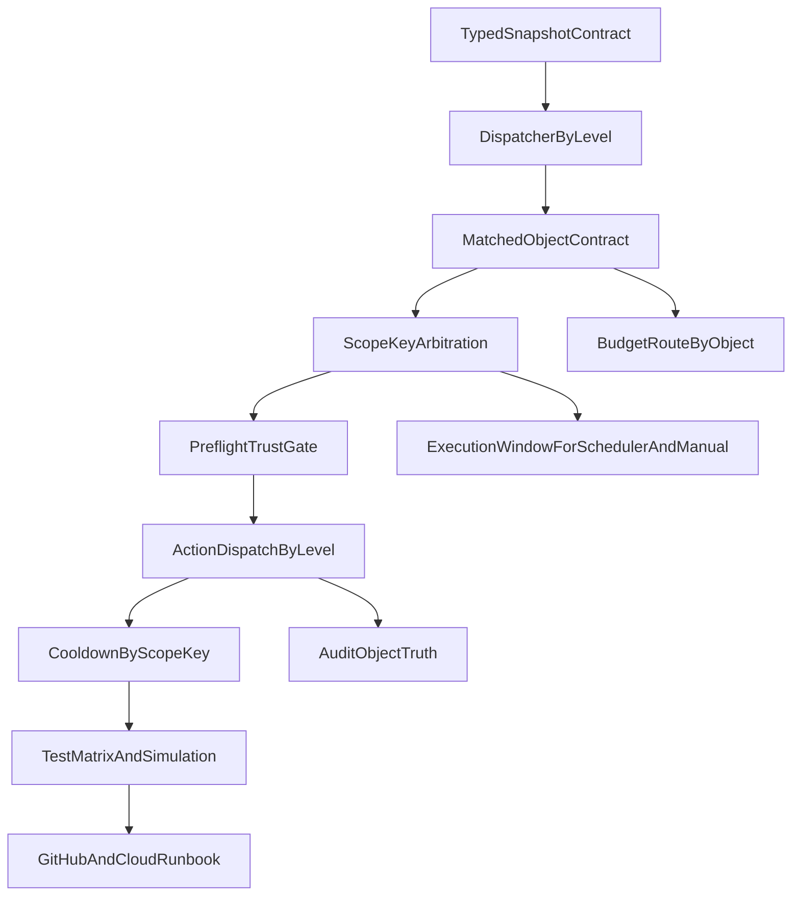

# 同层闭环问题修复与上线执行方案

## 目标

修复当前系统中 `campaign/adset` 规则仍残留的 **ad 语义污染**，使系统满足两份方案要求：

1. **同层聚合后判断一次**。
2. **同一父级对象每轮只执行一次**。
3. **冷却表、执行时间窗、Pre-flight、审计日志都以真实目标层级生效**。
4. **本地开发完成后，可通过 GitHub 更新到云上运行项目，并具备灰度与回滚手册**。

## 当前确认的问题

### P0：同层对象模型仍未真正建立

- [D:/projects/FB-Ad-Logic-Engine/server/index.js](D:/projects/FB-Ad-Logic-Engine/server/index.js) 的 `evaluateRuleWithData()` 仍固定产出 `matchedAds`，字段形态仍是 `ad_id/ad_name/ad_set_id/campaign_id`。
- [D:/projects/FB-Ad-Logic-Engine/server/services/ruleDataService.js](D:/projects/FB-Ad-Logic-Engine/server/services/ruleDataService.js) 的 `queryRuleDataByLevel()` 虽然会聚合指标，但返回结果没有形成统一的 `matchedObject` 合同。
- 结果：后续执行层、Batch、审计、预算、冷却仍不断回退到 ad 语义。

### P0：灰度开关接了，但默认仍关闭同层闭环

- [D:/projects/FB-Ad-Logic-Engine/server/services/ruleEngineDispatcher.js](D:/projects/FB-Ad-Logic-Engine/server/services/ruleEngineDispatcher.js) 中 `RULE_LEVEL_EXECUTION_V2` 默认值为 `0`。
- 结果：默认部署后，`campaign/adset` 规则仍会回退到 ad 查询与 ad 级评估。

### P0：预算动作对 campaign 级规则不可用

- [D:/projects/FB-Ad-Logic-Engine/server/services/actionExecutorService.js](D:/projects/FB-Ad-Logic-Engine/server/services/actionExecutorService.js) 预算入口先取 `matchedAd.ad_set_id`，而 campaign 聚合结果通常没有该字段。
- 结果：`campaign` 级预算动作当前会直接失败。

### P1：冷却表对父级对象“半有效”，仍有 ad 污染

- [D:/projects/FB-Ad-Logic-Engine/server/services/cronService.js](D:/projects/FB-Ad-Logic-Engine/server/services/cronService.js) 调度主键已经使用 `status_campaign:*` / `status_adset:*`。
- 但执行完成后仍补写 `status_ad:${adId}`，且 `adId` 为空时可能落异常键。
- [D:/projects/FB-Ad-Logic-Engine/server/services/ruleExecutionStateService.js](D:/projects/FB-Ad-Logic-Engine/server/services/ruleExecutionStateService.js) 对兼容字段 `ad_id` 仍按旧前缀 `ad:` 解析，不识别 `status_ad:`。

### P1：执行时间窗仅对调度路径生效

- [D:/projects/FB-Ad-Logic-Engine/server/services/cronService.js](D:/projects/FB-Ad-Logic-Engine/server/services/cronService.js) 的 `isInExecutionWindow()` 在 `fromScheduler=true` 路径生效。
- 但 `executeSingleRule()` 未调用该逻辑，手动“运行此规则”仍会绕过执行时间窗。

### P1：单规则 Batch 路径未限制 targetLevel

- [D:/projects/FB-Ad-Logic-Engine/server/services/actionExecutorService.js](D:/projects/FB-Ad-Logic-Engine/server/services/actionExecutorService.js) 的 `executeActionsForRule()` 只按动作类型判断是否进 Batch，没有再限制 `targetLevel === 'ad'`。
- 结果：非 ad 规则存在误入 ad Batch 路径的风险。

### P1：typed snapshot 语义需与非 ad 目标层再次对齐

- [D:/projects/FB-Ad-Logic-Engine/server/services/dynamicScopeService.js](D:/projects/FB-Ad-Logic-Engine/server/services/dynamicScopeService.js) 当前写入 `rule_matched_objects` 时，需要再次确认 `targetLevel=campaign/adset` 下写入的 `object_id` 是否始终为父级对象，而不是广告 id。
- 这是整个闭环的上游合同，必须先钉死。

### P2：性能门禁未真正落地

- [D:/projects/FB-Ad-Logic-Engine/server/db/migrations/046_add_level_aggregation_indexes.sql](D:/projects/FB-Ad-Logic-Engine/server/db/migrations/046_add_level_aggregation_indexes.sql) 已补索引。
- 但仓库中未看到 `EXPLAIN` 报告、性能基准测试、或 `p95 <= 500ms / 3000ms` 的自动化门禁。
- [D:/projects/FB-Ad-Logic-Engine/server/services/ruleDataService.js](D:/projects/FB-Ad-Logic-Engine/server/services/ruleDataService.js) 当前 `queryRuleDataByLevel()` 仍是“全账户 ad 数据拉出后再内存聚合”。

### P2：模板与读侧时间窗枚举不一致

- [D:/projects/FB-Ad-Logic-Engine/server/utils/templateValidator.js](D:/projects/FB-Ad-Logic-Engine/server/utils/templateValidator.js) 仍缺 `last_7_days`、`last_30_days`。
- 结果：模板层与调度读侧的时间窗能力不完全一致。

## 修复总图

## 里程碑1：先修正“对象模型合同”

### [目标]

把当前“聚合了指标，但返回的还是 ad 形态 matched 结果”的问题改成统一的 `matchedObject` 合同，给后续执行、冷却、审计、预算提供稳定输入。

### [具体改动方案]

1. 在 [D:/projects/FB-Ad-Logic-Engine/server/index.js](D:/projects/FB-Ad-Logic-Engine/server/index.js) 中拆分：

   - 保留 ad 规则兼容输出。
   - 新增 non-ad 规则专用输出模型，例如：
     - `objectType`
     - `objectId`
     - `objectName`
     - `statusSourceRef`
     - `ad_id` 仅兼容保留，不再作为业务主键

2. 在 [D:/projects/FB-Ad-Logic-Engine/server/services/ruleDataService.js](D:/projects/FB-Ad-Logic-Engine/server/services/ruleDataService.js) 中补齐 `queryRuleDataByLevel()` 返回字段：

   - `adset` 至少返回 `ad_set_id/adset_name/campaign_id`
   - `campaign` 至少返回 `campaign_id/campaign_name`
   - 统一返回可被执行层直接消费的同层对象字段

3. 在 [D:/projects/FB-Ad-Logic-Engine/server/services/dynamicScopeService.js](D:/projects/FB-Ad-Logic-Engine/server/services/dynamicScopeService.js) 中核实并修正 typed snapshot：

   - `object_type=campaign` 时，`object_id` 必须是 `campaign_id`
   - `object_type=adset` 时，`object_id` 必须是 `adset_id`
   - 不允许“object_type 是 campaign，但 object_id 实际是 ad_id”

### [验证/验收标准]

- `campaign/adset` 规则命中结果对象不再依赖 `ad_id` 才能成立。
- `rule_matched_objects` 中 `object_type/object_id` 语义一致。
- 自动化测试能证明同层对象模型成立。

## 里程碑2：把调度执行链彻底改成“按 scopeKey 执行一次”

### [目标]

让调度路径真正做到：**同一父级对象只仲裁一次、只执行一次、只记一条真实对象日志**。

### [具体改动方案]

1. 在 [D:/projects/FB-Ad-Logic-Engine/server/services/cronService.js](D:/projects/FB-Ad-Logic-Engine/server/services/cronService.js) 中：

   - 将 `executionResultsByAd` 重命名为按 `scopeKey` 语义的结构。
   - 将 `ruleToOutsideWindow`、`ruleToSuppressed` 等辅助结构从 ad 语义切为 object/scope 语义。
   - 删除或条件化 `status_ad:${adId}` 的补写逻辑：
     - 状态动作的 `campaign/adset` 路径禁止再无条件双写 ad 级冷却。
     - 预算动作是否保留附加 ad 键，需要明确限定只在 ad 预算兼容路径使用。

2. 收敛 Batch 边界：

   - `cronService` 与 `actionExecutorService` 中统一规定：**仅 ad 级状态动作可 Batch**。
   - non-ad 规则一律走单对象路径。

3. 在 [D:/projects/FB-Ad-Logic-Engine/server/services/actionExecutorService.js](D:/projects/FB-Ad-Logic-Engine/server/services/actionExecutorService.js) 中：

   - 抽离 `executeActionsForObject()` 或等价层，入参以 `matchedObject` 为主，而不是 `matchedAd`。

### [验证/验收标准]

- 同一 `campaign` 下多条 ad 命中时，仅生成一个 `scopeKey` 执行计划。
- non-ad 规则不会进入 ad Batch 路径。
- 调度日志与冷却状态都能按真实对象对齐。

## 里程碑3：修正 Pre-flight、冷却键、执行时间窗三条控制链

### [目标]

保证“该不该执行”的三个判断口径全部以真实层级生效。

### [具体改动方案]

1. Pre-flight：

   - 保留 [D:/projects/FB-Ad-Logic-Engine/server/services/actionExecutorService.js](D:/projects/FB-Ad-Logic-Engine/server/services/actionExecutorService.js) 现有 `loadPreflightStatusByLevel()` 结构。
   - 补测试，验证三层状态源与 `preflight/direct_api_fallback` 三态语义。

2. 冷却键：

   - 在 [D:/projects/FB-Ad-Logic-Engine/server/services/ruleExecutionStateService.js](D:/projects/FB-Ad-Logic-Engine/server/services/ruleExecutionStateService.js) 中修正 `ad_id` 兼容字段回填：识别 `status_ad:`。
   - 将 `rule_ad_execution_state` 的诊断输出与新前缀语义对齐。

3. 执行时间窗：

   - 在 [D:/projects/FB-Ad-Logic-Engine/server/services/cronService.js](D:/projects/FB-Ad-Logic-Engine/server/services/cronService.js) 的 `executeSingleRule()` 补 `isInExecutionWindow()`，让手动执行与调度执行口径一致。

### [验证/验收标准]

- `campaign/adset` 的 `outside_window`、`suppressed`、`success` 都在父级 `scopeKey` 上生效。
- 手动执行在窗口外也会被拦截或明确跳过。
- 不再出现 `status_ad:` 空键或父级规则无意义 ad 污染键。

## 里程碑4：修复预算动作的同层兼容边界

### [目标]

明确预算动作在同层闭环中的支持边界，避免 campaign 级预算直接失败。

### [具体改动方案]

1. 在 [D:/projects/FB-Ad-Logic-Engine/server/services/actionExecutorService.js](D:/projects/FB-Ad-Logic-Engine/server/services/actionExecutorService.js) 中二选一落地：

   - **方案A（推荐）**：当前阶段限制预算动作只支持 `targetLevel=ad`，对 `campaign/adset` 在规则保存时直接拒绝或明确降级。
   - **方案B**：真正为 `campaign/adset` 建立预算执行对象合同：
     - `adset` 保证有 `ad_set_id`
     - `campaign` 保证有 `campaign_id`
     - CBO/ABO 路由按真实对象进入

2. 若采用方案A：

   - 在 [D:/projects/FB-Ad-Logic-Engine/server/routes/rules.js](D:/projects/FB-Ad-Logic-Engine/server/routes/rules.js) 与 [D:/projects/FB-Ad-Logic-Engine/server/utils/templateValidator.js](D:/projects/FB-Ad-Logic-Engine/server/utils/templateValidator.js) 中增加显式校验。

3. 若采用方案B：

   - 同步补齐测试与 Dry Run 验证矩阵。

### [验证/验收标准]

- 不再出现 `campaign` 级预算规则运行后直接报 `adset_id 不存在`。
- 预算路径的支持边界在前后端、接口、文档、测试中完全一致。

## 里程碑5：补齐测试矩阵，先把缺口变成可回归资产

### [目标]

把目前“靠人工审查发现”的问题转成自动化回归测试。

### [具体改动方案]

1. 扩展 [D:/projects/FB-Ad-Logic-Engine/server/tests/ruleEngineDispatcher.test.js](D:/projects/FB-Ad-Logic-Engine/server/tests/ruleEngineDispatcher.test.js)：

   - `RULE_LEVEL_EXECUTION_V2=0/1` 双路径测试
   - non-ad typed snapshot 过滤测试

2. 新增测试文件：

   - [D:/projects/FB-Ad-Logic-Engine/server/tests/ruleDataService.levelAggregation.test.js](D:/projects/FB-Ad-Logic-Engine/server/tests/ruleDataService.levelAggregation.test.js)
   - [D:/projects/FB-Ad-Logic-Engine/server/tests/actionExecutorService.statusIntent.test.js](D:/projects/FB-Ad-Logic-Engine/server/tests/actionExecutorService.statusIntent.test.js)
   - [D:/projects/FB-Ad-Logic-Engine/server/tests/cronService.arbitration.test.js](D:/projects/FB-Ad-Logic-Engine/server/tests/cronService.arbitration.test.js)
   - [D:/projects/FB-Ad-Logic-Engine/server/tests/dynamicScopeService.refresh.test.js](D:/projects/FB-Ad-Logic-Engine/server/tests/dynamicScopeService.refresh.test.js)

3. 增补 [D:/projects/FB-Ad-Logic-Engine/server/tests/rules.test.js](D:/projects/FB-Ad-Logic-Engine/server/tests/rules.test.js)：

   - typed snapshot 语义
   - GET 详情与动态匹配统计

4. 扩展 [D:/projects/FB-Ad-Logic-Engine/server/tests/executionWindow.test.js](D:/projects/FB-Ad-Logic-Engine/server/tests/executionWindow.test.js) 的集成使用面，验证手动执行路径遵守窗口。

### [必须覆盖的场景]

- `campaign` 聚合后只命中一次
- 同一 `campaign` 下 2 条 ad 同时满足条件时，只执行一次、只写一条真实对象日志
- `status_campaign:*` / `status_adset:*` 冷却键读写
- `executionTimeWindows` 在调度与手动两条路径都生效
- `preflightMode=direct_api_fallback` 的过期场景
- `RULE_LEVEL_EXECUTION_V2` 开/关对照
- non-ad 规则不会进入 ad Batch

## 里程碑6：本地模拟验证与上线前检查

### [目标]

在不触发真实 FB POST 的前提下，把核心闭环先在本地证明到足够可信。

### [具体改动方案]

1. 本地环境维持：

   - [D:/projects/FB-Ad-Logic-Engine/.env](D:/projects/FB-Ad-Logic-Engine/.env) 中 `ENABLE_CRON=false`
   - 状态动作优先使用 `isSimulation=true`

2. 本地验证顺序：
   1. `npm test`
   2. `npm run build`
   3. `npm run dev:all`
   4. 前端创建一条 `campaign` 级模拟规则，只针对单 `campaign_id`
   5. 后端手动执行或调度模拟，检查：

      - 命中对象数
      - 审计日志 `object_type/object_id/preflight_mode`
      - 冷却表 `scope_key`
      - outside_window / suppressed / success

3. SQL 验证：

   - `rule_matched_objects` 中 typed snapshot 结果
   - `rule_ad_execution_state` 中 scope_key
   - `automation_logs` 中真实对象字段

4. 性能验证：

   - 为 `queryRuleDataByLevel` 输出 3 份 `EXPLAIN`（ad/adset/campaign）
   - 至少补一份本地基线记录，说明当前是否仍是全账户聚合实现

### [验收标准]

- 模拟运行下已能证明同层规则只执行一次。
- 冷却、执行时间窗、审计都按父级对象生效。
- 不需要真实 FB POST 即可确认主闭环正确。

## 里程碑7：GitHub 更新与云上发布 Runbook

### [目标]

把本地修复安全发布到云上正在运行的 FB 项目。

### [当前已确认的部署事实]

- 仓库内**没有** GitHub Actions 自动部署链路。
- 当前可见方式是：**本地开发 -> 推 GitHub -> 云主机手工 `git pull` -> 手工迁库 -> `npm run build` -> `systemctl restart fb-ad-logic-engine`**。
- 后端入口是 [D:/projects/FB-Ad-Logic-Engine/server/server.js](D:/projects/FB-Ad-Logic-Engine/server/server.js)，生产监听默认 `3001`，用 `systemd` 常驻。

### [具体发布步骤]

1. 本地分支完成修复并通过：

   - `npm test`
   - `npm run build`

2. 提交到 GitHub：

   - PR 描述必须包含：
     - 修复范围
     - 风险点
     - migration 045/046/047 的执行顺序
     - 灰度开关 `RULE_LEVEL_EXECUTION_V2`

3. 云上发布顺序：
   1. 备份数据库关键表：

      - `rule_matched_objects`
      - `rule_ad_execution_state`
      - `automation_logs`

   1. 执行 migration：

      - [D:/projects/FB-Ad-Logic-Engine/server/db/migrations/045_rule_matched_objects_typed_snapshot.sql](D:/projects/FB-Ad-Logic-Engine/server/db/migrations/045_rule_matched_objects_typed_snapshot.sql)
      - [D:/projects/FB-Ad-Logic-Engine/server/db/migrations/046_add_level_aggregation_indexes.sql](D:/projects/FB-Ad-Logic-Engine/server/db/migrations/046_add_level_aggregation_indexes.sql)
      - [D:/projects/FB-Ad-Logic-Engine/server/db/migrations/047_add_generic_object_fields_to_automation_logs.sql](D:/projects/FB-Ad-Logic-Engine/server/db/migrations/047_add_generic_object_fields_to_automation_logs.sql)

   1. 云主机更新代码：

      - `git pull`
      - 如依赖有变化则 `npm install`
      - `npm run build`
      - `systemctl restart fb-ad-logic-engine`

   1. 灰度控制：

      - 先保持 `RULE_LEVEL_EXECUTION_V2=0`
      - 迁库与代码稳定后，再切 `RULE_LEVEL_EXECUTION_V2=1`
      - 先用单 owner / 单账户 / 单 campaign 做模拟规则验证

4. 回滚策略：

   - 应用回滚：回退 Git 提交并重启服务
   - 数据库结构不回滚，优先向前修复
   - 若 V2 逻辑异常，第一时间关闭 `RULE_LEVEL_EXECUTION_V2`

## 最终交付物

- 一份同层闭环修复代码
- 一组新的自动化测试矩阵
- 一份本地模拟验证记录
- 一份 GitHub -> 云上发布 Runbook
- 一份灰度与回滚说明