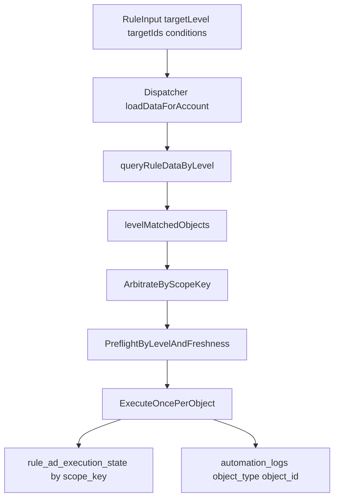

# 同层闭环残留问题修复计划

## 背景

当前系统已经完成 `targetLevel` 合同、typed snapshot、执行层按 `campaign/adset` 分发、通用审计字段等基础改造，但主执行链路仍存在与原方案不一致的残留缺口。核心偏差是：

- 调度与单条执行主链仍以 `ad_id` 为中心，`campaign/adset` 规则会先展开为多条广告，再逐广告判断、逐广告仲裁、逐广告写日志。
- 已实现的同层聚合入口 `queryRuleDataByLevel(...)` 还没有接入主链路。
- `Pre-flight` 在 `campaign/adset` 下仍依赖 `matchedAd.status`，没有真正读取同层状态源。
- 冷却键与审计日志在部分调度路径仍带有 ad 语义。
- 方案要求的灰度开关 `RULE_LEVEL_EXECUTION_V2` 只存在于文档，没有真正进入代码控制流。

## 当前残留问题与证据

### 1. 同层聚合查询未接入主链路

- [server/services/ruleEngineDispatcher.js](server/services/ruleEngineDispatcher.js)
  - 当前 `loadDataForAccount()` 统一收集 `unionAdIds`，然后直接调用 `queryRuleData(accountId, unionAdIds, ...)`。
  - `evaluateRuleWithCache()` 也是按 `ad_id` 过滤和逐条判断。
- [server/services/ruleDataService.js](server/services/ruleDataService.js)
  - `queryRuleDataByLevel(accountId, objectIds, level, ...)` 已实现，但未被主链路调用。

### 2. campaign/adset 规则仍按 ad 粒度命中与执行

- [server/index.js](server/index.js)
  - `evaluateRuleWithData()` 逐条遍历 `ruleDataArray`，每条命中都产出一个 `matchedAd`。
- [server/services/cronService.js](server/services/cronService.js)
  - 当前仍是“全量评估 -> 按 `ad_id` 仲裁 -> 执行”。
  - 这会导致同一 `campaign/adset` 下多条 ad 同时命中时，重复执行、重复写日志。

### 3. 同层 Pre-flight 状态源未真正切换

- [server/services/actionExecutorService.js](server/services/actionExecutorService.js)
  - `pause_ad/activate_ad` 在 `campaign/adset` 分发前，仍用 `matchedAd.status` 做 `Pre-flight`。
  - 这与原方案要求的：`ad -> ad_snapshots.status`、`adset -> structure_adsets.effective_status`、`campaign -> structure_campaigns.effective_status` 不一致。

### 4. 冷却键读写存在层级不一致风险

- [server/services/cronService.js](server/services/cronService.js)
  - 调度过滤阶段使用 `status_adset:*` / `status_campaign:*`。
  - `buildStatusCooldownKey()` fallback 又会返回 `ad:*`。
  - 执行完成后还会额外双写 `status_ad:${adId}`，可能污染广告级规则的冷却语义。
- [server/services/ruleExecutionStateService.js](server/services/ruleExecutionStateService.js)
  - 冷却表主键是 `(rule_id, scope_key)`，支持层级键，但当前上游未彻底统一。

### 5. 调度/Batch 审计日志对象字段仍可能失真

- [server/services/cronService.js](server/services/cronService.js)
  - `writeBatchStatusAuditLog()` 当前把 `objectId` 固定成 `matchedAd.ad_id`，与 `targetLevel=campaign/adset` 不一致。
- [server/services/actionExecutorService.js](server/services/actionExecutorService.js)
  - 单条执行路径对 `objectType/objectId` 推导较完整，但与调度路径不一致。

### 6. 时间窗与灰度控制未真正闭环

- [server/index.js](server/index.js)、[server/services/ruleDataService.js](server/services/ruleDataService.js)
  - `time_window` 直接透传，像 `last_30d` 这样的别名不会统一归一化到内部枚举 `last_30_days`。
- [server/tests/ruleEngineDispatcher.test.js](server/tests/ruleEngineDispatcher.test.js)
  - 现有测试仍是 ad 级缓存与评估测试，没有覆盖 `campaign/adset` 的“聚合一次、执行一次”。
- [`.cursor/plans/1方案b增强版执行计划：同层闭环规则执行改造_55d3dff9.plan.md`](.cursor/plans/1方案b增强版执行计划：同层闭环规则执行改造_55d3dff9.plan.md)
  - 文档声明了 `RULE_LEVEL_EXECUTION_V2=1`，但代码中尚未接线。

## 目标架构（修复后）

## 修复里程碑

## 里程碑1：接通同层聚合主路径

### [目标]

让 `campaign/adset` 规则真正走 `queryRuleDataByLevel(...)`，而不是继续复用 ad 级 `queryRuleData(...)`。

### [具体改动方案]

1. 修改 [server/services/ruleEngineDispatcher.js](server/services/ruleEngineDispatcher.js)：

   - `resolveTargetAdIdsForRule()` 拆成两层语义：
     - `targetObjectIdsByRuleId`：真实目标对象 ID（`ad_id / ad_set_id / campaign_id`）
     - `targetAdIdsByRuleId`：仅在 ad 级兼容路径保留
   - `cacheKey` 从 `timeWindow[:customRange]` 升级为 `level:timeWindow[:customRange]`。

2. 在 `loadDataForAccount()` 中：

   - `ad` 规则继续走 `queryRuleData(...)`
   - `adset/campaign` 改走 `queryRuleDataByLevel(accountId, objectIds, level, ...)`

3. 在 `evaluateRuleWithCache()` 中：

   - 不再默认按 `ad_id` 过滤 `fullData`
   - 对 non-ad 规则直接评估聚合后的对象数组

### [验收标准]

- `campaign/adset` 规则缓存内只存在聚合对象行，而不是多条 ad 行。
- 主链路中出现实际调用 `queryRuleDataByLevel(...)`。

## 里程碑2：把“命中与执行单位”从 ad 改为 scopeKey

### [目标]

实现“一个 `campaign/adset` 只判断一次、只执行一次、只写一条日志”。

### [具体改动方案]

1. 修改 [server/index.js](server/index.js) 的命中结果模型：

   - 为 non-ad 规则产出统一的 `matchedObject`，而不是沿用 ad 形态的 `matchedAd`。
   - `matchedObject` 至少包含：`objectType`、`objectId`、`objectName`、`statusSourceRef`、聚合指标字段。

2. 修改 [server/services/cronService.js](server/services/cronService.js)：

   - 用 `arbitrateByScopeKey()` 取代当前 `arbitrateByAdId()`，或在仲裁前先按 `scopeKey` 去重。
   - 调度路径的 `pairs` 从 `{ ruleId, scopeKey, matchedAd }` 改成 `{ ruleId, scopeKey, matchedObject }`。

3. 修改 [server/services/actionExecutorService.js](server/services/actionExecutorService.js)：

   - 新增/重构 `executeActionsForObject()`，以聚合对象为输入。
   - 对状态类动作保证同一 `campaign/adset` 每轮最多执行一次。

### [验收标准]

- 同一 `campaign` 下多条 ad 命中时，只产生一条执行计划。
- 同一 `campaign` 执行后只落一条真实对象日志。

## 里程碑3：修正同层 Pre-flight 与状态可信度门禁

### [目标]

让 `Pre-flight` 真正读取同层状态源，并在数据不可信时降级 `direct_api_fallback`。

### [具体改动方案]

1. 在 [server/services/actionExecutorService.js](server/services/actionExecutorService.js) 抽离 `loadPreflightStatusByLevel()`：

   - `ad` 读取 `ad_snapshots.status`
   - `adset` 读取 `structure_adsets.effective_status`
   - `campaign` 读取 `structure_campaigns.effective_status`

2. 引入新鲜度判断：

   - 使用 `structure_sync_status.last_heartbeat_data_update_at`
   - 阈值固定 `30` 分钟

3. 若状态缺失或超时：

   - 不做本地 `Pre-flight`
   - `preflightMode = direct_api_fallback`

4. 同步修改 [server/services/cronService.js](server/services/cronService.js) 的非单条执行路径，避免继续批量刷新广告 `effective_status` 来代替父级状态。

### [验收标准]

- `campaign/adset` 的 `Pre-flight` 不再依赖 `matchedAd.status`。
- 过期状态下仍可执行，但日志明确记 `direct_api_fallback`。

## 里程碑4：统一冷却键语义并验证执行时间窗

### [目标]

让 `rule_ad_execution_state` 在 `campaign/adset` 下真正按父级对象生效，不再混入 ad 级污染键。

### [具体改动方案]

1. 修改 [server/services/cronService.js](server/services/cronService.js)：

   - `buildStatusCooldownKey()` fallback 统一为 `status_ad:*`，禁止出现 `ad:*` 与 `status_ad:*` 混用。
   - 对 `campaign/adset` 状态动作移除“无条件补写 `status_ad:${adId}`”逻辑。

2. 保持 [server/services/ruleExecutionStateService.js](server/services/ruleExecutionStateService.js) 现有 `(rule_id, scope_key)` 结构不变，只修正上游写入语义。
3. 用调度路径验证 `executionTimeWindows`：

   - 仅 `fromScheduler=true` 的路径读写冷却表与执行时间窗
   - 计划中增加专门的集成测试覆盖 `campaign/adset` 的 outside_window / suppressed / success 三态

### [验收标准]

- `campaign/adset` 规则只写 `status_campaign:*` / `status_adset:*`。
- outside_window / suppressed 在父级对象下生效，不依赖底层 ad 数量。

## 里程碑5：修正审计日志与批量路径对象真实性

### [目标]

确保所有路径都以真实目标对象写日志，不再出现 `targetLevel=campaign` 但 `object_id=ad_id` 的情况。

### [具体改动方案]

1. 修改 [server/services/cronService.js](server/services/cronService.js) 中的 `writeBatchStatusAuditLog()`：

   - 复用 [server/services/actionExecutorService.js](server/services/actionExecutorService.js) 的目标解析规则
   - `objectType/objectId/objectName` 统一写真实对象

2. 对 Batch 路径做边界收缩：

   - 保持“仅 ad 级状态动作可 Batch”
   - `campaign/adset` 一律走单对象路径，避免日志与执行脱节

3. 校正 `preflightMode`：

   - `preflight` / `direct_api_fallback` / `null` 三态真正区分

### [验收标准]

- 单条执行与调度执行两条路径的审计对象字段语义一致。
- 同一个 `campaign` 不再出现多条 ad 级 objectId 伪装成 campaign 日志。

## 里程碑6：补上时间窗归一化与灰度开关

### [目标]

消除 `time_window` 别名问题，并把方案中的灰度与回滚能力真正接线。

### [具体改动方案]

1. 在规则保存或规则读取评估前统一归一化 `time_window`：

   - `last_3d -> last_3_days`
   - `last_7d -> last_7_days`
   - `last_30d -> last_30_days`

2. 在主链路接入 `RULE_LEVEL_EXECUTION_V2`：

   - `off`：保留旧 ad 口径
   - `on`：启用新的同层聚合 + 单对象执行路径

3. 在文档和代码中同步明确灰度、回滚与默认值。

### [验收标准]

- 手工 API 与前端保存出的 `time_window` 都能被读侧识别。
- 关闭 `RULE_LEVEL_EXECUTION_V2` 后可回退到当前稳定旧路径。

## 里程碑7：补齐测试与最小风险验证矩阵

### [目标]

让残留问题变成可回归、可证明修复的测试资产。

### [具体改动方案]

1. 修改/新增测试：

   - [server/tests/ruleEngineDispatcher.test.js](server/tests/ruleEngineDispatcher.test.js)
   - [server/tests/ruleDataService.test.js](server/tests/ruleDataService.test.js)
   - 新增 `server/tests/cronService.level-execution.test.js`
   - 新增 `server/tests/actionExecutorService.preflight.test.js`

2. 覆盖场景：

   - `campaign` 聚合后只命中一次
   - 同一 `campaign` 下 2 条 ad 同时满足条件时，只执行一次、只写一条日志
   - `status_campaign:*` / `status_adset:*` 冷却键读写
   - `executionTimeWindows` 在调度路径下对父级对象生效
   - `preflightMode=direct_api_fallback` 的过期场景
   - `RULE_LEVEL_EXECUTION_V2` 开/关双路径测试

3. 本地验证顺序：

   - `npm test`
   - `npm run build`
   - 模拟运行优先
   - 如必须真实 POST，仅允许单账户单广告系列最小范围执行

### [验收标准]

- 新增测试能直接复现并防住本次发现的缺口。
- 文档要求的“同层聚合判断后只执行一次”有自动化测试佐证。

## 验证与发布建议

### [模拟验证优先]

- 所有 `campaign/adset` 状态动作默认 `isSimulation=true`
- 先验证：命中数、日志唯一性、cooldown key、preflightMode

### [真实验证最小化]

- 仅在以下条件下允许真实 POST：
  - 单账户
  - 单 `campaign_id`
  - `targetIds` 仅 1 条
  - 云端与本地单活
  - 执行前后明确记录 FB 后台状态

### [发布顺序]

1. 先补测试
2. 再接灰度开关
3. 先灰度 `RULE_LEVEL_EXECUTION_V2=0/1` 对照验证
4. 通过后再上线父级真实动作

## 交付物

- 一份新的残留修复设计与执行文档
- 主链路修复代码清单
- 同层聚合/单对象执行/冷却/Pre-flight 的测试用例
- 一份最小风险真实验证记录