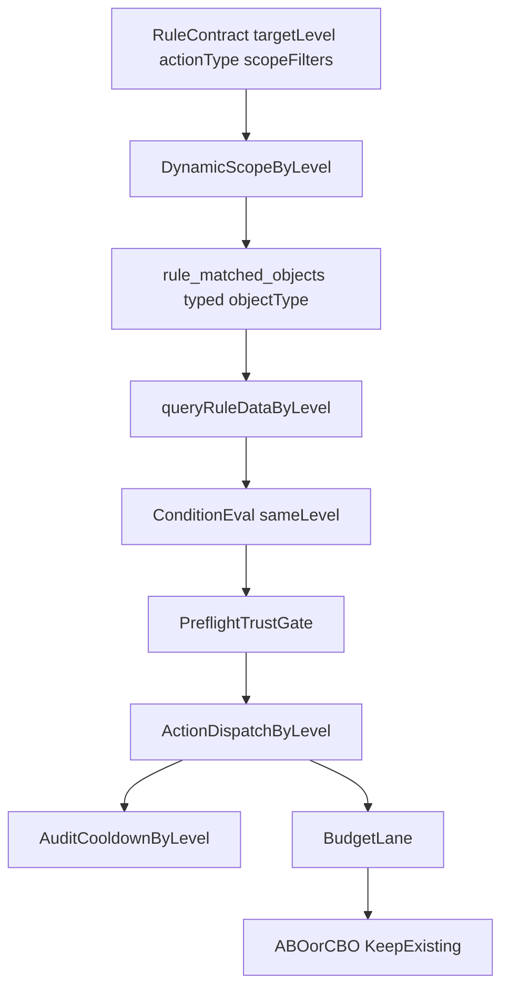

# 方案B增强版执行计划：同层闭环规则执行改造

## 背景与本次补强目标

在既有方案B基础上，补入三个高风险约束并落成可执行门禁：

- Pre-flight 状态源可信度门禁（避免旧状态误判）
- 聚合 SQL 性能门禁（避免全表扫描和定时任务压垮 MySQL）
- 动作语义映射门禁（避免 `pause_ad` 在多层级语义歧义）

## 现状证据（为什么必须补强）

- 动态快照与执行读取当前仍偏 ad 语义：
  - [server/services/dynamicScopeService.js](/root/work/FB-Ad-Logic-Engine/server/services/dynamicScopeService.js)
  - [server/services/ruleEngineDispatcher.js](/root/work/FB-Ad-Logic-Engine/server/services/ruleEngineDispatcher.js)
  - [server/db/schema.js](/root/work/FB-Ad-Logic-Engine/server/db/schema.js)
- 状态动作执行当前仍以 ad 为中心：
  - [server/services/actionExecutorService.js](/root/work/FB-Ad-Logic-Engine/server/services/actionExecutorService.js)
- 预算动作已具备 ABO/CBO 智能路由，可保留：
  - [server/services/actionExecutorService.js](/root/work/FB-Ad-Logic-Engine/server/services/actionExecutorService.js)
  - [server/index.js](/root/work/FB-Ad-Logic-Engine/server/index.js)

## 增强后的目标架构

## 里程碑与落地细节

### M1 合同层（动作语义与兼容）

- 定义统一语义：
  - 外部 `action.type` 允许继续传 `pause_ad/activate_ad`（兼容历史）
  - 后端内部映射为 `pause_target/activate_target`，执行目标由 `targetLevel` 决定
- 明确冲突处理：
  - 若后续新增 `pause_adset/pause_campaign`，与 `targetLevel` 不一致时直接 400 拒绝
- 文档化并在接口校验中落地：
  - [server/routes/rules.js](/root/work/FB-Ad-Logic-Engine/server/routes/rules.js)
  - [server/services/rulesService.js](/root/work/FB-Ad-Logic-Engine/server/services/rulesService.js)
  - [src/views/RuleManager.vue](/root/work/FB-Ad-Logic-Engine/src/views/RuleManager.vue)

### M2 动态筛选同层产出（typed snapshot）

- `targetLevel=ad|adset|campaign` 分别产出对应对象 ID
- `rule_matched_objects.object_type` 实际启用三值，不再默认固定 ad
- 排除逻辑按同层处理（不跨层下钻）
- 涉及文件：
  - [server/services/dynamicScopeService.js](/root/work/FB-Ad-Logic-Engine/server/services/dynamicScopeService.js)
  - [server/db/schema.js](/root/work/FB-Ad-Logic-Engine/server/db/schema.js)
  - [server/db/migrations](/root/work/FB-Ad-Logic-Engine/server/db/migrations)

### M3 同层聚合判断（性能门禁必须通过）

- 新增 `queryRuleDataByLevel(accountId, objectIds, level, timeWindow, timezone, customRange)`
- 聚合规则：先累加分子分母，再计算派生指标（ROAS/CPA/UCPC 等）
- SQL 性能门禁（P0）：
  - 每条核心 SQL 提供 `EXPLAIN`
  - 禁止 `type=ALL`/全表扫描
  - 补充复合索引并与 where/group by 对齐（示例）：
    - `daily_stats(account_id, date, ad_set_id)`
    - `daily_stats(account_id, date, campaign_id)`
    - `ad_snapshots(account_id, data_date, ad_set_id)`
    - `ad_snapshots(account_id, data_date, campaign_id)`
- 涉及文件：
  - [server/services/ruleDataService.js](/root/work/FB-Ad-Logic-Engine/server/services/ruleDataService.js)
  - [server/services/ruleEngineDispatcher.js](/root/work/FB-Ad-Logic-Engine/server/services/ruleEngineDispatcher.js)

### M4 执行层同层化（Pre-flight 可信度门禁）

- 新增 API 客户端动作：
  - `pauseAdset/activateAdset`
  - `pauseCampaign/activateCampaign`
- 状态动作分发：
  - `ad` -> ad
  - `adset` -> adset
  - `campaign` -> campaign
- Pre-flight 可信度门禁（P0）：
  - 仅当同层状态数据“存在 + 新鲜”时执行 pre-flight
  - 若状态源不可信：跳过 pre-flight，直接下发 API，并依赖 `already-in-state` 容错
- 状态新鲜度建议：
  - 通过结构同步最近更新时间判断（阈值默认 30 分钟，可配置）
- 涉及文件：
  - [server/index.js](/root/work/FB-Ad-Logic-Engine/server/index.js)
  - [server/services/actionExecutorService.js](/root/work/FB-Ad-Logic-Engine/server/services/actionExecutorService.js)
  - [server/services/cronService.js](/root/work/FB-Ad-Logic-Engine/server/services/cronService.js)

### M5 可观测性与运营可理解性

- 冷却键按层级区分：`status_ad:*` / `status_adset:*` / `status_campaign:*`
- 审计日志追加：`targetLevel/objectType/preflightMode(preflight|direct_api_fallback)`
- 前端文案明确：状态动作作用于“目标层级对象”，预算动作仍智能路由
- 涉及文件：
  - [server/services/ruleExecutionStateService.js](/root/work/FB-Ad-Logic-Engine/server/services/ruleExecutionStateService.js)
  - [src/utils/ruleAuditNarrative.js](/root/work/FB-Ad-Logic-Engine/src/utils/ruleAuditNarrative.js)
  - [src/views/RuleManager.vue](/root/work/FB-Ad-Logic-Engine/src/views/RuleManager.vue)

## 新增P0隐患与防护（必须执行）

- 状态旧数据误判：
  - 防护：Pre-flight 信任门禁 + 不可信时降级 direct API
- 聚合慢查询：
  - 防护：EXPLAIN 门禁 + 复合索引 + 分批执行 + 限流
- 动作语义漂移：
  - 防护：合同层动作映射文档化 + 接口校验 + 审计输出内部语义

## 验收标准（可量化）

- 合同层：
  - `pause_ad + targetLevel=campaign` 能被明确映射且审计可见
- 性能层：
  - 核心聚合 SQL `EXPLAIN` 不出现全表扫描
  - 定时任务在目标规模下达到约定 SLA（建议 p95 单账户评估耗时阈值）
- 执行层：
  - `ad/adset/campaign` 三层状态动作均可成功执行
  - 状态源不可信场景下仍可执行且不误跳过
- 回归层：
  - 预算动作 ABO/CBO 行为与改造前一致
  - 历史 ad 规则结果与改造前一致

## 发布与回滚

- 灰度开关：`RULE_LEVEL_EXECUTION_V2=1`
- 分步发布：
  - 先上 M1+M2（合同与快照）
  - 再灰度 M3+M4（先小 owner 集）
  - 最后全量 M5
- 回滚：关闭开关回退到 ad 口径；migration 保留不回滚结构

## 交付物

- 增强版设计文档（含动作映射、pre-flight 信任门禁、SQL 索引策略）
- migration 与索引变更说明
- 单测/集成/压测与 EXPLAIN 报告
- 灰度与回滚操作手册