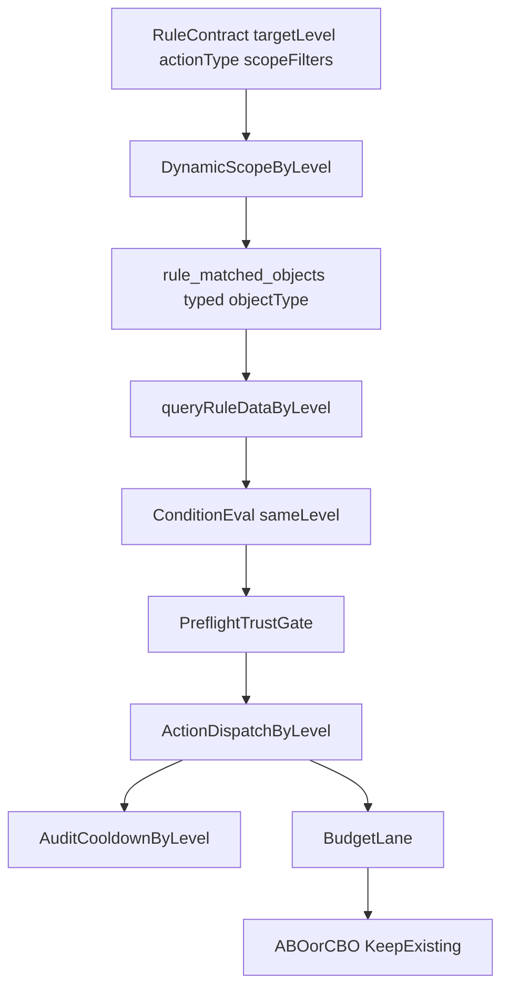

# 方案B增强版执行计划：同层闭环规则执行改造

## 背景与本次补强目标

在既有方案B基础上，补入五个高风险约束并落成可执行门禁：

- 动作持久化合同门禁（避免一次性改写 actions 历史数据）
- typed snapshot 唯一键与索引门禁（避免跨层 object_id 冲突）
- Pre-flight 状态源可信度门禁（避免旧状态误判）
- 聚合 SQL 性能门禁（避免全表扫描和定时任务压垮 MySQL）
- 审计日志对象模型门禁（避免 ad 语义绑死导致上线后日志失真）

## 现状证据（为什么必须补强）

- 动态快照与执行读取当前仍偏 ad 语义：
  - [server/services/dynamicScopeService.js](/root/work/FB-Ad-Logic-Engine/server/services/dynamicScopeService.js)
  - [server/services/ruleEngineDispatcher.js](/root/work/FB-Ad-Logic-Engine/server/services/ruleEngineDispatcher.js)
  - [server/db/schema.js](/root/work/FB-Ad-Logic-Engine/server/db/schema.js)
- 状态动作执行当前仍以 ad 为中心：
  - [server/services/actionExecutorService.js](/root/work/FB-Ad-Logic-Engine/server/services/actionExecutorService.js)
- 合同校验与前端文案当前直接依赖旧动作枚举：
  - [server/utils/templateValidator.js](/root/work/FB-Ad-Logic-Engine/server/utils/templateValidator.js)
  - [server/utils/actionPriority.js](/root/work/FB-Ad-Logic-Engine/server/utils/actionPriority.js)
  - [src/utils/ruleAuditNarrative.js](/root/work/FB-Ad-Logic-Engine/src/utils/ruleAuditNarrative.js)
- 预算动作已具备 ABO/CBO 智能路由，可保留：
  - [server/services/actionExecutorService.js](/root/work/FB-Ad-Logic-Engine/server/services/actionExecutorService.js)
  - [server/index.js](/root/work/FB-Ad-Logic-Engine/server/index.js)
- 审计日志表当前以 `ad_id/ad_name` 为核心字段：
  - [server/db/schema.js](/root/work/FB-Ad-Logic-Engine/server/db/schema.js)
  - [server/routes/system.js](/root/work/FB-Ad-Logic-Engine/server/routes/system.js)

## 硬合同（先定死）

### 合同 1：动作持久化边界

- `持久化合同 = rules.actions[*].type 在数据库中继续保存现有枚举`
- 当前允许值继续使用：
  - `pause_ad`
  - `activate_ad`
  - `increase_budget`
  - `decrease_budget`
  - `set_budget`
- `执行层映射 = 真正执行前，根据 targetLevel 把 pause_ad/activate_ad 解释成对 ad、adset 或 campaign 的状态动作`
- 本期不把库内动作类型整体改写为 `pause_target/activate_target`

### 合同 2：typed snapshot 存储模型

- `object_type` 真实生效，允许值固定为：
  - `ad`
  - `adset`
  - `campaign`
- `object_id = 同层对象 ID`
- 唯一键必须升级为：
  - `(rule_id, account_id, object_type, object_id)`
- 原因：
  - 不同层级对象 ID 在字符串层面可能发生碰撞
  - 旧唯一键 `(rule_id, account_id, object_id)` 不能安全承载多层对象

### 合同 3：状态源与新鲜度

- `ad` 层状态源：
  - `ad_snapshots` 最新记录的 `status`
- `adset` 层状态源：
  - `structure_adsets.effective_status`
- `campaign` 层状态源：
  - `structure_campaigns.effective_status`
- 新鲜度统一门禁：
  - `structure_sync_status.last_heartbeat_data_update_at >= NOW() - 30 MINUTE`
- 若状态缺失或超过 `30` 分钟：
  - 跳过本地 pre-flight
  - 直接走 `direct_api_fallback`
  - 依赖 FB `already-in-state` 容错

### 合同 4：审计日志兼容策略

- 新增通用字段：
  - `object_type`
  - `object_id`
  - `object_name`
  - `preflight_mode`
- 新写入日志采用“双写”：
  - 通用字段写真实目标对象
  - 旧 `ad_id/ad_name` 继续兼容写入，避免现有查询页立即失效
- 查询层升级顺序：
  - 先读通用字段
  - 无通用字段再回退读旧 `ad_id/ad_name`

## 增强后的目标架构

## 里程碑与落地细节

### M1 合同层（动作语义与兼容）

- 定义统一语义：
  - 外部 `action.type` 继续传 `pause_ad/activate_ad`（兼容历史）
  - 数据库存量与新增规则继续保存 `pause_ad/activate_ad`
  - 后端内部新增“执行意图解析层”，执行目标由 `targetLevel` 决定
- 明确冲突处理：
  - 若后续新增 `pause_adset/pause_campaign`，与 `targetLevel` 不一致时直接 400 拒绝
- 本期落地边界：
  - `templateValidator/actionPriority/ruleAuditNarrative` 不切换到新持久化枚举
  - 仅在执行分发前生成内部变量，例如 `resolvedStatusTargetLevel` / `resolvedStatusOp`
- 文档化并在接口校验中落地：
  - [server/routes/rules.js](/root/work/FB-Ad-Logic-Engine/server/routes/rules.js)
  - [server/utils/templateValidator.js](/root/work/FB-Ad-Logic-Engine/server/utils/templateValidator.js)
  - [server/services/actionExecutorService.js](/root/work/FB-Ad-Logic-Engine/server/services/actionExecutorService.js)
  - [src/views/RuleManager.vue](/root/work/FB-Ad-Logic-Engine/src/views/RuleManager.vue)

### M2 动态筛选同层产出（typed snapshot）

- `targetLevel=ad|adset|campaign` 分别产出对应对象 ID
- `rule_matched_objects.object_type` 实际启用三值，不再默认固定 ad
- `rule_matched_objects.object_id` 改为“同层对象 ID”，不再总是 ad_id
- migration 要求：
  - 旧唯一键 `(rule_id, account_id, object_id)` 替换为 `(rule_id, account_id, object_type, object_id)`
  - 新增索引 `idx_account_rule_type(account_id, rule_id, object_type)`
- 排除逻辑按同层处理（不跨层下钻）
- 涉及文件：
  - [server/services/dynamicScopeService.js](/root/work/FB-Ad-Logic-Engine/server/services/dynamicScopeService.js)
  - [server/db/schema.js](/root/work/FB-Ad-Logic-Engine/server/db/schema.js)
  - [server/db/migrations](/root/work/FB-Ad-Logic-Engine/server/db/migrations)

### M3 同层聚合判断（性能门禁必须通过）

- 新增 `queryRuleDataByLevel(accountId, objectIds, level, timeWindow, timezone, customRange)`
- 聚合规则：先累加分子分母，再计算派生指标（ROAS/CPA/UCPC 等）
- SQL 性能门禁（P0）：
  - 每条核心 SQL 提供 `EXPLAIN`
  - 禁止 `type=ALL`/全表扫描
  - 补充复合索引并与 where/group by 对齐（示例）：
    - `daily_stats(account_id, date, ad_set_id)`
    - `daily_stats(account_id, date, campaign_id)`
    - `ad_snapshots(account_id, data_date, ad_set_id)`
    - `ad_snapshots(account_id, data_date, campaign_id)`
- 基准样本固定为：
  - `1` 个账户
  - `5000` 个 ad
  - `500` 个 adset
  - `100` 个 campaign
  - `50` 条启用规则
- 验收阈值固定为：
  - 单条核心聚合 SQL `p95 <= 500 ms`
  - 单账户完整评估 `p95 <= 3000 ms`
  - `EXPLAIN` 中 `type=ALL` 出现次数必须为 `0`
- 涉及文件：
  - [server/services/ruleDataService.js](/root/work/FB-Ad-Logic-Engine/server/services/ruleDataService.js)
  - [server/services/ruleEngineDispatcher.js](/root/work/FB-Ad-Logic-Engine/server/services/ruleEngineDispatcher.js)

### M4 执行层同层化（Pre-flight 可信度门禁）

- 新增 API 客户端动作：
  - `pauseAdset/activateAdset`
  - `pauseCampaign/activateCampaign`
- 状态动作分发：
  - `ad` -> ad
  - `adset` -> adset
  - `campaign` -> campaign
- Pre-flight 可信度门禁（P0）：
  - 仅当同层状态数据“存在 + 新鲜”时执行 pre-flight
  - `ad` 读 `ad_snapshots.status`
  - `adset` 读 `structure_adsets.effective_status`
  - `campaign` 读 `structure_campaigns.effective_status`
  - 新鲜度统一使用 `last_heartbeat_data_update_at`，阈值固定 `30` 分钟
  - 若状态源不可信：跳过 pre-flight，直接下发 API，并依赖 `already-in-state` 容错
- 预算动作边界：
  - ABO/CBO 路由保持现状
  - 本期只改状态动作同层化，不改预算语义
- 涉及文件：
  - [server/index.js](/root/work/FB-Ad-Logic-Engine/server/index.js)
  - [server/services/actionExecutorService.js](/root/work/FB-Ad-Logic-Engine/server/services/actionExecutorService.js)
  - [server/services/cronService.js](/root/work/FB-Ad-Logic-Engine/server/services/cronService.js)

### M5 可观测性与运营可理解性

- 冷却键按层级区分：`status_ad:*` / `status_adset:*` / `status_campaign:*`
- 审计日志追加：`targetLevel/objectType/objectId/objectName/preflightMode(preflight|direct_api_fallback)`
- 审计日志兼容策略：
  - 新字段记录真实对象
  - 旧 `ad_id/ad_name` 暂时保留兼容写入
  - 列表页/详情页优先展示通用对象字段
- 前端文案明确：状态动作作用于“目标层级对象”，预算动作仍智能路由
- 涉及文件：
  - [server/services/ruleExecutionStateService.js](/root/work/FB-Ad-Logic-Engine/server/services/ruleExecutionStateService.js)
  - [server/db/schema.js](/root/work/FB-Ad-Logic-Engine/server/db/schema.js)
  - [src/utils/ruleAuditNarrative.js](/root/work/FB-Ad-Logic-Engine/src/utils/ruleAuditNarrative.js)
  - [src/views/RuleManager.vue](/root/work/FB-Ad-Logic-Engine/src/views/RuleManager.vue)

## 新增P0隐患与防护（必须执行）

- 状态旧数据误判：
  - 防护：Pre-flight 信任门禁 + 不可信时降级 direct API
- 聚合慢查询：
  - 防护：EXPLAIN 门禁 + 复合索引 + 分批执行 + 限流
- 动作语义漂移：
  - 防护：旧枚举继续入库 + 执行层解析 + 接口校验 + 审计输出真实 targetLevel
- 多层对象 ID 冲突：
  - 防护：typed snapshot 唯一键包含 `object_type`
- 审计日志失真：
  - 防护：新增通用对象字段 + 双写兼容 + 查询层优先读新字段

## 验收标准（可量化）

- 合同层：
  - `pause_ad + targetLevel=campaign` 能被明确映射且不改写库内 actions 历史值
- 快照层：
  - `rule_matched_objects` 能同时正确存储 `ad/adset/campaign` 三层对象
  - 唯一键不出现跨层冲突
- 性能层：
  - 核心聚合 SQL `EXPLAIN` 不出现全表扫描
  - 单条核心聚合 SQL `p95 <= 500 ms`
  - 单账户完整评估 `p95 <= 3000 ms`
- 执行层：
  - `ad/adset/campaign` 三层状态动作均可成功执行
  - 状态源不可信场景下仍可执行且不误跳过
- 回归层：
  - 预算动作 ABO/CBO 行为与改造前一致
  - 历史 ad 规则结果与改造前一致
- 审计层：
  - 新日志可展示真实对象层级与对象 ID
  - 历史日志查询页不因新字段上线而失效

## 发布与回滚

- 灰度开关：`RULE_LEVEL_EXECUTION_V2=1`
- 分步发布：
  - 先执行 migration（typed snapshot 唯一键/索引、automation_logs 新字段）
  - 再发布后端代码
  - 最后灰度开启 `RULE_LEVEL_EXECUTION_V2=1`
  - 灰度范围先限定小 owner 集，再逐步放量
- 回滚：
  - 关闭 `RULE_LEVEL_EXECUTION_V2`，执行链路回退到 ad 口径
  - migration 不回滚，结构字段保留
  - 查询层继续兼容读旧字段，避免回滚时日志页异常

## 本地验收清单

1. 命令：
   - `npm test`
   - `npm run build`
   - `npm run dev:all`
2. 手工验证：
   - `ad/adset/campaign` 三层 pause/activate
   - `last_heartbeat_data_update_at` 新鲜与过期两类 pre-flight
   - ABO/CBO 预算回归
   - typed snapshot 三层写入与读取
   - 自动化日志展示真实对象层级
3. 压测与 SQL 验证：
   - 输出 3 份 `EXPLAIN` 报告：`ad/adset/campaign`
   - 输出 1 份本地压测报告：`50` 条规则、`1` 账户、目标规模按本方案固定样本

## 交付物

- 增强版设计文档（含动作映射、pre-flight 信任门禁、SQL 索引策略）
- migration 与索引变更说明
- 单测/集成/压测与 EXPLAIN 报告
- 灰度与回滚操作手册