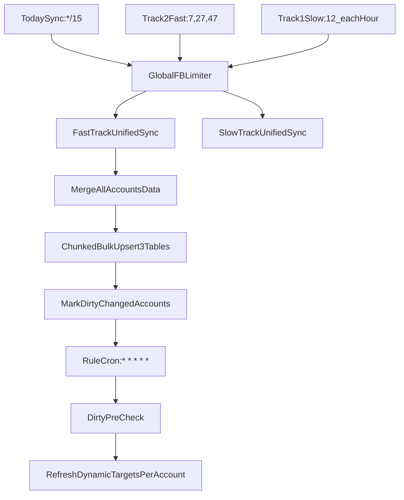

# Track1+Track2 最终执行方案（按你确认口径）

## 目标

- 将结构可见时效提升到 20 分钟级，同时保持配额安全与数据一致性。
- 采用双轨：Track2 主时效，Track1 兜底校准。

## 已确认的实现取舍

- Track2 分页策略：**默认不分页循环**，但若返回 `paging.next` 则对该 edge 做**轻量补页**（soft guard）。
- 入库策略：**全账户合并后分块批量 Upsert**（而不是单次超大 SQL）。

## 架构与调度

## 具体落地步骤

### 1) 提供统一 Batch 同步内核（unifiedSync）

- 文件：
  - [d:/projects/FB-Ad-Logic-Engine/server/index.js](d:/projects/FB-Ad-Logic-Engine/server/index.js)
  - [d:/projects/FB-Ad-Logic-Engine/server/services/structureSyncService.js](d:/projects/FB-Ad-Logic-Engine/server/services/structureSyncService.js)
- 动作：
  - 在 `FacebookMarketingAPI` 增加三边 Batch 方法（campaigns/adsets/ads 同批）。
  - 字段固定包含：
    - campaigns: `id,name,status,effective_status,updated_time,created_time`
    - adsets: `id,name,status,effective_status,updated_time,created_time,campaign_id`
    - ads: `id,name,status,effective_status,configured_status,updated_time,created_time,adset_id,campaign_id`
  - filtering 统一 `updated_time > sinceSec`，`limit=500`。

### 2) Track2（每20分钟，全账户）

- 文件：
  - [d:/projects/FB-Ad-Logic-Engine/server/services/cronService.js](d:/projects/FB-Ad-Logic-Engine/server/services/cronService.js)
  - [d:/projects/FB-Ad-Logic-Engine/server/services/structureSyncService.js](d:/projects/FB-Ad-Logic-Engine/server/services/structureSyncService.js)
- 调度建议：`7,27,47 * * * *`（错峰）。
- 账户规模：36 个全覆盖。
- 并发：账户级 `p-limit(10)`。
- 动态滑窗：
  - `sinceSec = max(last_fast_sync_sec - 7200, now - 3d)`。
  - 即 2 小时缓冲，且不越过 3 天大窗。
- 软分页补页（你确认的口径）：
  - 首次只发一批三边请求；
  - 若某 edge 返回 `paging.next/after`，仅对该 edge 继续补页，直到该 edge 无 next。
  - 非 next edge 不再重复拉取。

### 3) Track1（每小时兜底轮转）

- 文件：
  - [d:/projects/FB-Ad-Logic-Engine/server/services/cronService.js](d:/projects/FB-Ad-Logic-Engine/server/services/structureSyncService.js)
- 调度建议：每小时 `:12` 触发，处理 6 账户（`p-limit(5)`）。
- 语义：`since=3d` 的三边增量校准。
- 风控：保留 `usage>=85%` 跳过与熔断跳过。

### 4) 全局并发闸门（防多任务撞车）

- 文件：
  - [d:/projects/FB-Ad-Logic-Engine/server/index.js](d:/projects/FB-Ad-Logic-Engine/server/index.js)
- 动作：
  - 在 FB 客户端层引入全局单例 limiter（建议 10）。
  - Today/Track1/Track2/归因等所有 FB 请求都经此 limiter。
- 结果：无论任务如何叠加，全系统发往 FB 的并发请求上限固定。

### 5) 全账户合拢 + 分块批量 Upsert

- 文件：
  - [d:/projects/FB-Ad-Logic-Engine/server/services/structureSyncService.js](d:/projects/FB-Ad-Logic-Engine/server/services/structureSyncService.js)
- 动作：
  - Track2 每轮先汇总 36 账户结果到 `allCampaigns/allAdsets/allAds`。
  - 按 `(account_id, object_id)` 去重（Map）。
  - 三张表分别做 chunked bulk upsert（如每块 200~500 行，视 SQL 包体调整）。
- 说明：
  - 采用分块可显著降低大事务锁风险、max packet 风险和单 SQL 回滚成本。

### 6) 空结果也推进同步水位

- 文件：
  - [d:/projects/FB-Ad-Logic-Engine/server/services/structureSyncService.js](d:/projects/FB-Ad-Logic-Engine/server/services/structureSyncService.js)
- 动作：
  - 只要账户 Batch 成功（code=200），无论 data 是否为空，都更新 `last_fast_sync_ts`。
  - 同步记录 `last_fast_filter_since_sec` 便于审计。
- 目的：防止窗口停滞导致重复查询。

### 7) Dirty Flag 联动与重置（避免重复刷新）

- 文件：
  - [d:/projects/FB-Ad-Logic-Engine/server/services/structureSyncService.js](d:/projects/FB-Ad-Logic-Engine/server/services/structureSyncService.js)
  - [d:/projects/FB-Ad-Logic-Engine/server/services/cronService.js](d:/projects/FB-Ad-Logic-Engine/server/services/cronService.js)
- 逻辑：
  - Track2 写库后，仅对“有变动”的账户标记 dirty。
  - 规则执行前检查 dirty：若为 true 先刷新目标快照。
  - **刷新成功必须清空 dirty**；失败则保留 dirty 并打告警/退避。

### 8) 时区与字段口径

- 保持现有 UTC 规范：`updated_time/created_time` 入库统一 UTC 语义。
- 继续保障“创建时间段”规则对 `created_time` 的稳定判断。

## 灰度与验收

- 开关：
  - `ENABLE_TRACK2_FAST_SYNC`
  - `ENABLE_UNIFIED_STRUCTURE_BATCH`
- 验收指标（3~7 天）：
  - 新广告可见性 P95 < 20 分钟。
  - Track2 每轮成功率 > 99%。
  - usage >85% 触发跳过时，Today/规则执行不受影响。
  - dirty 刷新成功后重复刷新率接近 0。

## 回滚策略

- 一键关闭 Track2（仅保留 Track1 现网路径）。
- 保留 Track1 全流程兜底，确保任何 Fast 逻辑异常不会导致结构长期缺失。