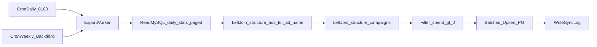

# FB 到 PG 数据导出执行方案

## 目标与边界

- 目标：每天凌晨 `01:00` 将“昨天”广告数据同步到对方 PG 表 `facebook_ads_daily_export`。
- 补偿：每周执行一次“近 7 天回补”，修正迟到归因或偶发失败。
- 过滤：仅同步 `spend > 0` 记录。
- 重试：同步失败后重试 1 次。
- 不改核心链路：采用独立 Export Worker，避免影响现有抓取与规则引擎。

## 字段合同（已确认）

- 业务字段（6）：`account_id`, `ad_id`, `ad_name`, `campaign_name`, `spend`, `stat_date`
- 审计字段（2）：`created_at`, `updated_at`
- 幂等键：`UNIQUE(account_id, ad_id, stat_date)`
- 口径：`stat_date` 取你库中 `daily_stats.date`（账户时区自然日）

## 现有代码与数据依据

- 日级数据写入与口径来源：[/root/work/FB-Ad-Logic-Engine/server/services/ingestorService.js](/root/work/FB-Ad-Logic-Engine/server/services/ingestorService.js)
  - 该文件对 `daily_stats` 使用 `insight.date_start || insight.date` 写入日期字段，且携带 `timezone_name`，说明日维度按账户时区自然日处理。
- 广告系列名称来源：[/root/work/FB-Ad-Logic-Engine/server/db/migrations/023_create_structure_campaigns.sql](/root/work/FB-Ad-Logic-Engine/server/db/migrations/023_create_structure_campaigns.sql)
  - `structure_campaigns` 含 `campaign_id` 与 `name`，可用于补齐 `campaign_name`。
- 广告名称兜底来源：[/root/work/FB-Ad-Logic-Engine/server/db/migrations/014_create_structure_ads.sql](/root/work/FB-Ad-Logic-Engine/server/db/migrations/014_create_structure_ads.sql)
  - `structure_ads` 含 `ad_id` 与 `name`（广告名称），当 `daily_stats.ad_name` 为空时可 `LEFT JOIN` 补齐。

## 实现补丁（工程必带，与业务约定一致）

以下条目在实现阶段必须落实，避免遗漏与线上风险：

| 项 | 说明 |
|----|------|
| Node 连接 PG | 在项目根目录执行 `npm install pg`，脚本使用 `pg` 连接 PostgreSQL；`psql` 仅用于人工建表与验收，不能替代驱动。 |
| `ad_name` 来源 | 主路径：`daily_stats.ad_name`（ingest 已写入，见 [ingestorService.js](/root/work/FB-Ad-Logic-Engine/server/services/ingestorService.js)）。兜底：若为空或空串，用 `COALESCE(daily_stats.ad_name, structure_ads.name)`，`LEFT JOIN structure_ads ON account_id + ad_id`。仍无则写 `NULL`。 |
| `campaign_name` 来源 | `LEFT JOIN structure_campaigns ON account_id + daily_stats.campaign_id`，取 `structure_campaigns.name`；缺失写 `NULL`。 |
| 分批读写 | MySQL 按主键或 `LIMIT/OFFSET`、或按 `id` 游标分页读取，每批建议 **500～1000** 行；PG 每批执行一次 `INSERT ... ON CONFLICT ... DO UPDATE`，避免单次拼出超大 SQL 导致 **OOM** 或 RDS 压力尖峰。 |
| 调度位置 | 使用 **Linux `crontab`（或 `systemd timer`）** 触发独立脚本，**不要**用主进程内 `setInterval` / `node-cron` 跑导出任务，保证与核心服务进程隔离。 |
| 防重入 | 建议 `flock -n /tmp/fb-export-to-pg.lock` 包裹 cron 行，避免任务重叠。 |
| 运行环境 | 生产任务在 **云服务器** 执行；同事已将 **该 ECS 出口 IP** 加入 RDS 白名单。 |

## 架构与数据流



## 实施步骤（Milestones）

### Milestone 0：PG 环境准备（本地 + 云上）

- 目标：不要求安装 PG 服务端，只安装 PG 客户端工具，满足建表、查询、排错与脚本联调。
- 安装范围：
  - **云服务器（必做）**：安装 `psql` 客户端；在项目根目录 `npm install pg`（供导出脚本使用）。
  - 本地开发机（可选）：安装 `psql` 便于本地联调。
- 连接信息：使用同事提供的 RDS 连接参数（host/port/db/user/password）。
- 安全建议：密码通过环境变量或受限配置文件注入，不明文写进脚本仓库。
- 网络：确保 RDS 白名单已包含 **运行导出脚本的 ECS 的出口 IP**（由同事在阿里云 RDS 控制台配置）。

建议命令（按系统择一执行）：

- 本地（Linux）：
  - `sudo dnf install -y postgresql` 或 `sudo apt-get install -y postgresql-client`
- 云服务器（Linux）：
  - `sudo dnf install -y postgresql` 或 `sudo apt-get install -y postgresql-client`
- 连通性测试：
  - `PGPASSWORD='你的密码' psql -h <host> -p 5432 -U <user> -d <db> -c 'select now();'`

最小使用命令（后续建表/验收会用到）：

- 查看表结构：`\\d facebook_ads_daily_export`
- 执行 SQL 文件：`psql -h <host> -p 5432 -U <user> -d <db> -f create_table.sql`
- 快速查询：`select stat_date, count(*) from facebook_ads_daily_export group by stat_date order by stat_date desc;`

验证步骤：

- 本地执行 `select now();` 成功返回时间。
- 云服务器执行 `select now();` 成功返回时间。
- 若连接失败，优先检查：RDS 白名单、安全组、端口 `5432`、账号权限。

### Milestone 1：建 PG 目标表与索引

- 创建表 `facebook_ads_daily_export`，字段与类型：
  - `account_id text not null`
  - `ad_id text not null`
  - `ad_name text null`
  - `campaign_name text null`
  - `spend numeric(12,2) not null`
  - `stat_date date not null`
  - `created_at timestamptz not null default now()`
  - `updated_at timestamptz not null default now()`
- 创建唯一约束：`unique(account_id, ad_id, stat_date)`。
- 创建常用查询索引：`(stat_date)`, `(campaign_name)`, `(ad_name)`（支持同事按名称查询）。

验证步骤：

- 在 PG 执行 `\d facebook_ads_daily_export`，确认列与唯一键正确。
- 执行重复插入同一 `(account_id, ad_id, stat_date)`，验证唯一约束生效。

### Milestone 2：实现独立同步脚本（旁路）

- 新建独立脚本（建议路径）：
  - [/root/work/FB-Ad-Logic-Engine/server/scripts/export-facebook-to-pg.js](/root/work/FB-Ad-Logic-Engine/server/scripts/export-facebook-to-pg.js)
- 依赖：在 [/root/work/FB-Ad-Logic-Engine/package.json](/root/work/FB-Ad-Logic-Engine/package.json) 增加 `pg` 依赖（`npm install pg`），MySQL 继续用现有 `mysql2` + `.env`。
- 查询源数据（单 SQL 思路示例）：
  - 主表：`daily_stats`，条件 `date = targetDate AND spend > 0`
  - `LEFT JOIN structure_campaigns sc ON sc.account_id = d.account_id AND sc.campaign_id = d.campaign_id`
  - `LEFT JOIN structure_ads sa ON sa.account_id = d.account_id AND sa.ad_id = d.ad_id`
  - 输出列：`ad_name = NULLIF(TRIM(COALESCE(d.ad_name, sa.name)), '')` 或等价逻辑（空则 `NULL`）
- 分批：从 MySQL **分页拉取**（每批 500～1000 行），每批对 PG 执行一次 **UPSERT**；禁止一次性 `SELECT *` 全表进内存再拼巨型 INSERT。
- 字段映射：
  - `daily_stats.date -> stat_date`
  - `daily_stats.spend -> spend`
  - `campaign_name <- structure_campaigns.name`
  - `ad_name <- COALESCE(daily_stats.ad_name, structure_ads.name)`
- 过滤条件：`daily_stats.spend > 0`
- 写入策略：PG `INSERT ... ON CONFLICT (account_id, ad_id, stat_date) DO UPDATE`
  - 更新列：`ad_name`, `campaign_name`, `spend`, `updated_at`
  - `created_at` 仅首次插入赋值。
- 失败重试：脚本内对**整次任务**失败重试 1 次（与 Milestone 3 一致）。

验证步骤：

- 手动执行一次 targetDate=昨天，核对“读取条数/写入条数/更新条数/失败条数”。
- 抽样 20 条对账：MySQL 与 PG 的 `account_id, ad_id, spend, stat_date` 一致。

### Milestone 3：调度与重试

- **调度方式**：使用运行导出脚本的那台云服务器的 **Linux `crontab`** 触发 Node 脚本，**不要**把定时逻辑写进 `server/server.js` 或常驻进程内的 `node-cron`。
- **防重入**：cron 行用 `flock` 保证同一时刻只有一个导出实例（示例见下）。
- 每日任务：`01:00` 运行，targetDate=昨天。
- 每周回补：固定每周一次（例如周日 `02:00`），调用脚本带 `--backfill-days=7` 或等价参数，循环 7 个 `stat_date` 逐日同步。
- 失败重试：单次任务失败后延迟短暂时间重试 1 次；仍失败则告警并退出非 0。

**Crontab 示例（路径与 node 以服务器实际为准）：**

```cron
# 每天 01:00：同步昨天（进程锁防止重叠）
0 1 * * * flock -n /tmp/fb-export-to-pg.lock -c 'cd /path/to/FB-Ad-Logic-Engine && /usr/bin/node server/scripts/export-facebook-to-pg.js --mode=yesterday >> /var/log/fb-export-to-pg.log 2>&1'

# 每周日 02:00：近 7 天回补
0 2 * * 0 flock -n /tmp/fb-export-to-pg-backfill.lock -c 'cd /path/to/FB-Ad-Logic-Engine && /usr/bin/node server/scripts/export-facebook-to-pg.js --backfill-days=7 >> /var/log/fb-export-to-pg.log 2>&1'
```

验证步骤：

- 人工触发“昨日同步”与“7天回补”各一次，确认幂等（重复执行不产生重复脏数据）。
- 人工制造一次 PG 连接失败，验证只重试 1 次且有明确错误日志。
- 确认 `flock`：任务执行中再次手动触发应快速跳过或等待（按你脚本策略），避免双实例。

### Milestone 4：交付与验收

- 输出给同事：
  - 表名：`facebook_ads_daily_export`
  - 全字段说明（8字段）
  - 一条样例数据
  - 同步频率说明（每日+每周回补）
- 增补运维文档：执行命令、日志路径、失败排查步骤。

验收 SQL（PG）：

- 行数验收：`select stat_date, count(*) from facebook_ads_daily_export group by stat_date order by stat_date desc;`
- 幂等验收：重复跑同一天，同一主键无重复。
- 查询验收：按 `ad_name` / `campaign_name` 检索命中。

## 风险与控制

- 风险：`campaign_name` 可能缺失（结构表尚未同步到最新）。
  - 控制：`left join` 容错，缺失时写 `null`，后续回补会更新。
- 风险：`ad_name` 在极端情况下为空（`daily_stats` 与 `structure_ads` 均未命中）。
  - 控制：双路径 `COALESCE`；仍无则 `NULL`，回补后可能更新。
- 风险：单次加载/写入数据量过大导致 Node **OOM** 或 RDS 瞬时压力过大。
  - 控制：MySQL 分页读取 + PG 分批 UPSERT（每批 500～1000 行）。
- 风险：跨库网络抖动导致写入失败。
  - 控制：失败重试 1 次 + 每周回补兜底。
- 风险：日期口径错位导致串天。
  - 控制：仅使用 `daily_stats.date` 作为 `stat_date`，不使用服务器本地日期计算业务日。
- 风险：cron 任务重叠（运行时间超过 1 小时等）。
  - 控制：`flock` 防重入；或脚本内检测“上一 run 未结束则退出”。

## 回滚策略

- 逻辑回滚：停用导出脚本的 cron，不影响现有主系统。
- 数据回滚：按 `stat_date` 在 PG 执行定向删除（仅回滚导出表，不触及 MySQL 主数据）。
