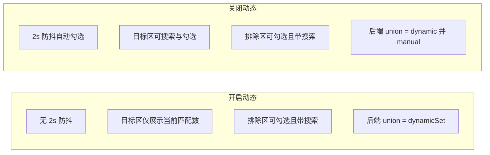

# 做法 A：开启动态禁手动目标 + 排除名单加搜索 + 后端仅 dynamicSet

## 目标与依据

- **产品约定**：开启动态筛选时，生效范围仅由监控条件实时计算（做法 A），运营**不能**手动添加目标，**只能**手动添加排除；关闭动态时恢复 2s 防抖自动勾选且可手动添加目标。
- **后端**：有 scope_filters 时仅用 dynamicSet 作为作用范围（不并 manualSet），排除名单仍参与（finalAdIds = dynamicSet − excludeSet），避免改名误判。
- **前端**：开启动态时隐藏/禁用「选择目标对象」的勾选与操作，仅展示当前匹配数；排除名单始终可操作，并新增与目标区同款的搜索框；关闭动态时保持现有 2s 与目标区完整能力。

---

## 一、后端修改（单一改动点）

**文件**：[server/services/dynamicScopeService.js](server/services/dynamicScopeService.js)

**位置**：`calculateMatchedAdIdsForRule` 内，在填完 `dynamicSet` 之后、构建 `union` 之前（约 307–309 行）。

**逻辑**：

- 进入 `if (rule.useDynamicScope || rule.use_dynamic_scope)` 且未因 `conditions.length === 0` 或 `buildStructureFilter` 抛错而 return 时，已用当前 scope 算出 `dynamicSet`。约定：**有 scope 时仅用 dynamicSet**，不并 manualSet。
- 实现：在分支开头声明 `let scopeOnlyForUnion = false`；在 ad / adset / campaign 某一分支成功填完 `dynamicSet` 后置 `scopeOnlyForUnion = true`。构建 union 时：
  - `scopeOnlyForUnion === true` → `union = new Set(dynamicSet)`；
  - 否则 → `union = new Set([...dynamicSet, ...manualSet])`（现状）。
- 后续不变：`finalAdIds = union` 中减去 `excludeSet`，仍受 `max_dynamic_matches` 限制；返回值保留 `dynamicCount` / `manualCount`。

---

## 二、前端修改

**文件**：[src/views/RuleManager.vue](src/views/RuleManager.vue)

### 2.1 开启动态时关闭 2s 防抖自动勾选

**位置**：watch `[scopeConditionRows, selectedAccountIds, () => ruleForm.value.targetLevel]`（约 2191–2208 行）。

**修改**：仅在**未**开启动态时设 2s timer 并调用 `applyScopeConditions()`。在 `if (completed.length > 0 && selectedAccountIds.value.length > 0)` 内增加条件：`&& !ruleForm.value.useDynamicScope`，再执行 `scopeAutoApplyTimer = setTimeout(...)`。开启动态时仍执行清空搜索栏等逻辑，但不设 timer、不调用 `applyScopeConditions()`。

### 2.2 开启动态时「加载更多」不自动写已选

**位置**：`loadMoreScopeItems` 内，加载更多完成后的分支（约 1856–1859 行）。

**修改**：仅当**未**开启动态时才调用 `applyScopeConditionsToCurrentList`。条件改为：`if (!isApplyingScopeConditions.value && completed.length > 0 && !ruleForm.value.useDynamicScope) { applyScopeConditionsToCurrentList(completed, true) }`。开启动态时加载更多只追加列表数据，不写 `ruleForm.targetIds`。

### 2.3 开启动态时禁止手动添加目标（仅展示当前匹配数）

**位置**：「选择目标对象（可多选）」整块（约 362–416 行）。

**行为约定**：当 `ruleForm.useDynamicScope === true` 时，运营不能勾选目标、不能使用全选/清空/同步，仅能看到「当前匹配 N 个」的说明。

**具体修改**：

- **搜索栏**（约 364–369 行）：当 `useDynamicScope` 为 true 时**不渲染**该输入框（或渲染为禁用并配文「开启动态时生效范围由监控条件决定」）。可用 `v-if="!ruleForm.useDynamicScope"` 包裹 `scope-filters` 的 input。
- **下方内容**（约 371–415 行）：当 `useDynamicScope` 为 true 时：
  - **仅展示**一行摘要：当前匹配数（`ruleForm.matchedCount`）+ 短句说明，例如「当前匹配 {{ ruleForm.matchedCount }} 个对象（按监控条件实时计算，无需选择目标）」。
  - **不展示**：同步/全选/清空按钮、已选 tag 列表（selected-preview）、缺失提示（missingSelectedCount）、**整块复选框列表**（scope-items）、加载更多（scope-more）。即用 `v-if="!ruleForm.useDynamicScope"` 包裹上述区域，或对 `scope-actions` 内按钮与下方列表做 `v-if="!ruleForm.useDynamicScope"`，仅保留一行摘要的 `v-if="ruleForm.useDynamicScope"` 分支。
- 当 `useDynamicScope === false` 时：保持现有完整 UI（搜索栏、同步/全选/清空、已选预览、复选框列表、加载更多），逻辑不变。

这样开启动态时该区块仅剩「当前匹配 N 个（按监控条件实时计算，无需选择目标）」类一行文案，无任何可操作目标选择。

### 2.4 排除名单：增加与「选择目标对象」同款的搜索框

**位置**：排除名单区块（约 419–441 行）。当前无搜索框，列表直接使用 `filteredScopeItems`（与目标区共用 `scopeSearch`）。

**修改**：

- **新增响应式与计算属性**：
  - 增加 `excludeScopeSearch = ref('')`（与 `scopeSearch` 同级，约 762 行附近）。
  - 增加计算属性 `filteredExcludeScopeItems`：逻辑与现有 `filteredScopeItems` 一致，但用 `excludeScopeSearch` 替代 `scopeSearch` 做关键词过滤（按 name/id 包含，同排序）。即：`const key = String(excludeScopeSearch.value || '').trim().toLowerCase()`，再对 `scopeItems.value` 做 filter 与 sort。
- **模板**：
  - 在排除名单的「已排除 N 个」与按钮行**上方**增加与「选择目标对象」相同的搜索区域：例如 `
` 内 `<input v-model="excludeScopeSearch" class="input-text" placeholder="搜索名称或ID" />`（与目标区 input 同 class、同 placeholder）。
  - 排除名单下的列表 `v-for` 由 `filteredScopeItems` 改为 `filteredExcludeScopeItems`，使排除区列表随 `excludeScopeSearch` 过滤。
- **全选排除**：`selectAllExcludeScope` 当前为 `ruleForm.value.excludeTargetIds = filteredScopeItems.value.map(...)`。改为基于**当前排除区可见列表**：`ruleForm.value.excludeTargetIds = [...new Set([...ruleForm.value.excludeTargetIds, ...filteredExcludeScopeItems.value.map(item => scopeItemValue(item))])]`，即「全选」= 将当前过滤后的列表中的项全部加入排除名单（与已有排除取并集），与目标区「全选」语义一致。
- **清空排除**：逻辑不变，仍清空 `ruleForm.excludeTargetIds`。
- **弹窗关闭/重置时**：在已有清空 `scopeSearch` 的地方（如约 1298、1410 等）同时清空 `excludeScopeSearch`，避免下次打开残留。

排除名单的「请先选择至少一个广告账户并加载列表」「正在加载列表」「暂无可选对象」及加载更多（若排除区有加载更多则保持）逻辑不变；排除区与目标区仍共用同一套 `scopeItems` 数据源，仅过滤条件独立（目标区用 `scopeSearch`，排除区用 `excludeScopeSearch`）。

### 2.5 开启动态时隐藏「同步」按钮

**位置**：选择目标对象区块内同步按钮的显示条件（约 378 行），当前为 `v-if="showSyncButton"`。

**修改**：开启动态时不显示同步按钮。例如改为 `v-if="showSyncButton && !ruleForm.useDynamicScope"`，或修改 `showSyncButton` 的 computed 在 `ruleForm.value.useDynamicScope === true` 时返回 false。这样与「开启动态不操作目标」一致。

---

## 三、数据流与 UI 小结

- **开启动态**：目标区仅文案「当前匹配 N 个（按监控条件实时计算，无需选择目标）」；排除区有搜索框 + 列表勾选；后端仅用 dynamicSet − excludeSet。
- **关闭动态**：目标区保留搜索栏、同步/全选/清空、复选框列表、加载更多及 2s 防抖；排除区同样有搜索框 + 列表勾选；后端 dynamicSet ∪ manualSet − excludeSet。

---

## 四、验收要点

1. **开启动态**：修改监控条件或账户后，2s 内不会出现「已勾选 N 个对象」、targetIds 不会被自动改写；「选择目标对象」区块仅显示当前匹配数与说明，无搜索框、无勾选列表、无同步/全选/清空。
2. **开启动态**：排除名单有与目标区同款的「搜索名称或ID」输入框；输入后排除列表按名称/ID 过滤；全选/清空排除行为正确，保存后 excludeIds 正确。
3. **关闭动态**：2s 防抖、目标区搜索与勾选、全选/清空/同步、加载更多与现有一致；排除区仍带独立搜索框。
4. **后端**：规则配置了 scope 且开启动态时，执行/重算仅用 dynamicSet 再减 excludeSet；改名后广告不再在范围内；排除名单始终生效。
5. 不实现「保存规则时自动应用」。

---

## 五、不做的内容

- 不实现「保存规则时自动应用」。
- 开启动态时不再提供目标区的「应用」或「同步」能力（已通过隐藏同步、关闭 2s、禁用目标勾选区实现）。