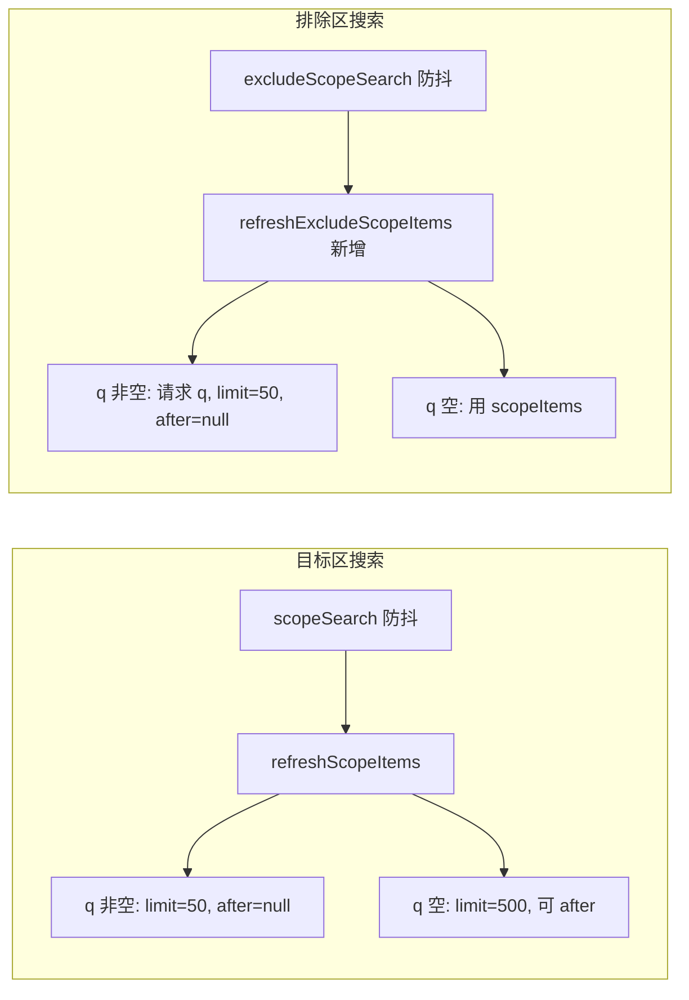

#  动态匹配数展示与搜索精准化 — 执行方案

## 一、背景与目标

- **问题一**：开启动态筛选并填写监控范围条件后，前端未展示「符合条件的对象数量」，用户无法直观看到该规则将作用在多少个广告上。
- **问题二**：目标区与排除区的搜索目前要么只对当前已加载列表（如 500 条）做前端过滤，要么目标区虽调用了接口但未统一为「精准单页搜索」。需求是：**搜索 = 防抖后使用当前关键词调用列表接口，`q` = 关键词，`limit` = 50，不使用 `after`**，使即使对象不在当前 500 条内也能被搜到，同时避免全量拉取。

## 二、依赖与约定

- **预览接口**：已有 `POST /api/rules/preview-dynamic-scope`（[server/routes/rules.js](server/routes/rules.js) 约 201–255 行），入参 `account_ids`、`scope_filters`、`target_level`、`exclude_ids`、`max_dynamic_matches`，返回 `count`、`object_ids`、`per_account`。前端封装在 [src/services/facebookApi.js](src/services/facebookApi.js) 的 `previewDynamicScope`。
- **结构列表接口**：`getStructureObjects` / `getStructureObjectsMulti` 已支持 `q`、`limit`、`after`（[src/services/facebookApi.js](src/services/facebookApi.js) 约 25、70 行），后端按 `q` 过滤名称/ID。
- **做法 A 约定**：开启动态时不允许改写 `ruleForm.targetIds`，仅可更新展示用字段（如 `matchedCount`）。

---

## 三、方案一：开启动态后展示「当前匹配数」

### 3.1 行为说明

- 当 **已开启动态** 且 **已选至少一个广告账户** 且 **监控范围条件行均合法**（无 `scopeConditionRowError`）时，自动（防抖）调用预览接口，**仅用返回的 `count` 更新 `ruleForm.matchedCount`**，不写入 `targetIds`。
- 展示处已存在：开启动态时目标区显示「当前匹配 {{ ruleForm.matchedCount ?? 0 }} 个对象（按监控条件实时计算，无需选择目标）」（[RuleManager.vue](src/views/RuleManager.vue) 约 374–376 行），只需保证 `matchedCount` 被正确更新。

### 3.2 实现要点

**文件**：[src/views/RuleManager.vue](src/views/RuleManager.vue)

1. **新增防抖 watch（仅更新 matchedCount）**

   - 监听：`[scopeConditionRows, selectedAccountIds, () => ruleForm.value.targetLevel, () => ruleForm.value.excludeTargetIds, () => ruleForm.value.maxDynamicMatches, () => ruleForm.value.useDynamicScope]`，`deep: true` 或对对象用 getter。
   - 条件：`ruleForm.value.useDynamicScope === true` 且 `selectedAccountIds.value.length > 0` 且存在「已完成」的条件行：  

`const completed = scopeConditionRows.value.filter(row => !scopeConditionRowError(row)); if (completed.length === 0) return`。

   - 防抖：3 秒（3000ms），在定时器内执行请求，避免条件频繁改动时刷接口。
   - 请求：使用现有 `buildScopeFiltersFromRows(scopeConditionRows.value, ruleForm.value.targetLevel)`、`buildExcludeIdsForPreview(ruleForm.value.excludeTargetIds, ruleForm.value.targetLevel)` 与 `ruleForm.value.maxDynamicMatches`，调用 `facebookApi.previewDynamicScope(...)`，传入当前 `account_ids`、`target_level`、`scope_filters`、`exclude_ids`、`max_dynamic_matches`。
   - 成功：`ruleForm.value.matchedCount = response.count`（取数值，注意类型）。
   - 失败：`ruleForm.value.matchedCount = null`（或 0），可选在界面给出简短提示如「匹配数预览失败」。
   - **禁止**：任何分支下都不执行 `ruleForm.value.targetIds = response.object_ids` 或类似写入。

2. **与现有 applyScopeConditions 的区分**

   - 现有 `applyScopeConditions` 在「关闭动态」时 2s 防抖写 `targetIds`，在「开启动态 + needFetchAll」时调预览并写 `targetIds`（约 2098–2132 行）。新增的 watch **仅**在开启动态时跑，且**只读 count、只写 matchedCount**，不进入上述写 targetIds 的逻辑，二者互不替代。

3. **边界**

   - 未选账户或条件未填完整：不发起预览，可保持 `matchedCount` 为 null 或上一次值；若希望严格一致，可在 `completed.length === 0` 时置 `ruleForm.value.matchedCount = null`。
   - 弹窗关闭/新建时，已有逻辑会重置 `ruleForm`，`matchedCount` 会随表单重置，无需额外处理。

---

## 四、方案二：搜索 = q + limit 50 + 不用 after

### 4.1 约定

- **搜索请求**：用户输入关键词（防抖后）触发一次列表请求：`q` = 当前关键词（trim），`limit` = 50，`after` = null（不传或显式 null），即单页结果，不做分页。
- **目标区**：已有 `scopeSearch` + `refreshScopeItems()`，改为在「有关键词」时使用 `limit=50`、`after=null`，且不再在搜索模式下展示「加载更多」。
- **排除区**：当前仅对 `scopeItems` 做前端过滤（[RuleManager.vue](src/views/RuleManager.vue) 约 1232–1245 行）。改为：有关键词时用 `excludeScopeSearch` 调同一结构列表接口（q + limit 50 + 无 after），结果单独保存并展示；无关键词时展示目标区当前已加载的 `scopeItems`（或空），不单独请求。

### 4.2 目标区（选择目标对象）修改

**文件**：[src/views/RuleManager.vue](src/views/RuleManager.vue)

1. **常量**

   - 新增 `SCOPE_SEARCH_LIMIT = 50`（搜索单页条数）；保留 `SCOPE_PAGE_LIMIT = 500` 用于无关键词时的首屏/加载更多。

2. **refreshScopeItems 内（约 1788–1848 行）**

   - 当前使用固定 `SCOPE_PAGE_LIMIT` 与 `after: null`（首屏），`scopePagingAfter` 来自响应。
   - 修改为：
     - `const keyword = String(scopeSearch.value || '').trim()`
     - 若 `keyword` 非空：请求参数使用 `limit: SCOPE_SEARCH_LIMIT`（50）、`after: null`；请求完成后不论后端是否返回 `paging.after`，均置 `scopePagingAfter.value = null`，即搜索模式下不出现「加载更多」。
     - 若 `keyword` 为空：保持现有逻辑，`limit: SCOPE_PAGE_LIMIT`（500），`after: null` 首屏，并将响应中的 `paging.after` 赋给 `scopePagingAfter`，以便后续「加载更多」。
   - 单账户与多账户两处请求（`getStructureObjects` / `getStructureObjectsMulti`）均按上述规则传入 `limit` 与 `after`，并在 keyword 非空时在成功后清空 `scopePagingAfter`。

3. **loadMoreScopeItems**

   - 无需改逻辑：搜索模式下 `scopePagingAfter` 已被置空，加载更多按钮不会显示；无关键词时行为与现有一致。

### 4.3 排除区（排除名单）修改

**文件**：[src/views/RuleManager.vue](src/views/RuleManager.vue)

1. **状态**

   - 新增 `excludeScopeItems = ref([])`：排除区独立列表（有关键词时由接口填充）。
   - 新增 `excludeScopeLoading = ref(false)`：排除区请求中状态。
   - 可选 `excludeScopeReady = ref(false)`：若需与目标区一致的「就绪」语义可加；否则仅用 `excludeScopeLoading` 控制加载中展示。

2. **refreshExcludeScopeItems（新函数）**

   - 条件：`selectedAccountIds.value.length > 0`，且 `const keyword = String(excludeScopeSearch.value || '').trim()` **非空** 时才发请求（keyword 为空时不调接口，见下）。
   - 请求前：`excludeScopeLoading.value = true`，可选 `excludeRequestId = ++someRequestId` 防竞态。
   - 调用：与目标区相同的层级与账户逻辑（单账户 `getStructureObjects`，多账户 `getStructureObjectsMulti`），参数：`q: keyword`，`limit: 50`，`after: null`，其余（`include_paused`、`scope_status` 等）可与目标区当前一致或从现有 scope 相关 ref 读取。
   - 成功：`excludeScopeItems.value = result.items || []`（单账户取 `resp.items`），不写入 `scopePagingAfter`（排除区不做分页）。
   - 失败 / 竞态：在 finally 中 `excludeScopeLoading.value = false`，若使用 requestId 则仅在请求仍为当前时写 `excludeScopeItems`。
   - keyword 为空时：不请求，在展示层用「空关键词时用 scopeItems」（见下）。

3. **filteredExcludeScopeItems 计算属性（约 1232–1245 行）**

   - 当前：始终基于 `scopeItems.value` 用 `excludeScopeSearch` 做前端 filter。
   - 修改为：
     - 若 `String(excludeScopeSearch.value || '').trim()` 非空：返回 `excludeScopeItems.value`（已由服务端按 q 过滤），并做与现有一致的排序（如 ACTIVE 在前）。
     - 若为空：返回 `scopeItems.value`（与目标区共用当前已加载列表），同样排序。这样无关键词时排除区展示与目标区同一批数据，无需额外请求。

4. **watch excludeScopeSearch**

   - 防抖（如 300ms），在回调中调用 `refreshExcludeScopeItems()`。若 keyword 为空，可在 watch 内直接 `excludeScopeItems.value = []` 或保持为 []，并保证 UI 使用 `filteredExcludeScopeItems`，此时会走「空则用 scopeItems」分支。

5. **模板与加载状态**

   - 排除区列表当前绑定 `filteredExcludeScopeItems` 与 `scopeLoading`。改为：
     - 加载中：当 `excludeScopeSearch` 非空时用 `excludeScopeLoading`，为空时可用 `scopeLoading`（与目标区一致）或仅用 `excludeScopeLoading`（排除区无独立请求时为 false）。
     - 列表仍用 `filteredExcludeScopeItems`，其内部已区分「有关键词用 excludeScopeItems / 无关键词用 scopeItems」。
   - 排除区不展示「加载更多」按钮（搜索为单页 50 条，不做 after 分页）。

6. **canSelectAllExclude**

   - 基于 `filteredExcludeScopeItems.value.length > 0` 且非加载中；加载中状态按上一条使用 `excludeScopeLoading`（及在无关键词时 `scopeLoading` 若需一致）。

7. **清空与重置**

   - 在已有清空 `excludeScopeSearch` 的地方（如 openCreateRule、openEditRule）保持；若存在「关闭弹窗」重置逻辑，确保 `excludeScopeItems = []` 或保持不持久即可。

---

## 五、数据流小结

| 场景 | 目标区列表数据 | 排除区列表数据 | 备注 |

|------|----------------|----------------|------|

| 目标区无关键词 | refreshScopeItems: limit=500, after 支持加载更多 | 使用 scopeItems（与目标区共用） | 保持现有行为 |

| 目标区有关键词 | refreshScopeItems: q=scopeSearch, limit=50, after=null | 仍用 scopeItems（或排除区有关键词时见下） | 单页 50，无加载更多 |

| 排除区无关键词 | — | filteredExcludeScopeItems = scopeItems | 不单独请求 |

| 排除区有关键词 | — | refreshExcludeScopeItems: q=excludeScopeSearch, limit=50, after=null → excludeScopeItems | 独立请求，单页 50 |

---

## 六、验收要点

1. **动态匹配数**

   - 开启动态、选账户、填完整监控条件后，防抖约 3 秒内「当前匹配 N 个对象」更新为预览接口返回的 count；修改条件/账户/排除/上限后，数字随防抖再次更新；预览失败时显示 0 或「—」且不改写已选目标。

2. **目标区搜索**

   - 输入关键词并防抖后，列表为服务端返回的匹配结果，最多 50 条，且不显示「加载更多」；清空关键词后恢复首屏 500 条及加载更多（若后端有 after）。

3. **排除区搜索**

   - 输入关键词并防抖后，列表为按该关键词请求得到的单页结果（最多 50 条），即使该对象不在目标区当前 500 条内也能出现；清空关键词后排除区展示与目标区相同的 scopeItems；排除区不显示「加载更多」。

4. **做法 A**

   - 开启动态时，仅 matchedCount 随预览更新，targetIds 不被预览结果改写。

---

## 七、涉及文件与改动小结

- **[src/views/RuleManager.vue](src/views/RuleManager.vue)**  
  - 新增：开启动态下仅更新 `matchedCount` 的防抖 watch；`SCOPE_SEARCH_LIMIT`；`excludeScopeItems`、`excludeScopeLoading` 及可选 `excludeScopeReady`；`refreshExcludeScopeItems`；对 `excludeScopeSearch` 的防抖 watch。  
  - 修改：`refreshScopeItems` 内按 keyword 是否为空选择 limit（50 vs 500）及搜索模式下清空 `scopePagingAfter`；`filteredExcludeScopeItems` 改为「有关键词用 excludeScopeItems，无关键词用 scopeItems」；排除区加载状态与 canSelectAllExclude 使用上述新状态。
- **后端**：无需改动；预览与结构列表接口已满足需求。