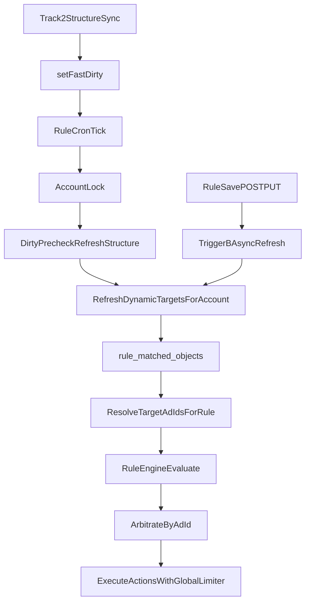

# 动态筛选执行方案（最终版 V3）

## 1. 目标与落地原则

- **目标**：把动态筛选从“实时扫结构表”改为“按账户离线预计算 + 执行时读快照”，将规则目标解析开销稳定在毫秒级。
- **固定语义**：`finalAdIds = (dynamicMatchedAdIds ∪ manualTargetIds) - excludeAdIds`。
- **状态口径**：动态筛选默认按 `effective_status` 过滤，`status` 仅用于展示/兜底，不作为主过滤。
- **并发原则**：所有账户级快照刷新必须在“账户锁 + DB 事务”保护下完成。

## 2. 数据模型与迁移设计

### 2.1 扩展 `rules`（存契约与状态）

涉及文件：

- [d:/projects/FB-Ad-Logic-Engine/server/db/schema.js](d:/projects/FB-Ad-Logic-Engine/server/db/schema.js)
- 新增迁移：`server/db/migrations/034_add_dynamic_scope_fields_to_rules.sql`

新增字段建议：

- `use_dynamic_scope` TINYINT(1) NOT NULL DEFAULT 0
- `scope_filters` JSON NULL
- `exclude_ids` JSON NULL
- `max_dynamic_matches` INT NOT NULL DEFAULT 1000
- `dynamic_scope_status` VARCHAR(32) NOT NULL DEFAULT 'NORMAL'
- `dynamic_scope_error_msg` VARCHAR(255) NULL
- `dynamic_scope_updated_at` TIMESTAMP NULL

状态枚举（后端常量）：

- `NORMAL`
- `ERROR_OVERSIZE`
- `ERROR_FILTER_INVALID`
- `ERROR_REFRESH_FAILED`

### 2.2 新建快照表 `rule_matched_objects`

涉及文件：

- 新增迁移：`server/db/migrations/035_create_rule_matched_objects.sql`

字段与索引：

- 字段：`rule_id, account_id, object_id, object_type, created_at`
- `UNIQUE(rule_id, account_id, object_id)`
- `INDEX idx_account_rule(account_id, rule_id)`
- `INDEX idx_rule(rule_id)`
- `object_type` 在 V1 固定写 `ad`（便于执行层统一按 ad_id 处理）

## 3. 核心服务：DynamicScopeService

涉及文件：

- 新增 [d:/projects/FB-Ad-Logic-Engine/server/services/dynamicScopeService.js](d:/projects/FB-Ad-Logic-Engine/server/services/dynamicScopeService.js)

### 3.1 服务职责

实现以下核心函数：

- `refreshDynamicTargetsForAccount(accountId, options)`
- `calculateMatchedAdIdsForRule(tx, rule)`
- `expandManualTargetIdsToAdLevel(tx, accountId, rule)`
- `expandExcludeIdsToAdLevel(tx, accountId, excludeIds)`
- `buildStructureFilterWhere(scopeFilters)`

### 3.2 高性能查询策略（两段式）

- `level=ad`：直接查 `structure_ads`。
- `level=adset`：先查 `structure_adsets` 得 `adset_id`，再 `IN` 查 `structure_ads` 得 ad_id。
- `level=campaign`：先查 `structure_campaigns` 得 `campaign_id`，再 `IN` 查 `structure_ads` 得 ad_id。

避免大 JOIN 常驻路径，优先利用现有索引（`account_id + effective_status`、`account_id + campaign_id`）。

### 3.3 递归排除（跨层级差集）

`exclude_ids` 允许混合 ad/adset/campaign：

- ad：直接加入排除集
- adset：下钻 `structure_ads.adset_id -> ad_id`
- campaign：下钻 `structure_ads.campaign_id -> ad_id`

最终统一到 ad_id 后再做差集。

### 3.4 超限保护与状态化

- 若 `finalAdIds.length > max_dynamic_matches`：
  - 不写该规则快照数据
  - 写 `dynamic_scope_status = ERROR_OVERSIZE`
  - 写 `dynamic_scope_error_msg`
- 非超限成功：`dynamic_scope_status = NORMAL`

### 3.5 原子替换写库

在同一事务内：

1. 读取账户下动态规则并计算全部结果
2. `DELETE FROM rule_matched_objects WHERE account_id=?`
3. 分块插入本账户所有规则的新结果（chunk 建议 300）
4. 批量更新规则状态字段

## 4. 刷新触发链路（A/B/C 三触发）

涉及文件：

- [d:/projects/FB-Ad-Logic-Engine/server/services/cronService.js](d:/projects/FB-Ad-Logic-Engine/server/services/cronService.js)
- [d:/projects/FB-Ad-Logic-Engine/server/routes/rules.js](d:/projects/FB-Ad-Logic-Engine/server/routes/rules.js)

### TriggerA（已有链路增强）

在 `refreshStructureIfDirtyBeforeRules(accountId)` 中：

- 结构刷新成功且清 dirty 后，追加调用 `refreshDynamicTargetsForAccount(accountId, { trigger: 'dirty_precheck' })`
- 动态刷新失败不阻塞规则执行，但记录状态与日志

### TriggerB（新增：规则保存即时反馈）

在 POST/PUT `/api/rules` 保存成功后：

- 异步触发 `refreshDynamicTargetsForAccount(accountId, { trigger: 'rule_saved' })`
- 增加账户级去重/防抖（如 10~30 秒）避免频繁保存打爆刷新

### TriggerC（可选：手动重算）

新增 API：`POST /api/rules/dynamic-scope/refresh-account`（或按 ruleId 定位账户）

- 复用同一账户锁逻辑
- 用于运营手动回补/排障

## 5. Dispatcher 接入（执行层最小改动）

涉及文件：

- [d:/projects/FB-Ad-Logic-Engine/server/services/ruleEngineDispatcher.js](d:/projects/FB-Ad-Logic-Engine/server/services/ruleEngineDispatcher.js)

改造点：

- 在 `resolveTargetAdIdsForRule` 中分支：
  - `use_dynamic_scope=1`：从 `rule_matched_objects` 读取 ad_id
  - 否则：保持现有 `targetLevel/targetIds/target_by_account` 逻辑
- `evaluateRuleWithCache`、`arbitrateByAdId`、动作执行层保持不变

## 6. API 与前端改造

### 6.1 后端规则 API

涉及文件：

- [d:/projects/FB-Ad-Logic-Engine/server/routes/rules.js](d:/projects/FB-Ad-Logic-Engine/server/routes/rules.js)
- [d:/projects/FB-Ad-Logic-Engine/server/services/rulesService.js](d:/projects/FB-Ad-Logic-Engine/server/services/rulesService.js)

新增/放开字段：

- 入参：`useDynamicScope, scopeFilters, excludeIds, maxDynamicMatches`
- 出参：`dynamicScopeStatus, dynamicScopeErrorMsg, dynamicScopeUpdatedAt`

校验：

- `scopeFilters.level in ['ad','adset','campaign']`
- `maxDynamicMatches` 范围（建议 1~5000）
- `excludeIds` 必须是数组

### 6.2 前端 RuleManager

涉及文件：

- [d:/projects/FB-Ad-Logic-Engine/src/views/RuleManager.vue](d:/projects/FB-Ad-Logic-Engine/src/views/RuleManager.vue)

改造点：

- 新增动态筛选开关与上限输入
- 新增排除名单编辑区
- 规则卡片展示 `dynamicScopeStatus`：
  - `ERROR_OVERSIZE` 红字提示“匹配对象超过上限，动态筛选已暂停，请收窄条件”
- 增加“立即重算动态范围”按钮（调用 TriggerC）

## 7. 僵尸数据清理策略

### 7.1 即时清理（必做）

- 在 DELETE `/api/rules/:id` 成功后执行：
  - `DELETE FROM rule_matched_objects WHERE rule_id = ?`

### 7.2 兜底清理（建议）

- 新增低频定时清理任务（每日一次）：
  - 清理不存在规则的快照孤儿行
  - 清理账户失效后遗留快照行

## 8. 可观测性与灰度开关

涉及文件：

- [d:/projects/FB-Ad-Logic-Engine/server/services/dynamicScopeService.js](d:/projects/FB-Ad-Logic-Engine/server/services/dynamicScopeService.js)
- [.env](d:/projects/FB-Ad-Logic-Engine/.env)

建议环境变量：

- `ENABLE_DYNAMIC_SCOPE=true/false`
- `DYNAMIC_SCOPE_INSERT_CHUNK=300`
- `DYNAMIC_SCOPE_TRIGGER_B_DEBOUNCE_MS=15000`
- `DYNAMIC_SCOPE_DEFAULT_MAX_MATCHES=1000`

关键日志指标：

- 每账户刷新耗时、规则数、命中条数、超限条数
- Trigger 来源分布（dirty_precheck / rule_saved / manual)
- Dispatcher 目标解析来源分布（dynamic/manual/fallback)

## 9. 测试与验收

涉及文件（新增测试）：

- `server/tests/dynamicScopeService.test.js`
- `server/tests/ruleEngineDispatcher.dynamicScope.test.js`
- `server/tests/dynamicScopeTriggerB.test.js`

必须通过的验收项：

- 保存规则后可在短时间内看到动态匹配更新（TriggerB）
- 动态状态筛选按 `effective_status` 生效
- `(动态 ∪ 手动) - 排除` 语义稳定
- campaign/adset 排除可正确下钻到 ad 级别
- 并发场景下快照无脏写（账户锁+事务）
- 规则删除后快照即时清理

## 10. 实施顺序（建议 4 个里程碑）

1. **M1（数据层）**：完成 034/035 迁移 + schema/API 字段贯通（不启用执行）
2. **M2（核心引擎）**：DynamicScopeService + 事务写库 + 递归排除 + 状态机
3. **M3（链路接入）**：TriggerA/TriggerB + Dispatcher 动态目标接入 + 删除清理
4. **M4（体验与灰度）**：前端状态提示/重算入口 + 测试回归 + 开关灰度

## 11. 执行流图（最终）

