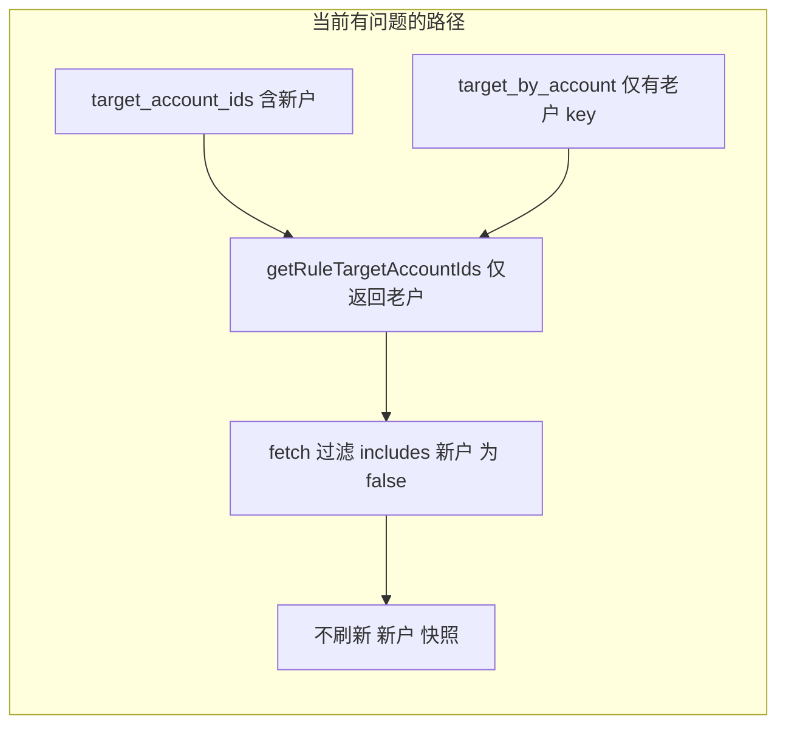

# 动态筛选适用账户口径修复（落地方案）

## 0. 执行方案说明（本仓库落地依据）

本次缺陷修复 **唯一依据的执行方案** 即 **本文档**（Cursor Plan 文件名：`动态筛选适用账户口径修复_落地方案.plan.md`，路径：`.cursor/plans/动态筛选适用账户口径修复_落地方案.plan.md`）。

| 本文档章节 | 落地对应 |

|------------|----------|

| **§3 推荐修复策略（代码优先）** | 采用 **§3.1 目标行为**：`getRuleTargetAccountIds` 对 `target_by_account` 非空 key、`target_account_ids`、`rules.account_id` 做归一化后 **并集、去重、稳定排序**；主实现见 [server/services/dynamicScopeService.js](server/services/dynamicScopeService.js)。**未采用**「仅运营补 `target_by_account` key」作为替代根治。 |

| **§4 实施步骤 checklist** | ① 改 `getRuleTargetAccountIds`；② 更新 [server/tests/dynamicScopeService.helpers.test.js](server/tests/dynamicScopeService.helpers.test.js)；③ 本地 `npm test` / vitest；④ 预发或生产用 `rule_matched_objects` + `structure_ads` 验证 `act_832525359903650` + 规则 604 等。 |

| **过程留痕** | [项目开发过程/项目总结-2026-04-08-动态筛选适用账户并集修复与验证.md](../../项目开发过程/项目总结-2026-04-08-动态筛选适用账户并集修复与验证.md)（含单测与验收说明）。 |

**说明**：仓库内若存在其他泛化方案（如云本地协同总方案等），**不覆盖**本问题的根因与改点；本问题以本文档 §1～§4 为准。

## 1. 问题复述（事实与因果）

### 1.1 现象

- 规则 **604～608、697**：`use_dynamic_scope=1`，`scope_filters` 仅「广告名包含测新」；[`structure_ads`](server/services/dynamicScopeService.js) 中账户 `act_832525359903650` 确有 5 条测新广告；`exclude_ids` 为空。
- 但 [`rule_matched_objects`](server/services/ruleEngineDispatcher.js) 上该账户 + 上述规则 **无快照**（`Empty set`）。
- 同账户 **762** 快照正常（例如 24 条）。

### 1.2 根因（代码层）

[`getRuleTargetAccountIds`](server/services/dynamicScopeService.js)（约 42～61 行）当前逻辑是：

- 若 **`target_by_account` 中存在至少一个 key，且对应数组非空**，则 **直接 `return` 仅这些 key**，**不再读取** `target_account_ids`。
- 若 **`target_by_account` 为空或无有效 key**（如 **762** 为 `{}`），才回退到 **`target_account_ids`**。

[`fetchDynamicScopeRulesForAccount`](server/services/dynamicScopeService.js)（约 641～654 行）在 SQL 查出候选规则后，又用：

`getRuleTargetAccountIds(rule).includes(accountId)` **二次过滤**。

因此：**账户仅在 `target_account_ids` 中列出、却未作为 `target_by_account` 的 key 出现时**（你们的新户场景），该规则 **不会参与该账户的动态快照刷新** → `finalAdIds` 从未写入 → 执行侧读快照为空。

这不是「关广告 / spend=0 / 轨道二」问题；是 **「适用账户」两套字段在动态刷新路径上口径不一致**。

### 1.3 与「旧规则 + 手动对象 + 动态筛选」的关系（概念澄清）

- 开启动态范围后，[`calculateMatchedAdIdsForRule`](server/services/dynamicScopeService.js) 在存在 `scope_filters` 时走 **「做法 A」**：**只用动态集合，不并手动 `target_ids`**（约 231、312 行注释与 `scopeOnlyForUnion`）。这是 **产品设计**，与本次 bug 不同。
- 本次 bug 是：**没进刷新**，与 「手动 target 是否被并上」无关；是 **`target_by_account` 抢占了 `target_account_ids` 的解释权**。

---

## 2. 不修的影响（供决策）

| 范围 | 影响 |

|------|------|

| 仅出现在 `target_account_ids`、未出现在 `target_by_account` key 中的账户 | 这些规则 **动态快照长期为空**；[`ruleEngineDispatcher`](server/services/ruleEngineDispatcher.js) **优先读** `rule_matched_objects`，等于这些规则对这类账户 **几乎不起动态作用**。 |

| `target_by_account` 为 `{}` 或仅无实质条目的规则（如 762） | **不受影响**。 |

| 老户若已在 `target_by_account` 的 key 里 | **行为与现在一致**（刷新仍会覆盖这些户）。 |

**不修**时可通过 **数据侧**缓解：给新户在 `target_by_account` 下补一层 key（可为空数组需确认产品是否允许，当前逻辑要求「非空数组」才算 key，空数组 key 不会进入首轮列表）。更干净的做法仍是 **代码并集**（见下）。

---

## 3. 推荐修复策略（代码优先）

### 3.1 目标行为

**`getRuleTargetAccountIds` 的返回值应为「规则适用账户」的完整集合**：在 **账户 id 归一化**（[`normalizeAccountId`](server/utils/targetIdUtils.js)）后，对以下来源做 **并集、去重**：

1. `target_by_account` 中 **数组长度 > 0** 的 key（保留现有语义：这些户曾配置按户广告列表）。
2. `target_account_ids` 数组中的每一项（历史上「多账户投放」名单）。
3. `rules.account_id`（主归属账户，若存在）。

**不再**在「存在 `target_by_account` 有效 key」时 **早退并丢弃** `target_account_ids`。

空结果：三者皆无有效账户时返回 `[]`（与现有一致）。

### 3.2 修改位置

- 主实现：[server/services/dynamicScopeService.js](server/services/dynamicScopeService.js) 内 `getRuleTargetAccountIds`。
- 单测：[server/tests/dynamicScopeService.helpers.test.js](server/tests/dynamicScopeService.helpers.test.js)

### 3.3 行为连带影响（需接受，且属预期）

- [`refreshDynamicTargetsForRule`](server/services/dynamicScopeService.js)：`accountIds` 变多 → 会对 **更多账户** 执行刷新，且 `DELETE ... account_id NOT IN (...)` 的保留列表与并集一致，**避免误删**。
- [`scheduleDynamicScopeRefreshForRule`](server/services/dynamicScopeService.js)：防抖刷新会覆盖 **更多账户**，符合「规则保存后相关账户都应 eventually 一致」。

### 3.4 运营侧兜底：可作短期手段，不宜作为「唯一」长期手段

**说明（避免误解）**：本节讨论的是「**若不做代码修复**时还能怎么办」，**不是**否定 3.1～3.3 的代码方案。**推荐的长期根治仍是改代码做并集**（3.1～3.2）。

以下做法 **不推荐作为唯一的长期依赖**（可与代码修复并存作应急，但不应替代代码）：

- **仅靠运营**把每个新户逐个补进 `target_by_account`（或等价手工双写）：容易漏配、与 `target_account_ids` 重复维护、和前端/导入流程容易再次不一致。

---

## 4. 实施步骤（可执行 checklist）

1. **改 `getRuleTargetAccountIds`**

   - 用 `Set` + `normalizeAccountId(String(id))` 收集三类来源；
   - 返回时转为数组；顺序建议 **稳定**（例如：先按 `account_id`、再 `target_account_ids`、再 `target_by_account` keys 排序后去重，或简单 `Array.from(set).sort()`），避免测试 flaky。
   - 在函数上方补 **简短中英文注释**：说明「动态刷新与单规则刷新均依赖此集合，须与 `target_account_ids` 并集」。

2. **更新单测**

   - 将现有用例「`target_by_account` 非空时仅 `act_secondary`」改为期望 **并集**：例如 `target_account_ids` 含 `act_primary` + `act_secondary`，`target_by_account` 且仅有 `act_secondary` 非空 → 期望 **两户均在列表**（具体断言与归一化后字符串一致）。
   - 新增用例：**仅** `target_account_ids` 含某户、**该户不在** `target_by_account` keys → 该户必须在结果中（直接对应你们线上 case）。
   - 若有 `act_act_xxx` 形式，可加一条 **归一化** 用例。

3. **本地验证**

   - 运行：`npm test` 或项目内对 `dynamicScopeService.helpers.test` / 全量 vitest 的命令（以仓库 [`package.json`](package.json) 为准）。

4. **预发/生产验证（SQL + 日志）**

   - 部署后触发一次该规则或该账户刷新（等下一次分钟 Cron 或调用现有 **manual refresh** 接口，见 [server/routes/rules.js](server/routes/rules.js) 中与 `refreshDynamicTargetsForAccount` 绑定的路由）。
   - 执行验证 SQL：
     - `SELECT COUNT(*) FROM rule_matched_objects WHERE account_id='act_832525359903650' AND rule_id=604;` 期望 **> 0**（且与结构侧测新条数一致或为其子集，视 `max_dynamic_matches` 等）。
   - 日志中 `[DynamicScope] ... inserted=...` 对该账户、该批规则应 **非零增长**（若此前为 0）。

5. **回滚**

   - Git 回退该提交即可；**无需**数据迁移。旧快照若曾被误空，回滚后需再等一轮刷新恢复。

---

## 5. 风险与边界

- **并集扩大刷新面**：账户数 × 规则数略增 CPU/DB；你们单账户规则量约十几条量级，风险低。
- **若存在「故意」只用 `target_by_account` 限制账户、却把更多户留在 `target_account_ids` 当展示用的怪异数据**：并集会扩大实际刷新范围；这属于 **数据契约** 问题，应在发布说明中写明：**`target_account_ids` 与 `target_by_account` 非互斥，适用账户取并集**。

---

## 6. 文档（可选，小范围）

- 在现有动态筛选说明文档（如仓库内 `docs/动态筛选*.md`）增加 **一节**：「适用账户 = `target_by_account` 非空 key ∪ `target_account_ids` ∪ `account_id`」，避免后续误解。