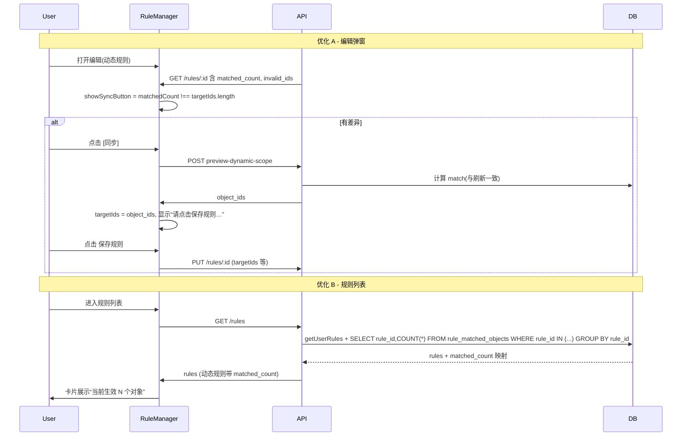

# 动态规则 UX 与列表性能优化方案

## 目标

- **优化 A（同步按钮）**：仅在“当前匹配 ≠ 规则配置”时显示 [同步] 按钮，带呼吸灯/高亮；点击后拉取最新 object_ids 更新表单，并显示“配置已更新，请点击【保存规则】以使更改永久生效”。
- **优化 B（列表主指标）**：GET /api/rules 为 `use_dynamic_scope=1` 的规则附带 `matched_count`；规则列表卡片对动态规则展示“当前生效 X 个对象”；确认 `rule_matched_objects.rule_id` 索引存在以保证 GROUP BY 性能。

---

## 一、优化 A：同步按钮与引导（细节增强）

### 1.1 显示条件（有差异才显示）

- **位置**：[RuleManager.vue](src/views/RuleManager.vue) 约 314 行，“当前匹配 N（规则配置共 M 个）”所在行。
- **逻辑**：新增计算属性（或内联表达式）  

`showSyncButton = ruleForm.useDynamicScope && ruleForm.matchedCount != null && (ruleForm.matchedCount !== ruleForm.targetIds.length)`

即：开启动态筛选、有 matched_count、且当前匹配数与配置数不一致时才显示按钮。

- **模板**：在“规则配置共 {{ ruleForm.targetIds.length }} 个”后增加：  

`<button v-if="showSyncButton" class="btn-tiny btn-sync-highlight" ...>同步</button>`

不满足 `showSyncButton` 时不渲染该按钮。

### 1.2 样式（呼吸灯/蓝色高亮）

- 在 [RuleManager.vue](src/views/RuleManager.vue) 的 `<style scoped>` 中新增 class `.btn-sync-highlight`：
  - 使用蓝色系背景/边框（如 `#3b82f6`），与现有 `btn-tiny` 区分。
  - 可选：`animation` 实现轻微呼吸灯（opacity 或 box-shadow 缓动），周期约 2s，避免过于抢眼。
- 仅在该 [同步] 按钮上使用该 class，不影响其他按钮。

### 1.3 点击逻辑（复用预览接口）

- 新增方法 `syncConfigFromMatch()`（与 `applyScopeConditions` 中调用预览的逻辑对齐）：
  - 若 `isApplyingScopeConditions === true` 则 return，避免重复请求。
  - 使用现有 `buildScopeFiltersFromRows(scopeConditionRows.value, ruleForm.targetLevel)`、`buildExcludeIdsForPreview(ruleForm.excludeTargetIds, ruleForm.targetLevel)` 以及 `selectedAccountIds.value`、`ruleForm.targetLevel`、`ruleForm.maxDynamicMatches` 调用 `facebookApi.previewDynamicScope(...)`。
  - 请求前：`isApplyingScopeConditions = true`；`finally` 中置回 `false`。
  - 成功返回后：
    - 记录同步前数量：`const prevLen = ruleForm.targetIds.length`。
    - 赋值：`ruleForm.targetIds = response.object_ids || []`。
    - 可选：若存在 `scopeLoadedIdSet` 等与已选列表展示相关的状态，可把本次返回的 `object_ids` 加入，避免“未加载数据”提示过多。
  - 不依赖全局 Toast 作为唯一反馈；见下文“提示语”。

### 1.4 提示语（同步后引导保存）

- 引入一个“同步后提示”状态，例如 `ref`：`syncJustDoneMessage`（或 `scopeApplyMessage` 复用，需与“应用动态条件”的文案区分）。
- 在 `syncConfigFromMatch()` 成功且 `ruleForm.targetIds` 已更新后：
  - 若发生“剧烈变化”（建议条件：`Math.abs(ruleForm.targetIds.length - prevLen) > 0`，即只要有变化即可，或加阈值如 ≥5 才视为“剧烈”），设置提示文案为：  

**「配置已更新，请点击【保存规则】以使更改永久生效」**

存到 `syncJustDoneMessage`（或 `scopeApplyMessage`）。

- 在模板中，在 [同步] 按钮下方或 scope-actions 区域下方增加一行：  

`v-if="syncJustDoneMessage"` 的提示块，展示该文案；样式可为小号字体、蓝色或中性色，与错误提示区分。

- 在用户点击“保存规则”成功后，或关闭弹窗时，清空 `syncJustDoneMessage`，避免残留。

### 1.5 与现有“应用动态条件”的关系

- “应用动态条件”仍保留现有逻辑与文案；[同步] 仅做“用当前匹配结果覆盖表单 targetIds + 提示保存”，不修改 `scopeApplyMessage` 的“已勾选 N 个对象（与规则执行范围一致）”等文案，避免混淆。
- 若复用 `scopeApplyMessage` 显示“配置已更新，请点击【保存规则】…”则需在 `applyScopeConditions` 成功时覆盖为原有成功文案，保证两种操作各有清晰反馈。

---

## 二、优化 B：列表接口 matched_count 与性能

### 2.1 后端：GET /api/rules 附带 matched_count

- **文件**：[server/routes/rules.js](server/routes/rules.js) 中 GET `/rules` 处理函数（约 128–152 行）。
- **步骤**：

  1. 在 `const userRules = await rulesService.getUserRules(userId, options)` 之后，得到 `userRules`。
  2. 筛选出 `use_dynamic_scope === 1`（或 `rule.useDynamicScope === true`，依 Drizzle 返回字段名）的规则 ID 列表 `dynamicRuleIds`。
  3. 若 `dynamicRuleIds.length === 0`，跳过查询，直接 `res.json({ rules: userRules, ... })`。
  4. 若 `dynamicRuleIds.length > 0`，执行一条批量统计查询：
     ```sql
     SELECT rule_id, COUNT(*) AS cnt
     FROM rule_matched_objects
     WHERE rule_id IN (?, ?, ...)
     GROUP BY rule_id
     ```


参数为 `dynamicRuleIds`；使用 `pool.execute`，占位符数量与 `dynamicRuleIds.length` 一致。

  1. 将查询结果转为 `Map<ruleId, cnt>`（或普通对象）。
  2. 遍历 `userRules`，若 `rule.id` 在 `dynamicRuleIds` 中，则 `rule.matched_count = map.get(rule.id) ?? 0`（或 `rule.matched_count = map[rule.id] ?? 0`）；非动态规则可不设或设为 `null`。
  3. 返回 `res.json({ rules: userRules, count: userRules.length, isAdmin })`。

### 2.2 索引确认（性能补丁）

- **依据**：[server/db/migrations/035_create_rule_matched_objects.sql](server/db/migrations/035_create_rule_matched_objects.sql) 第 49 行已定义 `KEY idx_rule (rule_id)`。
- **作用**：`WHERE rule_id IN (...)` 与 `GROUP BY rule_id` 会使用该索引，避免全表扫描；规则数量增长时列表接口仍可保持稳定耗时。
- **实施**：
  - 在实现 2.1 的同一处（或项目文档/注释）中注明：列表接口依赖 `rule_matched_objects` 表上存在 `rule_id` 的独立索引（如 `idx_rule`），见迁移 035。
  - 若有运维/部署检查清单，可增加一条：部署后执行 `SHOW INDEX FROM rule_matched_objects` 确认存在 `rule_id` 索引（name 如 `idx_rule` 或 `uk_rule_account_object` 的 leading 列为 `rule_id` 也可接受）。  
- **不新增迁移**：035 已包含该索引，仅需确认现有环境已执行 035；若某环境未执行，应由 DBA 执行 035 或单独补建 `rule_id` 索引。

### 2.3 前端：规则列表卡片展示“当前生效 N 个对象”

- **文件**：[RuleManager.vue](src/views/RuleManager.vue) 规则卡片区域（约 50–64 行），在“动态筛选：已开启”等动态相关 meta 区域。
- **逻辑**：当 `r.useDynamicScope && r.matched_count != null` 时，在卡片内增加一行主指标文案，例如：  

**「当前生效 {{ r.matched_count }} 个对象」**

（若接口返回 snake_case，需在 `normalizeRule` 中把 `matched_count` 映射为 `matchedCount`，模板用 `r.matchedCount` 亦可。）

- **展示位置**：建议紧接在“动态筛选：已开启”及状态 pill 下方，或与执行频率/时间同一区块，避免与“IF/THEN”条件块混在一起。
- 非动态规则（未开 use_dynamic_scope）不展示该行，保持现有卡片信息不变。

---

## 三、数据流与依赖关系



---

## 四、实施顺序建议

1. **索引确认**：确认生产/测试库已执行 035，或 `SHOW INDEX FROM rule_matched_objects` 含 `rule_id` 索引。
2. **优化 B 后端**：在 GET /api/rules 中增加 dynamicRuleIds 筛选与 GROUP BY 查询，并写回 `matched_count`；必要时在 normalizeRule 中统一 `matched_count` → `matchedCount`。
3. **优化 B 前端**：规则卡片在 `r.useDynamicScope && r.matched_count != null` 时展示“当前生效 X 个对象”。
4. **优化 A 前端**：新增 `showSyncButton`、`syncJustDoneMessage`、`syncConfigFromMatch()`，模板增加 [同步] 按钮与同步后提示块，并加上 `.btn-sync-highlight` 样式（含可选呼吸灯）。
5. **联调与回归**：列表页仅动态规则显示生效数；编辑页仅在不一致时显示同步按钮，点击后文案与保存动线符合预期。

---

## 五、验收要点

- 编辑动态规则时，当“当前匹配数 ≠ 规则配置数”时出现高亮 [同步] 按钮；相等时不出现。
- 点击 [同步] 后，targetIds 更新为预览结果，并出现“配置已更新，请点击【保存规则】以使更改永久生效”；保存或关闭弹窗后该提示消失。
- 规则列表接口返回的每条动态规则带 `matched_count`；列表卡片对动态规则显示“当前生效 N 个对象”。
- 列表接口在规则数量较多时，通过 `EXPLAIN` 或慢查询日志确认 `rule_matched_objects` 的 GROUP BY 使用 `rule_id` 索引，无全表扫描。