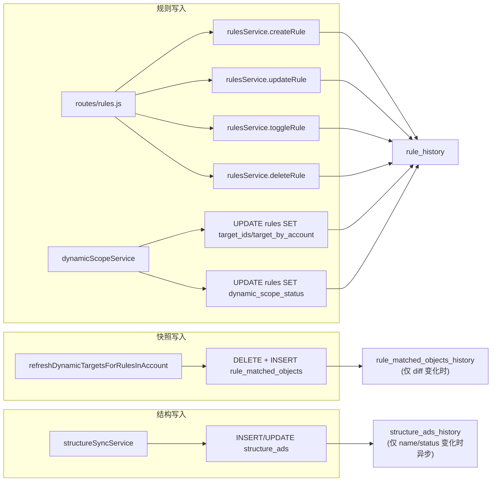

# 历史数据与审计 — 可落地执行方案

## 一、目标与原则

- **目标**：支持「规则谁改过、改成什么」及误判排查（某时刻快照/结构 name 是否曾错误）。
- **保留期（按你的要求）**：
  - **rule_history**：60 天（配置变更价值高、量相对小）
  - **rule_matched_objects_history**：30 天（近期误判排查足够）
  - **structure_ads_history**：60 天
- **原则**：无变动不记录（P1/P2 Change-Only）；系统与人为隔离（changed_by_user_id）；历史写入异步/不阻塞主任务（P2）；生存周期由定时任务清理。

**V3 深度优化（已纳入本方案）**：

1. **P2 性能**：全账户内存预加载对比——处理某账户 ads 前一次性 SELECT 该账户 `ad_id, name, effective_status` 入 Map，循环内仅内存比较；禁止在循环内执行 SELECT，避免 36 账户 × 千级广告时数据库压力翻倍与同步超时。
2. **P1 存储**：双特征（added_count、removed_count）+ 大列表窄化——object_count > 500 时只存前 100 个 ID 与 object_ids_checksum（MD5），控制单条 20KB 级 JSON，避免 30 天快照历史膨胀为数百 MB。
3. **P2 背压**：structure_ads_history 异步队列硬上限 5000 条；满时丢弃新审计并打 Warn，保证审计逻辑不导致 OOM 或拖垮同步。
4. **清理友好**：NightlyCleanupTask 分批 DELETE（LIMIT 10000），每批之间 sleep(500ms)，防止占满磁盘 IO 影响凌晨滑动窗口同步。
5. **deleteRule 一致性**：同一事务内严格顺序「SELECT 快照 → INSERT rule_history(DELETE) → DELETE rule_matched_objects → DELETE rules → commit」。
6. **P2 优雅停机**：进程退出前（SIGTERM/SIGINT）强制 flushHistoryQueue()，将内存中未写入的审计记录落库，避免发布/重启导致审计断档。
7. **P1 索引微调**：rule_matched_objects_history 主查询为「某规则的所有变动历史」，索引采用 (rule_id, refreshed_at, account_id)，便于按时间范围 range scan。

---

## 二、数据流与写入点总览

---

## 三、P0：rule_history

### 3.1 建表（迁移脚本）

- **文件**：新建 server/db/migrations/037_create_rule_history.sql
- **字段**：
  - id BIGINT AUTO_INCREMENT PRIMARY KEY
  - rule_id INT NOT NULL
  - change_type ENUM('CREATE','UPDATE','DELETE','TOGGLE','SYSTEM_REFRESH') NOT NULL
  - changed_at TIMESTAMP(6) NOT NULL DEFAULT CURRENT_TIMESTAMP(6)
  - source VARCHAR(32) NOT NULL（api_save | api_toggle | dynamic_scope_refresh）
  - changed_by_user_id INT NULL
  - changed_by_owner_id INT NULL
  - rule_snapshot JSON NULL（仅配置字段，严禁 matched_count、dynamic_scope_status、last_executed_at 等）
  - added_ids JSON NULL、removed_ids JSON NULL（可选，排障用）
- **索引**：(rule_id, changed_at)、(changed_at)、(change_type)

### 3.2 rule_snapshot 窄化

- **只存**：rule_name, target_level, target_ids, target_by_account, target_account_ids, scope_filters, use_dynamic_scope, exclude_ids, max_dynamic_matches, conditions, logic_operator, actions, enabled, timezone_name, is_simulation, execution_interval_minutes, execution_time_windows
- **严禁**：matched_count、dynamic_scope_status、dynamic_scope_error_msg、dynamic_scope_updated_at、last_executed_at、created_at、updated_at

### 3.3 写入点与 change_type/source

| 调用点 | 文件与位置 | change_type | source | changed_by_user_id |
|--------|-------------|-------------|--------|--------------------|
| 创建规则 | server/services/rulesService.js createRule 在 db.insert(rules) 成功、getRuleById 返回后 | CREATE | api_save | 入参 userId |
| 更新规则 | rulesService.updateRule 在 db.update(rules) 成功、getRuleById 返回后 | 若 updates 仅含 enabled → TOGGLE，否则 UPDATE | api_save 或 api_toggle（由路由区分） | 入参 userId |
| 删除规则 | rulesService.deleteRule：需先 SELECT 规则再 DELETE，在 commit 前插入 rule_history | DELETE | api_save | 入参 userId |
| 动态刷新回写 target | server/services/dynamicScopeService.js 约 623–626 行 UPDATE rules SET target_ids=?, target_by_account=? 之后 | SYSTEM_REFRESH | dynamic_scope_refresh | NULL |
| 动态刷新更新 status | dynamicScopeService 约 487–497 行、596–604 行 UPDATE rules SET dynamic_scope_status 之后 | SYSTEM_REFRESH | dynamic_scope_refresh | NULL |

- **owner_id**：路由层 server/routes/rules.js 有 req.user.owner_id，在 createRule/updateRule 调用时传入并写入 changed_by_owner_id。
- **实现建议**：新增 server/services/ruleHistoryService.js，提供 insertRuleHistory({ ruleId, changeType, source, changedByUserId, changedByOwnerId, ruleSnapshot, addedIds, removedIds })，由 rulesService 与 dynamicScopeService 在对应成功路径调用。

### 3.4 删除规则：精确 DELETE 事务（同一事务内严格顺序）

- 当前 deleteRule 直接 DELETE，无历史。改为在 **同一数据库事务内** 严格按以下顺序执行：
  1. **SELECT**：SELECT * FROM rules WHERE id=? [AND user_id=?] FOR UPDATE（或普通 SELECT）得到规则快照；若不存在则 rollback 并抛「规则不存在或无权」。
  2. **INSERT rule_history**：用上一步结果构造 rule_snapshot（仅配置字段），INSERT INTO rule_history (..., change_type=DELETE, source=api_save)。
  3. **DELETE rule_matched_objects**：DELETE FROM rule_matched_objects WHERE rule_id = ?。
  4. **DELETE rules**：DELETE FROM rules WHERE id=? [AND user_id=?]。
  5. **commit**。
- **禁止**：将 SELECT 或 INSERT rule_history 放在事务外；必须「查询快照 → 写入 DELETE 历史 → 物理删除」在同一事务内完成。

---

## 四、P1：rule_matched_objects_history（Change-Only + 存储容量保护）

### 4.1 建表

- **文件**：新建 server/db/migrations/038_create_rule_matched_objects_history.sql
- **字段**：
  - rule_id, account_id, refreshed_at TIMESTAMP(6), trigger_type VARCHAR(32), object_count INT
  - added_count INT NOT NULL DEFAULT 0、removed_count INT NOT NULL DEFAULT 0
  - object_ids_snapshot JSON NULL（见 4.2 窄化策略）
  - object_ids_checksum VARCHAR(64) NULL（当 object_count > 500 时存 MD5(sorted_ids)）
- **索引**：
  - **idx_rule_refreshed_account**：(rule_id, refreshed_at, account_id) — 典型查询为「某规则的所有变动历史」或「某规则在某时间段的变动」，将 refreshed_at 放在第二位便于按时间范围 range scan。
  - **idx_refreshed_at**：(refreshed_at) — 用于 NightlyCleanupTask 按 refreshed_at 删除超期数据。

### 4.2 仅变动时写入 + 双特征与大列表窄化

- **位置**：server/services/dynamicScopeService.js refreshDynamicTargetsForRulesInAccount 内，对每个 status=NORMAL 且已完成 DELETE+INSERT 的 (r.ruleId, accountId)：
  1. **上一份 ID 集合**：在本次事务内、DELETE 之前，SELECT object_id FROM rule_matched_objects WHERE rule_id=? AND account_id=? 得到 oldSet。
  2. **本次**：r.finalAdIds 为新集合；计算 added_count、removed_count。
  3. 若 added_count === 0 且 removed_count === 0 → **不插入** history。
  4. 若有变化 → 插入一条：refreshed_at, trigger_type, object_count, added_count, removed_count 必填；object_ids_snapshot 在 object_count ≤ 500 时存完整或前 200 条，object_count > 500 时**只存前 100 个 ID**；object_ids_checksum 在 object_count > 500 时存 MD5(sorted_ids)。
- **理由**：误判排查通常只需确认「某条广告当时在不在」；存 checksum + 前 100 可兼顾一致性与容量。
- **实现**：history 插入放在同一事务内（在 DELETE+INSERT rule_matched_objects 之后），与主业务同提交。

### 4.3 refreshDynamicTargetsForRule 的 target 回写

- refreshDynamicTargetsForRule 约 606–626 行在重算成功后从 rule_matched_objects 回写 target_ids/target_by_account 到 rules 表，已在「规则历史」中通过 SYSTEM_REFRESH 覆盖；rule_matched_objects_history 只需在 refreshDynamicTargetsForRulesInAccount 的循环里按 (rule_id, account_id) 做 diff 写入即可。

---

## 五、P2：structure_ads_history（Change-Only + 全账户内存预加载 + 异步背压）

### 5.1 建表

- **文件**：新建 server/db/migrations/039_create_structure_ads_history.sql
- **字段**：account_id, ad_id, changed_at TIMESTAMP(6), name VARCHAR(500), effective_status VARCHAR(50), source VARCHAR(32) NULL
- **索引**：(account_id, ad_id, changed_at)、(changed_at)

### 5.2 仅变动时写入 + 批量对比法（禁止循环内 SELECT）

- **风险**：若在每条 upsert 前对该 (account_id, ad_id) 做一次 SELECT，则单账户 1000 条广告 = 1000 次 SELECT，数据库压力翻倍，易导致 Track2 同步超时；36 账户并发时更不可接受。
- **优化（全账户内存预加载）**：
  1. 在 **处理某账户的 ads 之前**（doStructureAdsUpsertAndStatus 入口、以及 writeBatchStructureFromPayload 内按账户写 ads 前），**一次性**执行：SELECT ad_id, name, effective_status FROM structure_ads WHERE account_id = ?，将结果放入内存 Map：Map<ad_id, { name, effective_status }>。
  2. **对比逻辑**：在循环中，对 FB 返回的每条 item，用 map.get(item.id) 得到旧值；若 (item.name !== old?.name) || (item.effective_status !== old?.effective_status) 则视为变更，将 { account_id, ad_id, name, effective_status, source } 推入 history 队列；**禁止在循环内再执行 SELECT**。
- **写入位置**：所有写入 structure_ads 的路径均采用「先拉该 account 的 Map，再在内存中对比后推队列」。

### 5.3 异步写入 + 背压保护（硬上限 5000）

- **方式**：在 structureSyncService 内维护 historyQueue（数组），有变更时 push；定时或批量同步结束时批量 INSERT 到 structure_ads_history，不 await 主流程。
- **背压**：historyQueue 硬上限 Max Size = 5000（可配置为环境变量 STRUCTURE_ADS_HISTORY_QUEUE_MAX=5000）；当队列已满时直接丢弃新产生的审计记录，并打印一条高优先级 Warn 日志。
- **理由**：审计日志优先级永远低于业务同步；宁可丢掉部分「改名历史」，也不能让审计逻辑导致内存堆积、Node OOM 或拖垮同步。
- **保证**：主流程不 await 历史写入；历史写入失败只打 logger.warn，不影响 structure_ads 的写入结果和同步任务状态。

### 5.4 优雅停机（Graceful Shutdown）

- **风险**：异步队列中的数据在进程退出时若仍在内存中（例如队列里还有 2000 条未 flush），重启或重新部署会导致这些审计记录**永久丢失**，产生断档。
- **要求**：在 **进程完全退出前**，将 historyQueue 中剩余记录**强制写入**数据库。
- **实现**：
  - 在 structureSyncService 中暴露 **flushHistoryQueue()**：将当前 historyQueue 中所有条目批量 INSERT 到 structure_ads_history，然后清空队列；若队列为空则直接返回；若写入失败打 Warn。
  - 在 **应用主入口**（server/server.js 或 server/index.js）监听 **SIGTERM**、**SIGINT**：收到信号后调用 await structureSyncService.flushHistoryQueue()，再继续原有关闭逻辑（如关闭 HTTP 服务器、停止 cron、断开 DB 连接等）。
  - 将 flushHistoryQueue 纳入统一 shutdown 流程的**前半段**，在关闭 DB 连接之前执行；并给予 flush 一个**超时上限**（如 10s），超时则放弃剩余条数并打 Warn，避免进程被 kill -9 强杀前一直卡在 flush。
- **意义**：保证发布部署或重启时审计记录不因内存队列未 flush 而丢失，审计连续性更好。

---

## 六、数据保留与 NightlyCleanupTask

### 6.1 保留期

- rule_history：**60 天**
- rule_matched_objects_history：**30 天**
- structure_ads_history：**60 天**

### 6.2 定时清理任务（分批删除 + 间隔 sleep）

- **位置**：server/services/cronService.js 在现有「8. 每日 04:00 热表清理」之后新增一条 cron（**04:30**，Cron 表达式 `30 4 * * *`）。
- **执行内容**（顺序）：对三张表分别执行「分批 DELETE + 批间 sleep」：
  1. rule_matched_objects_history：WHERE refreshed_at < NOW() - INTERVAL 30 DAY
  2. structure_ads_history：WHERE changed_at < NOW() - INTERVAL 60 DAY
  3. rule_history：WHERE changed_at < NOW() - INTERVAL 60 DAY
- **实现要点**：
  - 每条 DELETE 使用 LIMIT 10000，在 **while 循环** 中执行：执行一批 → 若 affectedRows < 10000 则结束该表；否则 **sleep(500ms)** 再删下一批。
  - 理由：避免单次大批量 DELETE 长时间占用磁盘 IO，影响 04:00 前后正在跑的「凌晨滑动窗口同步」等任务。
  - 使用 refreshed_at / changed_at 索引，打日志记录每张表每批或总删除行数。
- **可选**：环境变量 ENABLE_HISTORY_CLEANUP、HISTORY_RETENTION_DAYS_RULE/MATCHED/ADS 便于测试环境关闭或调整。

---

## 七、实现顺序与验收

| 步骤 | 内容 | 验收 |
|------|------|------|
| 1 | 新建迁移 037/038/039，执行建表（038 含 added_count、removed_count、object_ids_checksum；**038 索引为 (rule_id, refreshed_at, account_id) + (refreshed_at)**） | 表与索引存在；无语法错误 |
| 2 | 实现 ruleHistoryService.insertRuleHistory；在 createRule/updateRule 成功路径调用（CREATE/UPDATE/TOGGLE）；deleteRule **同一事务内** SELECT → INSERT rule_history(DELETE) → DELETE rule_matched_objects → DELETE rules → commit | 创建/修改/开关规则后 rule_history 有对应记录；删除后有一条 DELETE 历史；change_type、rule_snapshot 正确 |
| 3 | dynamicScopeService 两处 UPDATE rules 后调用 insertRuleHistory(SYSTEM_REFRESH) | 动态刷新回写 target 或 status 后 rule_history 有 SYSTEM_REFRESH |
| 4 | dynamicScopeService 在 refreshDynamicTargetsForRulesInAccount 内：DELETE 前读 rule_matched_objects，与 finalAdIds diff；仅变化时 INSERT rule_matched_objects_history（含 added_count/removed_count；object_count>500 时 snapshot 仅前 100 + checksum） | 连续两次相同刷新不产生新 history；有增/删时产生一条；大列表不存全量 JSON |
| 5 | structureSyncService：**处理每账户 ads 前** 一次性 SELECT 该账户 ad_id,name,effective_status 入 Map；循环内仅内存对比，有变更则 push 队列；队列**硬上限 5000**，满则丢弃并 Warn；异步批量写 structure_ads_history；**暴露 flushHistoryQueue()**；主入口监听 SIGTERM/SIGINT，退出前 await flushHistoryQueue()（可设超时 10s） | 未改名/改状态不产生 history；主同步不因 history 失败而失败；循环内无额外 SELECT；队列满时见 Warn；重启/部署前队列中未写数据被 flush 落库 |
| 6 | cronService 新增 04:30 任务：三张表分批 DELETE（LIMIT 10000），**每批之间 sleep(500ms)**，带日志 | 任务日志可见每批/总删除行数；超期数据被清除；不影响凌晨同步 IO |

---

## 八、风险与注意点

- **deleteRule 事务**：必须在同一事务内完成「SELECT 快照 → INSERT rule_history(DELETE) → DELETE rule_matched_objects → DELETE rules → commit」；否则并发或异常时会导致审计缺失或误记。
- **rule_matched_objects_history 的「上一份」**：必须在本次事务的 DELETE 之前读取；diff 使用集合相等；大列表（>500）只存前 100 ID + MD5 checksum，避免单条 20KB+。
- **P2 禁止循环内 SELECT**：structure_ads 历史对比必须用「全账户一次性 SELECT 入 Map + 内存比较」；否则 N 账户 × 千级广告会导致 N×1000 次 SELECT，同步超时与库压翻倍。
- **异步队列背压**：historyQueue 硬上限 5000；满时丢弃新记录并打 Warn，绝不因审计导致 OOM 或阻塞主同步。
- **清理批间 sleep**：NightlyCleanupTask 每批 DELETE 后 sleep(500ms) 再下一批，防止占满磁盘 IO 影响 04:00 左右的同步任务。
- **迁移执行顺序**：037 → 038 → 039；部署时先跑迁移再发布新代码。
- **P2 优雅停机**：必须在进程收到 SIGTERM/SIGINT 后、关闭 DB 前调用 flushHistoryQueue()，并设超时避免卡死；否则部署/重启会丢失队列内未落库的审计记录。
- **P1 索引**：038 表索引采用 (rule_id, refreshed_at, account_id)，与「按规则查变动历史」「按时间范围查」的查询模式匹配，避免 (rule_id, account_id, refreshed_at) 下按时间范围扫描低效。
