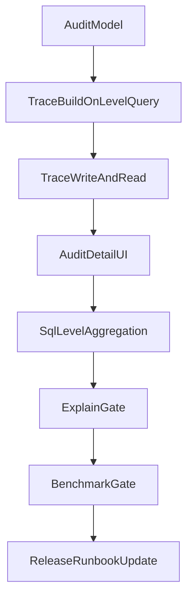

# 同层闭环可解释审计与性能门禁执行方案

## 背景结论

当前主执行链已接近同层闭环，但还缺两块验收门槛：

- `可解释审计` 尚未成立：[`server/db/schema.js`](server/db/schema.js) 的 `automation_logs` 只有 `metricsSnapshot`、`actionPayload`、`apiRequest`、`apiResponse`，当前写入方 [`server/services/actionExecutorService.js`](server/services/actionExecutorService.js) 与 [`server/services/cronService.js`](server/services/cronService.js) 仅记录聚合后对象摘要，未记录“参与判断的子 ad 快照 + 聚合推导链路 + 条件命中结果”。
- `性能门禁产物` 尚未成立：[`server/services/ruleDataService.js`](server/services/ruleDataService.js) 的 `queryRuleDataByLevel()` 仍是“先映射到 ad_id -> 再查 ad 数据 -> Node 侧 group/reduce 聚合”，[`server/db/migrations/046_add_level_aggregation_indexes.sql`](server/db/migrations/046_add_level_aggregation_indexes.sql) 已准备好按 `adset/campaign` 的复合索引，但主查询尚未真正吃到这些索引，也没有 EXPLAIN / p95 脚本与报告。

## 总体实施顺序

## 里程碑1：先定死可解释审计合同

### [目标]

把“父级对象执行一次”对应的一条日志，扩展成可回答以下问题的结构化事实源：

1. 执行对象是谁。
2. 哪些子 `ad` 参与了这次判断。
3. 聚合值如何从子 `ad` 累加得到。
4. 每条规则条件为何命中。

### [具体改动方案]

1. 在 [`server/db/schema.js`](server/db/schema.js) 基础上，新增一层专门的解释结构，优先采用 **单列 JSON** 方案：

   - 在 `automation_logs` 增加 `explanation`（JSON）字段。
   - 不把全部明细继续塞进现有 `metricsSnapshot`，保持 `metricsSnapshot = 聚合后摘要`，`explanation = 命中链路详情` 的职责分离。

2. 新增 migration（建议编号接在 `047` 后），DDL 只做一件事：给 `automation_logs` 增加 `explanation JSON NULL`。
3. 固定 `explanation` 的 JSON 合同，字段分 6 段：

   - `target`: `objectType/objectId/objectName/targetLevel/accountId`
   - `window`: `timeWindow/timezoneName/customRange`
   - `input`: `childCount/children[]`
   - `aggregate`: 聚合后的总分子、总分母、派生指标
   - `conditionTrace`: 每条条件的 `metric/operator/threshold/actual/passed/formula`
   - `logic`: `logicOperator/matched`

4. `children[]` 的单项字段固定为：

   - `adId/adName/adsetId/campaignId/status`
   - `spend/purchases/link_clicks/unique_link_clicks/purchase_value/add_to_cart_count/initiate_checkout_count/add_payment_info_count`

5. 定死口径：

   - `有数据的广告 = 进入本次父级聚合输入集的 ad 行`。
   - 指标为 `0` 也必须保留，不允许在解释层静默过滤。

### [验证/验收标准]

- 一条 `campaign/adset` 执行日志只对应一条 `automation_logs` 主记录。
- 同一条日志能完整回放“子 ad 输入 -> 聚合结果 -> 条件命中”的因果链。
- 历史老日志无 `explanation` 时，读路径仍可兼容展示旧 `metricsSnapshot`。

## 里程碑2：把解释链从聚合层一路传到执行审计层

### [目标]

让 `query -> evaluate -> execute -> audit` 四段链路都携带同一份结构化解释，不在执行层二次猜测。

### [具体改动方案]

1. 在 [`server/services/ruleDataService.js`](server/services/ruleDataService.js) 的 `queryRuleDataByLevel()` 中，把当前 `groups -> totals` 的中间数据提升为内部 trace：

   - 在每个父级结果上挂载 `aggregationTrace`。
   - 内容包含 `children` 明细与 `aggregate` 总结果。

2. 在 [`server/services/ruleEngineDispatcher.js`](server/services/ruleEngineDispatcher.js) 的 `loadDataForAccount()` / `evaluateRuleWithCache()` 中，确保非 ad 规则不会把该 trace 丢掉。
3. 在 [`server/index.js`](server/index.js) 的 `evaluateRuleWithData()` 中：

   - 生成 `matchedObject` 时带上 `aggregationTrace`。
   - 同时根据 `rule.conditions + logicOperator` 输出 `conditionTrace`。

4. 在 [`server/services/actionExecutorService.js`](server/services/actionExecutorService.js) 与 [`server/services/cronService.js`](server/services/cronService.js)：

   - 审计写入统一读取 `matchedObject.aggregationTrace` 与 `matchedObject.conditionTrace`。
   - 组装 `explanation` JSON，并与现有 `metricsSnapshot` 一起写入。
   - 两条写入路径必须统一：
     - 单对象执行：`executeActionsForAd()` / `executeActionsForObject()`
     - Batch/调度执行：`writeBatchStatusAuditLog()` / 单规则 batch 局部 `insertBatchAuditLog`

5. 在 [`server/routes/system.js`](server/routes/system.js)：

   - `GET /automation-logs` 列表补回 `run_id` 与 `object_*` 读字段。
   - `GET /automation-logs/:id` 详情解析 `explanation` JSON。

### [验证/验收标准]

- 任何一条 `campaign/adset` 日志详情都能看到完整 `children[]`。
- 任何一条命中条件都能看到 `actual`、`threshold`、`passed`、`formula`。
- 调度路径与手动执行路径写出的 `explanation` 结构一致。

## 里程碑3：前端把“对象执行日志”与“命中解释”展示出来

### [目标]

让前端日志页真正体现“目标对象级执行”，而不是继续被 `ad_id/ad_name` 语义绑死。

### [具体改动方案]

1. 在 [`src/views/Logs.vue`](src/views/Logs.vue)：

   - 列表优先展示 `objectType/objectId/objectName`，旧 `adId/adName` 仅做兼容次级信息。
   - 详情区增加三个块：
     - `聚合结果`
     - `条件命中链路`
     - `子 ad 快照表`

2. 不复用 [`src/utils/ruleAuditNarrative.js`](src/utils/ruleAuditNarrative.js) 的“规则历史差异 narrative”，而是新增一个轻量执行日志解释格式化函数（可放在 `Logs.vue` 内或独立到 `src/utils/automationLogNarrative.js`）。
3. 详情区按 `explanation.version` 做版本兼容；`explanation` 缺失时回退到旧 `metricsSnapshot` 视图。

### [验证/验收标准]

- 点击一条 `campaign` 执行日志，能看到：父级对象、子 ad 列表、总值、命中原因。
- 历史旧日志不报错，仍能展示基础信息。

## 里程碑4：把 `queryRuleDataByLevel` 改成真正的 SQL 聚合

### [目标]

让 046 的索引与 plan 中的 SQL 门禁真正生效，避免继续使用“查 ad 后 Node 聚合”的半成品方案。

### [具体改动方案]

1. 改造 [`server/services/ruleDataService.js`](server/services/ruleDataService.js)：

   - 为 `adset/campaign` 单独实现数据库层 `GROUP BY` 聚合查询。
   - today / yesterday / 多日窗口分别走明确 SQL 路径。

2. 查询口径统一为：

   - 先 `SUM` 所有分子、分母。
   - 再重算 `roas/cpa/cpc/ucpc/add_to_cart_cost/checkout_cost/payment_cost`。
   - 禁止平均 ad 级派生指标。

3. 让 SQL 直接使用 046 索引对应的 where/group 形态：

   - `daily_stats(account_id, date, ad_set_id)`
   - `daily_stats(account_id, date, campaign_id)`
   - `ad_snapshots(account_id, data_date, ad_set_id)`
   - `ad_snapshots(account_id, data_date, campaign_id)`

4. 将当前仅用于过渡的 `resolveAdIdsForLevelObjects()` 降为兼容兜底或彻底退出主路径。
5. 若多日窗口保留 today+history 合并策略，则拆成：

   - 历史段 SQL 聚合
   - 今日段 SQL 聚合
   - 最终再做一次同口径合并

### [验证/验收标准]

- `queryRuleDataByLevel()` 主路径不再依赖“大量 ad_id IN (...) + Node reduce”。
- 046 索引能在 EXPLAIN 中被实际命中。
- 聚合值与现有 Node 聚合结果逐字段一致。

## 里程碑5：交付 EXPLAIN 与 p95 门禁产物

### [目标]

把“性能符合要求”变成仓库内可执行、可复核、可交付的门禁，而不是口头结论。

### [具体改动方案]

1. 在 `scripts/` 下新增两类脚本：

   - `scripts/perf/verify-level-aggregation-explain.js`
   - `scripts/perf/benchmark-rule-level-query.js`

2. `verify-level-aggregation-explain.js` 的职责：

   - 执行 ad / adset / campaign 三类核心 SQL 的 `EXPLAIN`。
   - 解析关键字段：`type/key/rows/filtered`。
   - 断言 `type=ALL` 出现次数为 `0`。

3. `benchmark-rule-level-query.js` 的职责：

   - 对单条核心聚合 SQL 测 `p95`。
   - 对单账户完整评估链路测 `p95`。
   - 固定预热次数与正式次数，例如 `5 + 30`。

4. 在 `package.json` 增加门禁命令：

   - `perf:explain`
   - `perf:bench`
   - `perf:gate`

5. 在 `docs/` 下新增产物文档：

   - [`docs/同层聚合SQL性能门禁.md`](docs/同层聚合SQL性能门禁.md)
   - 说明运行环境、样本规模、阈值、失败判据。
   - 输出三份 explain 报告与一份 p95 报告。

### [验证/验收标准]

- 三类核心 SQL 都有 explain 产物。
- 单条核心聚合 SQL `p95 <= 500ms`。
- 单账户完整评估 `p95 <= 3000ms`。
- 门禁脚本失败时返回非零退出码。

## 里程碑6：更新发布与回滚手册

### [目标]

让上线手册覆盖新的审计结构和性能门禁步骤，避免“代码改完但发布标准没更新”。

### [具体改动方案]

1. 更新 [`docs/同层闭环发布Runbook.md`](docs/同层闭环发布Runbook.md)：

   - 新增 migration 顺序（含 `automation_logs.explanation`）。
   - 新增发布前门禁：`npm test`、`npm run build`、`npm run perf:gate`。
   - 新增日志验收：抽检一条 `campaign` 日志的 `children[]` 和 `conditionTrace`。

2. 将性能门禁与灰度步骤串联：

   - 先迁库
   - 再验证 explain / p95
   - 再开启 `RULE_LEVEL_EXECUTION_V2=1`

3. 回滚策略补充：

   - 审计新增字段允许保留不回滚。
   - 若 explain/p95 不达标，禁止开启 V2。

### [验证/验收标准]

- Runbook 能指导一次完整上线。
- 发布前检查项覆盖测试、构建、性能、审计抽检四类门槛。

## 文件清单

### 必改文件

- [`server/db/schema.js`](server/db/schema.js)
- [`server/services/ruleDataService.js`](server/services/ruleDataService.js)
- [`server/services/ruleEngineDispatcher.js`](server/services/ruleEngineDispatcher.js)
- [`server/index.js`](server/index.js)
- [`server/services/actionExecutorService.js`](server/services/actionExecutorService.js)
- [`server/services/cronService.js`](server/services/cronService.js)
- [`server/routes/system.js`](server/routes/system.js)
- [`src/views/Logs.vue`](src/views/Logs.vue)
- [`docs/同层闭环发布Runbook.md`](docs/同层闭环发布Runbook.md)

### 必增产物

- `server/db/migrations/048_*.sql`（为审计 explanation 增字段或等价结构）
- `scripts/perf/verify-level-aggregation-explain.js`
- `scripts/perf/benchmark-rule-level-query.js`
- [`docs/同层聚合SQL性能门禁.md`](docs/同层聚合SQL性能门禁.md)
- explain 报告 3 份
- p95 报告 1 份

### 可选增强

- `src/utils/automationLogNarrative.js`
- 详情 API 的按 `run_id` 聚合查询能力
- 规则摘要页跳转到执行日志详情的联动

## 最终验收清单

1. `campaign/adset` 规则依旧只执行一次、只写一条主日志。
2. 该日志详情能展示完整子 `ad` 快照。
3. 该日志详情能展示聚合值与每条条件命中理由。
4. `queryRuleDataByLevel()` 主路径已切到 SQL 聚合。
5. explain 报告齐全，`type=ALL = 0`。
6. p95 报告达标。
7. 发布手册已更新并可按步骤执行。