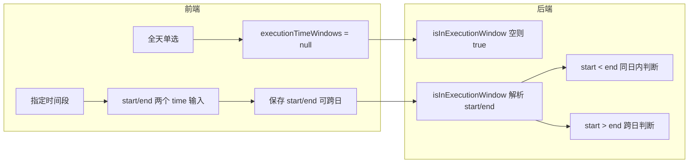

# 执行时间：跨日支持与 24 小时制方案

## 一、现状与依据

- **数据与存储**：`rules.execution_time_windows` 为 JSON，格式 `[{ start: "HH:mm:ss", end: "HH:mm:ss" }]`，空/NULL 表示全天（见 [server/db/schema.js](server/db/schema.js)）。
- **全天语义**：前端选「全天」时 payload 传 `executionTimeWindows: null`；编辑时 `win.length === 0` 则 `executionTimeAllDay = true`（[RuleManager.vue](src/views/RuleManager.vue) 约 1438–1439、1603 行）。后端 `isInExecutionWindow` 对 `windows == null || !Array.isArray(windows) || windows.length === 0` 直接返回 `true`（[cronService.js](server/services/cronService.js) 约 131–132 行）。**本方案不改动上述逻辑，确保未选指定时间段时仍为全天。**
- **当前限制**：后端对 `startSec >= endSec` 的窗口直接 `continue` 跳过（同上 143 行），故跨日（如 20:00–05:00）不生效；前端文案写「暂不支持跨日」（RuleManager 约 656 行）。

## 二、后端：跨日窗口判断

**文件**：[server/services/cronService.js](server/services/cronService.js) 中 `isInExecutionWindow`（约 130–147 行）。

**逻辑变更**：

- 保留：空/NULL/非数组或 `windows.length === 0` → 返回 `true`（全天）。
- 对每个窗口解析 `start`/`end` 为当日秒数 `startSec`、`endSec`（0–86400），逻辑改为：
  - **同日内**（`startSec < endSec`）：当前秒数在 `[startSec, endSec]` 内则命中。
  - **跨日**（`startSec > endSec`）：视为「当日 start 至次日 end」，命中条件为 `currentSec >= startSec || currentSec <= endSec`。
  - **相等**（`startSec === endSec`）：可视为全天该窗口恒命中，即 `return true`（或保持跳过，与产品约定；建议恒命中以与「24:00–24:00」语义一致）。

**实现要点**：仅调整 for 循环内对 `startSec`/`endSec` 的比较与命中条件，不改变入参、表结构及调用方。

## 三、前端：交互与展示

**文件**：[src/views/RuleManager.vue](src/views/RuleManager.vue)。

1. **24 小时制**  

已使用 `<input type="time">`（约 654–655 行），为 24 小时制，无需改组件。若有其他地方存在 12 小时/AM-PM 展示，改为 24 小时并去掉 AM/PM；当前代码中未发现 AM/PM 控件。

2. **文案与说明**  

   - 将「（可只填一个时段，暂不支持跨日）」改为明确说明跨日与 24 小时，例如：  

「可只填一个时段；24 小时制。结束时间早于开始时间表示到次日（如 20:00–05:00 表示当晚 20:00 至次日 05:00）。」

3. **列表展示**（`formatExecutionTimeDisplay`，约 1150–1158 行）  

   - 保持：无窗口或空数组 → 显示「全天」。  
   - 对每个窗口：将 `start`/`end` 转为「当日秒数」或可直接比较的 HH:mm 字符串；若 `end <= start`（按时间语义，即跨日），展示为「开始–次日 结束」（例如「20:00–次日 05:00」），否则仍为「开始–结束」。

4. **保存与回显**  

   - 保存：继续使用 `executionTimeAllDay.value ? null : [{ start: "...", end: "..." }]`，不新增字段；允许 `end` 早于 `start` 表示跨日。  
   - 回显：已有从 `win[0] `取 `start`/`end` 赋给 `executionTimeStart`/`executionTimeEnd`（约 1440–1441 行），跨日数据仍为两个时间点，无需改结构。

## 四、数据流与语义（保持不变）

- 未选指定时间段 → 全天：前端传 `null`，后端直接返回 `true`，行为不变。
- 选指定时间段：后端按上述同日/跨日规则判断，与现有 Cron 调度、冷却等逻辑兼容。

## 五、测试建议

- 后端：构造规则 `execution_time_windows: [{ start: "20:00:00", end: "05:00:00" }]`，在 21:00、02:00、10:00 北京时间的 nowBJ 下分别断言 `isInExecutionWindow` 为 true、true、false；同日内窗口 09:00–18:00 保持原样。
- 前端：选指定时间段，设 20:00–05:00，保存后列表显示「20:00–次日 05:00」；编辑回显为 20:00 与 05:00；选回「全天」保存后列表显示「全天」。

## 六、小结

| 项 | 做法 |

|----|------|

| 全天默认 | 不改：未选指定时间段仍传 null/空，后端空即 true。 |

| 跨日 | 后端 start > end 时用「currentSec >= startSec \|\| currentSec <= endSec」；前端允许 end < start，展示加「次日」。 |

| 24 小时制 | 保持 type="time"，文案注明 24 小时制并取消 AM/PM 描述。 |

| 数据结构 | 不新增字段，仍为 `[{ start, end }]`。 |