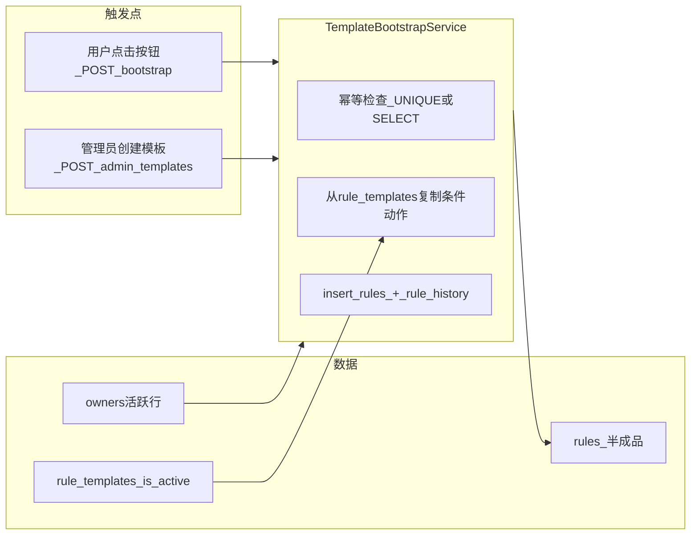

# 自定义模板体验升级：半成品规则自动铺底 — 执行方案

## 执行状态更新（2026-04-14）

- **总体状态**：本地开发与本地验收已完成；云端 M5 发布步骤待执行。
- **已完成范围**：
  - 阶段 0：口径定稿 + `043_rules_stub_template_and_nullable_account.sql` 落地（`account_id` 可空、`owner_id`、`source_template_slug`、唯一键）。
  - 阶段 1+2：`templateBootstrapService`、`POST /api/rules/bootstrap-from-templates`、`POST /api/admin/templates` 后异步增量铺底。
  - 阶段 3：`RuleManager.vue` 空状态一键生成按钮 + loading/防连点 + 页面内反馈提示。
  - 原则 A：`PUT /api/rules/:id` + `PATCH /api/rules/:id/toggle` 启用前强校验，错误码 `ENABLE_MISSING_ACCOUNT` 已验证。
  - 原则 B：`GET /api/rules` 无写库副作用已验证。
  - 审计：半成品创建写入 `rule_history`（`CREATE` / `api_save`）已验证。
- **新版本注记**：下文「当前实现与需求的差距」属于**立项时历史差距**，截至 2026-04-14 已收口；若与现代码冲突，以本节状态与代码实现为准。

## 与既有方案的关系

- **[终版云本地协同方案](d:/projects/FB-Ad-Logic-Engine/.cursor/plans/终版云本地协同方案_6100b6d5.plan.md)**：M4（含规则审计体验增强）已收口；**M5（云端拉主干发布）待执行**。本需求完成后应作为 **同一发布批次** 纳入 M5：迁移 → 后端 → 前端（若有）→ nginx/进程重启 → 验收。
- **[规则审计日志详细执行方案](d:/projects/FB-Ad-Logic-Engine/.cursor/plans/规则审计日志详细执行方案_7ffb510d.plan.md)**：半成品规则创建若走现有 [`rulesService.createRule`](server/services/rulesService.js) / 写 `rule_history`，会自然产生 **CREATE** 审计记录；**无需改审计 API**。若新增内部创建路径，须同样调用 [`insertRuleHistory`](server/services/ruleHistoryService.js) + `buildRuleSnapshot`，避免「有规则无审计」。

---

## 两条工程原则（必守，与业务规则同级）

以下两条为评审结论固化进本方案，**实现前必须在需求中视为硬约束**，否则易出现 Cron 误跑与读接口副作用。

### 原则 A：禁止「半成品 + 误开闸」进入执行链

- **场景**：`enabled = false` 且 `account_id` 可空（或未选账户）的半成品，若运营将 **`enabled` 改为 `true`**，Cron（[`cronService.js`](server/services/cronService.js) 仅过滤 `enabled`）会纳入该规则，进而调用 Facebook 相关逻辑，**易报错、刷日志、拖慢当轮甚至影响同进程其他规则**。
- **对策（API 层硬闸门）**：在 **[`PUT /api/rules/:id`](server/routes/rules.js)**（及若存在**单独改 `enabled` 的接口**，须一并覆盖）中：当请求将 **`enabled` 设为 `true`**（含从 `false`→`true` 或创建时即为 `true` 的更新路径）时，**必须**校验「执行所需最小配置」已完整；**任一不满足则 `400`，不允许保存为开启状态**。
- **校验字段须与执行入口对齐**（实现时以 Cron/单条执行读取的字段为准，不能只盯 `target_account_ids`）：
  - **`account_id`**：非空、格式合法，且在 [`account_mappings`](server/db/migrations/) 中存在且 **`is_active = 1`**（权限口径与现网 `POST /api/rules` 一致：非管理员须属于该用户 `owner_id`）。
  - **多账户**：若业务要求「必须多选账户」才允许执行，则 **`target_account_ids`（或等价落库字段）** 非空且每项可访问。
  - **动态筛选**：若 **`use_dynamic_scope = true`**，则 **`scope_filters`** 等须通过现有 [`validateDynamicScopePayload`](server/routes/rules.js) 同类校验。
  - 其他执行强依赖项（执行间隔、时间窗若引擎要求非空）按 [`rules` schema](server/db/schema.js) 与执行服务实际读取项补齐清单，**在本阶段 0 定稿一页「开闸检查表」**。

### 原则 B：禁止在 `GET /api/rules` 内隐式触发全量铺底

- **问题**：读接口内做批量 `INSERT` 属于**副作用**，高并发下易出现重复尝试、锁竞争、日志噪音；与「列表应可缓存/可重试」的工程习惯冲突。
- **对策**：
  - **全量铺底**仅通过 **显式写接口** 触发：例如 **`POST /api/rules/bootstrap-from-templates`**（路径名以最终实现为准），由前端在适当时机调用。
  - **前端**：当 **当前用户所属 `owner_id` 维度下规则条数为 0**（与「按负责人列表」口径一致，见下节差距 2）时，规则页展示醒目 **「一键生成常用模板规则」**（文案可产品微调）；用户点击后调用上述 POST，**loading / 防连点**；成功后刷新列表。
  - **后端 POST**：幂等（`UNIQUE(owner, template)` 或先 `SELECT`）、短事务、可选对 `owner` 行 **`SELECT ... FOR UPDATE`** 或应用层锁，避免双点插入风暴。
- **增量铺底**（新模板 → 各负责人一条）**不依赖 GET**：仍建议在 **`POST /api/admin/templates` 成功之后**异步执行（写路径触发写副作用，合理）。

---

## 业务规则（已定稿）

| 项 | 结论 |

|----|------|

| 负责人全集 | [`owners`](server/db/migrations/) 表：`is_active = 1`，并 **排除**「无 / none」占位（与主方案 §「owners：owner_key='none'」一致）。 |

| 零规则 / 新负责人 | 某负责人维度下 **规则条数为 0** 时，运营通过 **显式操作**（前端按钮 → **`POST .../bootstrap-from-templates`**）按当前 **全部启用中的** [`rule_templates`](server/db/migrations/018_create_rule_templates.sql) 各生成 **1 条**半成品；**不在 `GET /api/rules` 中自动铺底**。 |

| 已有规则 | 不再批量补历史模板；仅对 **新创建的模板** 做 **增量 1 条/负责人**（管理员创建模板成功后的异步任务）。 |

| 模板禁用再启用 | **否**：同一 `slug` 若已有对应半成品行则 **跳过**（幂等）。 |

| 模板内容变更 | **不同步**到已生成规则。 |

| 模板改名 | **不**回写规则名称。 |

| 半成品默认 | **`enabled = false`**；运营补全配置后方能开闸（且须通过 **原则 A** 校验）。 |

| 手动点模板 | 仍允许覆盖，**无需额外提示**（与现网 [`RuleManager.vue`](src/views/RuleManager.vue) `applyTemplate` 行为并存）。 |

---

## 当前实现与需求的差距（历史差距记录，2026-04-14 已收口）

以下三点来自代码阅读，**不解决则无法「无账户半成品」或「一负责人一条」**：

### 1）`account_id` 必填（方案三）

> 新版本注记：该项已变更为「`account_id` 可空 + 开闸校验 + 执行链双保险」；以迁移 `043_rules_stub_template_and_nullable_account.sql` 与 `ruleEnableGateService` 为准。

- 迁移 [`011_make_account_id_not_null_in_rules.sql`](server/db/migrations/011_make_account_id_not_null_in_rules.sql) 将 `rules.account_id` 设为 **NOT NULL**；[`POST /api/rules`](server/routes/rules.js) 强制校验 `accountId`。
- **半成品要求**：广告账户、动态筛选等为空 → 需要 **数据模型 + 执行链 + 原则 A** 共同支持「未绑定账户」的规则行。

**推荐方向（二选一，需在实现时定稿）：**

- **方案 A（推荐）**：迁移允许 `account_id` **NULL**，语义为「未配置账户」；**原则 A** 阻止未配置即 `enabled=true`；**原则 B 的执行链双保险**（[`cronService.js`](server/services/cronService.js) 或单条执行入口）对 `account_id IS NULL` **跳过**，避免漏网之鱼。
- **方案 B**：保留 NOT NULL，使用 **全局占位** `act_xxx` 写入 `account_mappings` 且执行前校验跳过——**业务语义脏**，不推荐，除非强约束不能改表。

### 2）规则列表对非管理员按 `rules.user_id` 过滤

> 新版本注记：该项已变更为「非管理员按负责人维度可见」；以 `rulesService.getUserRules/getRuleById/updateRule/deleteRule` 当前实现为准。

[`getUserRules`](server/services/rulesService.js) 在非 admin 时使用 `eq(rules.userId, userId)`，即 **仅创建者可见**。若同一负责人下多名运营应看到 **同一批规则**，则与「只新增一条模板规则」冲突。

**推荐方向**：非管理员列表改为按 **`users.owner_id`（当前登录用户所属负责人）** 对齐：**展示该负责人下、由任意绑定用户创建的规则**（`JOIN rules → users`，筛选 `creator_users.owner_id = req.user.owner_id`）。管理员现有 `ownerIds` 行为可保持不变。

> 若产品确认「历史上就允许每人只看自己的规则」，则需另议；但与你们已确认的「七八人只见一条」不一致，**本方案按负责人维度可见列前提**。

### 3）幂等键落库

> 新版本注记：该项已落地为 `rules.owner_id + rules.source_template_slug` 唯一键；重复铺底走幂等跳过。

需可查询字段支撑 **`UNIQUE(负责人, 模板)`**：

- 增加 `rules.source_template_slug`（可空）或 `source_template_id`（FK 至 `rule_templates.id`，软删模板时注意 ON DELETE/置空策略）。
- 若采用 **`rules.owner_id` 冗余列**（与 `users.owner_id` 一致，便于查询与唯一索引），可与「按负责人列表」一并设计；否则可用联结表 `owner_template_stub_rules(owner_id, template_slug, rule_id)` 实现唯一约束而不改 `rules` 宽表（实现复杂度略高）。

---

## 目标架构（数据流）

说明：**GET /rules** 仅负责列表与「是否展示一键生成按钮」（读 `count === 0`），**不**进入 `TemplateBootstrapService`。

---

## 实现任务分解

### 阶段 0：口径与迁移设计（阻塞项）【已完成】

1. 定稿 **`account_id` 可空** vs 占位账户（见上）。
2. 定稿 **列表按负责人可见** 的 SQL/Drizzle 改法（见上）。
3. 定稿 **原则 A「开闸检查表」**（字段列表与错误码），与 [`PUT /api/rules/:id`](server/routes/rules.js) 更新体解析路径对齐。
4. 新增迁移（建议编号接在现有 [`042_rule_history_snapshot_before.sql`](server/db/migrations/042_rule_history_snapshot_before.sql) 之后，如 `043_*.sql`）：

   - `source_template_slug` VARCHAR(64) NULL（或 `source_template_id` INT NULL）；
   - 可选 `owner_id` INT NULL，索引 + `UNIQUE(owner_id, source_template_slug)`（仅当 `source_template_slug` IS NOT NULL 时参与唯一性，MySQL 8 可考虑生成列或应用层保证）。

### 阶段 1：领域服务 `templateBootstrapService`（新建）【已完成】

- **输入**：`ownerId`、`mode: 'full' | 'incremental'`、`templateRecord?`（增量时可为单行模板）。
- **从模板读取**：与 [`AdminTemplates.vue`](src/views/AdminTemplates.vue) / [`RuleManager.vue`](src/views/RuleManager.vue) `applyTemplate` 一致——`when_lines` → 经 `linesToV2Groups` / [`conditionsTransform.js`](src/utils/conditionsTransform.js) 转为与 [`validateConditionsStructure`](server/routes/rules.js) 一致的 `conditions`；`when_time_window` / `when_custom_range` 写入条件结构；`actions` 复制。
- **落库字段**（半成品）：
  - `rule_name`：模板 `name`（或加前缀后缀，产品定）。
  - `enabled`: **false**。
  - `target_account_ids` / 动态筛选 / 执行时间窗 / 间隔：按现有 schema 置 **空/默认/关闭**（如 `use_dynamic_scope=0`、空 JSON，与 [`schema.js`](server/db/schema.js) 默认值对齐）。
  - `user_id`：该 `owner_id` 下 **任一活跃用户的 id**（例如 `SELECT id FROM users WHERE owner_id=? AND status='active' ORDER BY id LIMIT 1`），用于满足 NOT NULL；若无用户，**跳过该 owner 并打日志**（避免孤儿规则）。
- **幂等**：插入前 `SELECT` 或依赖 `UNIQUE` 冲突捕获；冲突则跳过。
- **审计**：必须写入 `rule_history`（与现 `createRule` 一致）。

### 阶段 2：触发点接线【已完成】

| 触发 | 行为 |

|------|------|

| **`POST /api/rules/bootstrap-from-templates`**（命名以代码为准） | **仅全量**：校验当前用户已绑定 `owner_id`、非「无」负责人；对该 `owner_id` 执行 `templateBootstrapService` 的 `full`；返回创建条数或幂等跳过说明。**禁止**在 `GET /api/rules` 内调用。 |

| **`POST /api/admin/templates` 成功** | 异步对 **每个活跃 owner** 调用 `incremental`（仅新模板）；与全量 POST 相互独立。 |

**POST bootstrap 鉴权**：与 `GET /api/rules` 相同（`requireAuth`、`requireActive`）；非管理员仅能为自己所属 `owner_id` 铺底；管理员若需代铺，需明确是否允许及如何传 `ownerId`（建议首期仅允许「当前用户 owner」）。

### 阶段 3：前端（必做项）【已完成】

- [`RuleManager.vue`](src/views/RuleManager.vue)（或规则列表空状态区域）：当 **当前负责人维度规则数为 0** 时，展示 **「一键生成常用模板规则」**；点击调用 **`POST /api/rules/bootstrap-from-templates`**，按钮 loading、防重复点击；成功后 `loadRules()`。
- 新版本注记：前端反馈已从 `alert` 升级为页面内提示条，并在按钮下补充「半成品需补全后启用」轻提示，体验以当前页面实现为准。
- **可选**：加载后若规则带 `source_template_slug`，轻量文案提示（非必须）；**不**改变手动点模板逻辑。

### 阶段 4：一次性数据策略（暂时不做）【未纳入本次开发，保持原结论】

- 上线前是否对 **现网已有负责人、已有规则** 跑脚本「补新模板」——与业务规则一致：**只补增量**（新模板创建事件），**不**回溯为每人补全套历史模板。

---

## 与云端部署（M5）的衔接

1. **发布顺序**（与主方案一致）：备份 DB → 执行新迁移 → 部署 Node 后端 → 构建前端静态资源 → 重启 `systemd` / `fb-ad-nginx` → 按 [`docs/云服务器部署-运营访问.md`](docs/云服务器部署-运营访问.md) 验收。
2. **回滚**：迁移回滚脚本单独准备（删列/改回 NOT NULL 前须清空 NULL `account_id`）。
3. **环境变量**：不新增则不改；异步增量铺底可用 `setImmediate`；若后续负责人规模上升再评估队列。
4. **验收清单（建议）**：

   - 某负责人下 0 条规则：规则页出现 **一键生成** → 点击 POST → 生成 N 条（N=启用模板数），均为 **disabled**，无账户信息；**刷新列表不再自动插入**（仅按钮或再次 POST 可幂等跳过）。
   - 半成品在未选账户时 **无法** 通过 PUT 将 `enabled` 设为 `true`（返回 **400** 与明确 `code`）。
   - 已有规则负责人 → 不显示一键全量（或显示但 POST 立即幂等无新行）；新建模板后每人多 **1** 条（增量）。
   - Cron 对 `account_id` 为空或仍 disabled 的规则 **不执行**（双保险）。
   - 规则审计页可见对应 CREATE 记录。

---

## 项目进度与项目目标（2026-04-14）

### 当前项目进度

- 模板半成品铺底需求在本地已实现并验收通过，包含：迁移、后端服务与路由、前端入口、审计、幂等、开闸校验、执行链防护。
- 与本需求直接相关的历史差距项已全部关闭；M5 剩余工作为云端发布执行与上线回归。
- 本阶段测试数据已完成清理，不阻塞后续云端发布与主干合并。

### 当前项目目标

- **短期目标（发布前）**：将本需求并入 M5 批次，按“备份→迁移→部署→重启→验收→回滚预案核对”完成上线。
- **中期目标（发布后）**：观察 owner 规模增长下的铺底吞吐与日志表现，必要时将增量铺底从 `setImmediate` 升级为队列化任务。
- **长期目标**：保持“显式写接口触发写副作用 + 开闸前完整性校验 + 审计留痕”这一规则平台工程基线，避免同类回归。

---

## 风险与依赖

- **`account_id` 放宽** 后，**必须**落实 **原则 A（PUT 开闸）** 与 **执行链跳过 NULL**（原则 A 的补充），不能仅依赖运营自觉。
- **负责人下无系统用户**：无法写 `user_id` 时需定义行为（跳过 / 用管理员代建），避免插入失败。
- **与钉钉/登录**：不改变认证，仅依赖现有 `users.owner_id` 与 `owners` 表。
- **产品代价**：全量铺底需 **一次显式点击**，无「打开列表即自动生成」；与 **原则 B** 一致，可接受。

---

## 建议文档落地位置

- 在 [`docs/`](docs/) 新增简短 **《模板半成品铺底》** 说明（迁移号、POST 路径、幂等键、开闸校验字段、回滚）——便于运维与二次开发；**若你希望保持 docs 精简，可仅在本 plan 与 PR 描述中写清。**