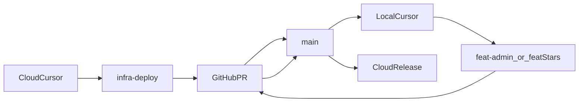

# 云端与本地协同执行方案

## 目标与原则

- 目标一：先在云端把基础设施和入口稳定下来，包括 `infra-deploy` 分支、`app-network`、MySQL 容器命名统一、FB 迁到 `80`、钉钉网页登录首轮闭环。
- 目标二：再在本地完成业务功能开发，包括跳转按钮、删除用户、以及应用对认证结果的感知逻辑。
- 目标三：最后回云端统一拉取主干、重新构建并完成全链路验收。
- 核心原则：
                - 外部入口与真实钉钉参数在云端做：域名、`80` 端口、钉钉后台回调地址、出口 IP 白名单、FB 后端 OAuth2 回调首轮闭环。
                - 认证实现以现有 FB 后端为核心：复用已存在的 `/api/auth/login`、`/api/me`、JWT 与 `token` cookie 体系，不再继续推进 `oauth2-proxy` 直连钉钉。
                - 业务感知与页面功能在本地做：谁登录了、哪些按钮可见、删除用户逻辑、审计页面、前后端业务代码。
                - 钉钉“你是谁”和本地系统“你能做什么”分层处理：钉钉负责确认员工身份，本地 `users`/角色/状态负责授权。
                - 所有云端环境改动统一放在一个分支：`infra-deploy`。
                - 所有业务代码改动放在本地 `feat/*` 分支。

## 进度台账（以 Git 和总结文档为准）

### 已完成

- `ronghe-platform`：`infra-deploy -> PR #1 -> main`，包含 `cdb062e` 等基础设施提交。
- `FB-Ad-Logic-Engine`：`infra-deploy -> PR #1 -> main`，包含 `dea6c56` 等分流与入口提交。
- 第一阶段云端地基已基本收口（见：`项目总结-2026-03-27-云上服务器协同部署阶段收口.md`）。
- M1：env 隔离与 `ENABLE_CRON` 防抢跑已完成，并已在本地封板通过。

### 进行中

- M2（修正版）：钉钉网页登录接入方案已改为“方式一：FB 后端直连钉钉 OAuth2 页面授权 + 复用现有 JWT/cookie”。

### 待执行

- M2：按修正版方案完成钉钉网页登录、身份映射与会话建立。
- M2.5：图床容器化接入（`tuchuang-backend`）。
- M3：联调验收。
- M4：本地业务功能。
- M5：云端统一发布与收口。

## 当前事实

- FB 系统当前部署方式：后端是 `systemd + Node`，前端入口是单独的 `fb-ad-nginx` 容器。
- 融合平台当前部署方式：由 [ronghe-platform/docker-compose.yml](/root/work/ronghe-platform/docker-compose.yml) 管理，公网入口当前是 `8081`。
- FB 当前入口文档仍以 [FB-Ad-Logic-Engine/docs/云服务器部署-运营访问.md](/root/work/FB-Ad-Logic-Engine/docs/云服务器部署-运营访问.md) 的 `8088` 为基础。
- 融合平台当前 Vite 配置文件 [ronghe-platform/frontend/vite.config.js](/root/work/ronghe-platform/frontend/vite.config.js) 没有显式 `base`，后续迁移到 `/ronghe/` 时必须处理。
- Compose 里 MySQL 服务名已经是 `mysql`，但容器名还是 `ronghe-mysql`，需要统一术语。
- FB 代码里已经有可复用的登录体系：`/api/auth/login`、`/api/me`、JWT 签发与 `token` cookie、`requireAuth/requireActive/requireAdmin`。
- 当前 `users` 体系没有钉钉身份字段或独立映射表；若接入钉钉网页登录，必须补“外部身份 -> 本地 user_id”的绑定模型。

## 第一阶段：云端环境打地基

这阶段全部在云端 Cursor 中完成。

### 里程碑 1：建立基础设施分支与网络地基

目标：把所有云端环境改动先收纳进 `infra-deploy`，并铺好共享认证网络。

#### 要做什么

- 在云端仓库创建并切换到 `infra-deploy` 分支。
- 创建 Docker 外部网络 `app-network`。
- 在 [ronghe-platform/docker-compose.yml](/root/work/ronghe-platform/docker-compose.yml) 中统一 MySQL 容器命名：把 `ronghe-mysql` 改为 `mysql`。
- 同时补齐 `networks` 配置，让后续 `nginx`、`/ronghe/` 代理链路、图床/网关等内网服务都能加入 `app-network`。
- Compose 层面的推荐写法要明确落地，避免后面每个人凭印象乱写：
```yaml
networks:
  app-network:
    external: true
```

                - 需要加入共享网络的 service，都显式补上：
```yaml
ervices:
  nginx:
    networks:
      - app-network
```

                - 后续新增内网服务时也沿用同样写法。
                - 原则：`app-network` 是“外部已存在网络”，Compose 负责“声明接入”，不负责“隐式创建替代品”。
- 在 [FB-Ad-Logic-Engine/0云端首次开发方案](/root/work/FB-Ad-Logic-Engine/0云端首次开发方案) 和 [FB-Ad-Logic-Engine/docs/云服务器部署-运营访问.md](/root/work/FB-Ad-Logic-Engine/docs/云服务器部署-运营访问.md) 中统一 MySQL 术语，避免后续文档还在写 `ronghe-mysql`。
- 同步检查并更新所有手工运维命令、备份命令、排障命令：
                - 把 `docker exec ronghe-mysql ...` 改成 `docker exec mysql ...`。
                - 建议把这条变化记到运维笔记首页，避免命令残留。
- 如果你在执行阶段使用了 `docker rename ronghe-mysql mysql` 这类命令做临时过渡：
                - 把它视为“现场动作”，不是最终配置真相。
                - 最终仍必须回到 `docker-compose.yml` 把 `container_name` 改成 `mysql`。
                - 否则下次 `docker compose up -d` 或容器重建时，名称会回滚。
- 同步全局排查是否有代码、脚本、服务配置仍写死 `ronghe-mysql`
                - 尤其要留意云端服务定义、历史脚本、个人临时命令。
                - 原则：改名后先验证连库，再结束操作。

#### M1 增补（防抢跑，代码级）

- 不能只改 `.env`，必须在后端入口增加 `ENABLE_CRON` 代码开关。
- 默认行为：未配置时视为 `true`（保障云端不死）。
- 本地行为：`ENABLE_CRON=false` 时跳过定时任务初始化。
- 验收：
                - 本地日志明确显示 “cron disabled / skip cron init”。
                - 云端未配置该值时仍保持定时任务正常。
- 回滚：
                - 去除开关逻辑，恢复原 cron 初始化流程。

#### M1.1 执行位次说明（避免云端改业务代码）

- 原则对齐：`ENABLE_CRON` 属于代码级逻辑，长期形态应由本地分支开发并合并，不作为云端常态手改项。
- 云端阶段动作（M1 内）：
                - 只验证“默认值未配置时 cron 仍正常运行”的不回归行为。
                - 如遇线上紧急抢跑风险，可做一次云端热修复，但必须在后续本地分支中补齐同等改动并合并，避免配置漂移。
- 本地阶段动作（进入业务开发前第一步）：
                - 在本地代码实现 `ENABLE_CRON` 开关。
                - 在本地 `.env` 明确设置 `ENABLE_CRON=false`，防止与云端重复触发定时任务。
                - 以日志作为门禁：出现 “cron disabled / skip cron init” 才允许进入后续里程碑。

#### 为什么先做

- 这是“施工前先修地下管道”。
- 后续 `/ronghe/` 代理、图床内网服务、网关与其他云端服务都需要共享网络，必须先把通道铺平。
- MySQL 名称不统一会让你后续排障、执行 `docker exec`、写文档时持续混乱。
- 容器改名这一步最容易留下“隐形旧命令”，所以必须连同人工运维习惯一起更新，而不是只改 compose 文件。
- `app-network` 如果不在 Compose 中显式声明 `external: true`，团队成员后续很容易写出“看起来像能跑、实际却没接到同一条通道”的配置，导致 `/ronghe/` 分流、网关内调与后续云端服务联调持续混乱。

#### 这一阶段的 Git

- 修改并验证通过后，在云端先提交一次：
                - 建议提交语义：`infra: add app-network and unify mysql container naming`

#### 这一阶段的验证

- `docker network ls` 里能看到 `app-network`
- `docker ps` 中 MySQL 的容器命名符合新的统一叫法
- 当前融合平台和 FB 既有功能不受影响
- FB 后端在容器改名后仍可正常连库，未出现 `Host not found` / 连接失败一类错误
- `docker compose config` 或等效检查结果中，`nginx` 已正确声明加入 `app-network`

### 里程碑 2：先把 FB 从 8088 迁到 80

目标：固定最终主入口，让钉钉回调地址以后不再反复改。

#### 要做什么

- 在真正切换前，先做一次 `80` 端口占用普查
                - 使用 `ss -tlnp | grep :80`。
                - 目标是确认当前到底是谁在占用 `80`。
                - 如果是宿主机裸 `nginx` 或其他进程占用，必须先识别再迁移。
- 修改 FB 的入口部署方式，让 `fb-ad-nginx` 从宿主机 `8088` 切到 `80`。
- 对齐文档：
                - [FB-Ad-Logic-Engine/docs/云服务器部署-运营访问.md](/root/work/FB-Ad-Logic-Engine/docs/云服务器部署-运营访问.md)
                - [FB-Ad-Logic-Engine/0云端首次开发方案](/root/work/FB-Ad-Logic-Engine/0云端首次开发方案)
- 保持 FB 后端 `3001` 不变，不在这一轮里去改 Node 服务本身。
- 保持融合平台继续在 `8081`，不要和 FB 入口切换绑成一团。
- 在改入口前，备份旧的 Nginx/部署配置
                - 原则：任何改 `80` 的动作前，都先留 `.bak`。
                - 迁移失败时可快速回退。

#### 为什么此时做

- 钉钉扫码回调和最终入口强绑定。
- 先把 `80` 稳住，再配钉钉，能避免回调地址、文档、验收步骤改两遍。
- `80` 是最容易翻车的公共入口，所以必须把“谁在占用端口”和“怎么回滚”放在修改动作之前，而不是之后再补救。

#### 这一阶段的 Git

- 80 端口验证通过后，在云端提交第二次：
                - 建议提交语义：`infra: move FB entry from 8088 to 80`

#### 这一阶段的验证

- 访问 `http://ad_tools.thinkpro.top` 能直接打开 FB
- `/api/health` 在新入口下正常
- 你手里有清晰的回滚方案，可以退回到 `8088`
- 已确认 `80` 端口没有被意外的宿主机进程抢占
- 如果迁移过程中曾停掉宿主机 `nginx` 或其他旧入口，已明确记录其原始状态和恢复方式

### 里程碑 3（对应 M2 修正版）：在云端接入钉钉网页登录（方式一）

目标：让用户访问 FB 主入口时，由 FB 后端发起钉钉官方页面登录授权，回调后复用现有 JWT 与 `token` cookie 建立会话；第一版先跑通 FB 主入口，再为 `/ronghe/` 做同域无感校验。

#### 先对齐结论（为什么不再继续 `oauth2-proxy`）

- 已验证失败的路径不再继续投入：`oauth2-proxy` 官方 provider 列表无 `dingtalk` 原生 provider，实测 `provider=oidc` 又要求 `issuer-url/jwks-url`，与钉钉当前 OAuth2 网页登录能力不匹配。
- 本阶段改用钉钉官方“实现网页方式登录应用（登录第三方网站）”能力：
                - 浏览器进入后端登录入口。
                - 后端 302 跳到钉钉授权页。
                - 钉钉回调带回 `code`。
                - FB 后端用 `code` 换用户 token，再拉用户信息。
                - FB 后端按本地身份映射和状态校验，复用现有 `signToken()` 与 `token` cookie 建立会话。

#### 要做什么

- 在 FB 后端接入钉钉网页登录第一版，优先走“方式一：钉钉提供的页面登录授权”，而不是一上来就做内嵌二维码。
- 推荐直接扩展现有认证模块：
                - [FB-Ad-Logic-Engine/server/routes/auth.js](/root/work/FB-Ad-Logic-Engine/server/routes/auth.js)
                - [FB-Ad-Logic-Engine/server/middleware/authJwt.js](/root/work/FB-Ad-Logic-Engine/server/middleware/authJwt.js)
- 后端至少新增两个入口：
                - `GET /api/auth/dingtalk/login`
                - `GET /api/auth/dingtalk/callback`
- 登录成功后仍复用现有体系：
                - 继续签发当前 `token` cookie。
                - 继续由 `/api/me` 返回当前用户。
                - 继续由 `requireAuth / requireActive / requireAdmin` 兜底业务权限。
- 不把钉钉字段硬塞进现有 `users` 逻辑主路径，推荐新增一张身份映射表（命名可在实施时细化），至少包含：
                - `provider`（固定 `dingtalk`）
                - `provider_user_id`（优先使用稳定标识，如 `unionid`）
                - `openid`
                - `corp_id`
                - `mobile`
                - `user_id`
                - 唯一约束：`(provider, provider_user_id)`
- 回调后的授权策略要写死：
                - 找不到本地绑定关系：拒绝登录或进入受控绑定流程，禁止默认放行。
                - 找到用户但 `status != active`：沿用现有 `pending / rejected / banned` 语义。
                - 高危接口继续只认本地系统角色，不把“能扫钉钉”直接等价成“能删用户”。

#### M2 增补（钉钉实参落位）

- 参数映射改为 FB 后端直连钉钉：
                - `DINGTALK_APP_KEY` <- 钉钉 `Client ID (AppKey)`
                - `DINGTALK_APP_SECRET` <- 钉钉 `Client Secret (AppSecret)`
                - `DINGTALK_REDIRECT_URI` <- FB 后端回调地址
                - `DINGTALK_SCOPE` <- 第一版建议 `openid`
- Secret 不写入 plan 正文，由你在执行阶段手工填入环境变量。
- 第一版推荐回调路径（与现有 `/api/auth/*` 风格保持一致）：
                - `http://ad_tools.thinkpro.top/api/auth/dingtalk/callback`
- `redirect_uri` 一致性清单（必须一字不差）：
                - 钉钉后台回调地址 = `http://ad_tools.thinkpro.top/api/auth/dingtalk/callback`
                - FB 环境变量 `DINGTALK_REDIRECT_URI` = `http://ad_tools.thinkpro.top/api/auth/dingtalk/callback`
                - 运维文档中的回调地址示例 = `http://ad_tools.thinkpro.top/api/auth/dingtalk/callback`
                - 严禁出现尾斜杠差异、大小写差异、前后空格；否则会触发 `redirect_uri mismatch`
- 浏览器登录链路第一版优先用“方式一”：
                - 访问 `/api/auth/dingtalk/login`
                - 后端跳钉钉授权页
                - 扫码后回到 `callback`
                - 成功后 302 回 `/dashboard`
- “方式二：内嵌二维码 `DTFrameLogin`”不删路线，但降级为后续体验优化，不作为首轮验收门槛。

#### 为什么这部分必须在云端做

- 域名、回调地址、扫码跳转都依赖真实公网入口，本地 `localhost` 无法真实模拟。
- 你要调的是“访问 `http://ad_tools.thinkpro.top` 时能否正确跳转钉钉并回到线上系统”，这是生产入口行为，不是本地 UI 细节。
- 钉钉如果没有把服务器公网 IP 加进白名单，即使回调地址正确，FB 后端去换 token/拉用户信息时也可能被拒绝，所以这属于必须在云端完成的前置安全配置。
- 同域共享登录态的关键不是二维码样式，而是回调后建立的本地 `token` cookie 是否能被浏览器稳定携带，这同样只能在真实域名环境里验证。

#### 这一阶段的 Git

- 云端网页登录验证成功后，再提交一次：
                - 建议提交语义：`auth: add dingtalk oauth page login flow`

#### 这一阶段的验证

- 访问主域名未登录时，会进入钉钉官方登录授权页。
- 扫码确认后，浏览器能回到 FB 系统。
- `/api/me` 能返回现有本地用户信息，而不是只停留在“拿到了钉钉用户信息”。
- 本地用户状态为 `pending / rejected / banned` 时，行为仍符合现有系统语义。
- 钉钉开放平台中已配置出口 IP 白名单，且当前公网 IP `104.194.95.40` 已在允许列表内。
- 钉钉后台与环境变量中的回调地址完全一致，扫码后无 `redirect_uri mismatch`。
- 登录成功后浏览器能保留现有 `token` cookie，并在同一浏览器中继续访问主域名下的受保护页面。

### 里程碑 3.5：为融合平台增加 `/ronghe/` 双入口过渡

目标：在不影响运营现有 `:8081` 访问习惯的情况下，逐步迁移到主域名统一入口。

#### 要做什么

- 在 [FB-Ad-Logic-Engine/deploy/nginx-fb-ad-docker.conf](/root/work/FB-Ad-Logic-Engine/deploy/nginx-fb-ad-docker.conf) 中增加 `/ronghe/` 代理入口，把它转给融合平台。
- 暂时保留 `http://ad_tools.thinkpro.top:8081`，形成“双入口并存”。
- 在过渡期验证：
                - `:8081` 能访问。
                - `/ronghe/` 也能访问。
                - 以主域名 `/ronghe/` 为主验证同域登录态。
                - 从 FB 跳转到 `/ronghe/` 时不重复扫码。

#### 为什么不立刻关掉 8081

- 这是“旧门先不关，新门先开放”的生产迁移策略。
- 运营正在使用时，最忌讳强制切换入口；双入口能显著降低上线焦虑和回滚成本。
- 跳转与登录态往往就在这一步出现“临界点”问题，所以保留旧入口可以帮你判断：问题到底出在路径、同域 Cookie、前端守卫还是资源加载，而不是一刀切后全站一起出错。

#### 这一阶段的 Git

- 当 `:8081` 与 `/ronghe/` 双入口都验证通过后，再在云端提交并准备推送：
                - 建议提交语义：`infra: add /ronghe dual entry transition`

#### 这一阶段的验证

- `http://ad_tools.thinkpro.top:8081` 正常
- `http://ad_tools.thinkpro.top/ronghe/` 正常
- 运营暂时不需要立即切换使用习惯
- 从 FB 页面点击跳转进入 `/ronghe/` 时，浏览器携带同域 `token` cookie，融合平台可通过主域名下的 `/api/me` 或同等校验接口确认已登录

### 第一阶段的 Git 总收口

- 当里程碑 1、2、3、3.5 全部完成并验证无误后：
                - `git push origin infra-deploy`
                - 在 GitHub 发起 PR
                - 将 `infra-deploy` 合并进 `main`
- 这一刻意味着：云端“地基”和“钉钉网页登录首轮闭环”正式固化到 GitHub。

### 里程碑 3.6（新增）：图床服务容器化接入（M2.5）

目标：在 UI 变更前完成 `tuchuang-backend` 的内网接入，稳定上传链路。

#### 要做什么

- 在 `ronghe-platform` 中把图床接为内网服务，禁止公网映射端口。
- 网关提供统一上传入口（例如 `/api/upload-image`），前端只调用网关，不直连图床服务。
- Nginx 新增上传路由，优先级高于通用 `/api`。
- 字段对齐：前端/网关/图床统一 `file` 字段名。
- 响应对齐：网关把图床返回结构转换为前端稳定可读结构。

#### 依赖与约束

- 运行方式匹配当前图床服务：`npm run start -> tsx src/server.ts`。
- Docker 构建需避免 `tsx` 缺失：
                - 不使用会剔除运行期 `tsx` 的安装策略；
                - 或将 `tsx` 调整到运行依赖（若继续采用 TS 直接运行）。

#### 验收

- 图床健康检查通过（`/health`）。
- 经 Nginx + 网关上传成功。
- 图床服务端口外网不可直连。

#### 回滚

- 回退 compose/nginx/gateway/frontend 的上传改动。
- 恢复旧上传路径并重载服务。

## 第二阶段：本地功能开发

这阶段全部在本地 Windows 的 Cursor 中完成。

### 准备动作

- 本地先执行：`git pull origin main`
- 目的：把云端已经合并的 80 端口、钉钉网页登录后端链路、`/ronghe/` 过渡入口全部同步到本地，避免本地开发覆盖云端已经验证过的地基。

### 里程碑 4：做业务代码、审计页面与交互优化

目标：完成“业务感知（代码）”部分，以及直接提升运营使用效率的页面功能，而不是继续改基础设施。

#### 建议分支

- 本地新建功能分支，例如：`feat-admin`
- 也可以拆成多个分支：
                - `feat/fb-portal-link`
                - `feat/admin-delete-user`
                - `feat/dingtalk-app-logic`
                - `feat/rule-audit-log`
                - `feat/rule-card-collapse`

#### 要做什么

- 跳转按钮：
                - 在 FB 前端中加按钮。
                - 跳转目标优先使用 `/ronghe/` 统一入口。
                - 使用 `target="_blank"`。
- 删除用户：
                - 增加前端管理员页面。
                - 增加后端 DELETE API。
                - 删除策略必须保证：
                                - 删除用户记录。
                                - 删除该用户作为 `creator_id` 创建的规则。
                                - 不删除其作为 `editor_id` 参与编辑的规则。
                                - 使用事务保证一致性。
- 认证业务感知：
                - 在应用代码里识别当前登录人是谁。
                - 做管理员可见性、用户映射、业务权限判断。
                - “删除用户”类高危操作，后端必须继续以现有 JWT / `req.user` 为准，不可把钉钉扫码结果直接当成管理员权限。
                - 只允许管理员身份执行删除，不可只靠前端隐藏按钮。
                - 若后续允许多个管理员，建议把名单抽到配置。
- 规则审计日志页面：
                - 目标：让管理员看到谁在何时创建、编辑、启停、删除规则，以及改动细节。
                - 优先复用现有 `rule_history`，第一版不重造表。
                - 后端做法：
                                - 新增管理员查询接口，读取 `rule_history`。
                                - 比较同一 `rule_id` 相邻两次 `rule_snapshot` 生成 diff。
                                - 第一版优先展示 `CREATE / UPDATE / DELETE / TOGGLE`。
                                - `SYSTEM_REFRESH` 默认隐藏或独立筛选。
                - 前端做法：
                                - 新增管理员页面（如 `/admin/rule-history`）。
                                - 提供筛选、分页、列表、详情抽屉。
                                - 列表显示：时间、操作人、规则名、变更类型、摘要。
                                - 详情显示字段级 “从什么改成什么”。
                - 可能涉及的文件：
                                - [FB-Ad-Logic-Engine/server/services/ruleHistoryService.js](/root/work/FB-Ad-Logic-Engine/server/services/ruleHistoryService.js)
                                - [FB-Ad-Logic-Engine/server/services/rulesService.js](/root/work/FB-Ad-Logic-Engine/server/services/rulesService.js)
                                - [FB-Ad-Logic-Engine/server/routes/rules.js](/root/work/FB-Ad-Logic-Engine/server/routes/rules.js)
                                - [FB-Ad-Logic-Engine/src/router/index.js](/root/work/FB-Ad-Logic-Engine/src/router/index.js)
                                - [FB-Ad-Logic-Engine/src/layouts/MainLayout.vue](/root/work/FB-Ad-Logic-Engine/src/layouts/MainLayout.vue)
                                - 新增页面 `src/views/RuleHistory.vue`
- 规则卡片折叠交互优化：
                - 目标：减少规则页纵向滚动，让运营先看重点，再按需展开细节。
                - 默认行为：
                                - 卡片默认折叠。
                                - Header 常驻，只展示规则名、账号、启停开关、THEN 动作、第 1 组 IF 条件。
                                - Body 折叠，放剩余 IF 条件组和细节参数。
                - 交互要求：
                                - 单卡右上角“展开/收起”图标。
                                - 页面顶部“一键展开/全部收起”。
                - 技术落点：
                                - 主改 [FB-Ad-Logic-Engine/src/views/RuleManager.vue](/root/work/FB-Ad-Logic-Engine/src/views/RuleManager.vue)
                - 注意点：
                                - 开关按钮避免误触整卡展开/收起。
                                - 页面级总开关与单卡状态保持一致模型。
- `/ronghe` 路径适配：
                - 检查 [ronghe-platform/frontend/vite.config.js](/root/work/ronghe-platform/frontend/vite.config.js)
                - 若融合平台最终稳定运行在 `/ronghe/`，需要设置 `base: '/ronghe/'`。
                - 本地需重新打包或验证构建产物，确认静态资源不碎。

#### 为什么业务代码在本地做

- 这部分属于复杂逻辑开发，不是运维配置。
- 本地更适合反复调试、读日志、改代码、重跑，不会直接污染云端生产环境。
- 但“谁能删除用户”不能只在本地前端页面上控制，真正的权限边界必须落在后端 API，对现有 JWT / `req.user` 做兜底校验。
- 规则日志页和规则卡片折叠都属于典型的“后台产品体验优化”，依赖的是现有接口与页面结构，最适合放在本地做细化打磨。
- 尤其是规则日志页的 diff 展示和卡片折叠交互，都需要频繁调整文案与 UI，放在本地开发效率最高。

#### 这一阶段的 Git

- 本地开发测通后：
                - `git push origin feat-admin` 或对应 `feat/*` 分支
                - 在 GitHub 发起 PR 并合并到 `main`

#### 这一阶段的验证

- 本地 `npm run dev` 或本地构建测试通过
- 跳转按钮可打开目标入口
- 删除用户逻辑符合预期
- 规则审计日志页面可看到：
                - 谁创建了规则
                - 谁编辑了规则
                - 谁启停了规则
                - 具体字段从什么改成了什么
- 规则卡片默认折叠，页面滚动显著减少
- 一键展开/全部收起可正常工作
- 单卡展开后能看到剩余 IF 条件组与详细参数
- `/ronghe/` 下静态资源路径正常

## 第三阶段：回云端统一发布与剪彩上线

这阶段回到云端 Cursor 操作。

执行节奏要求：

- 在云端里程碑 1、2、3、3.5 全部稳定前，先不要分散精力去改本地业务代码
- 原因：基础设施入口、认证与路径一旦未稳定，本地再开发功能会不断建立在变化的地基上，返工概率很高

### 里程碑 5：拉主干、构建、重启、验收

目标：让本地开发好的业务代码正式在云端落地，并与云端基础设施闭环。

#### 要做什么

- 云端执行：`git pull origin main`
- 在 FB 项目中执行：
                - `npm install`
                - `npm run build`
- 按实际变更范围重启：
                - FB 后端服务
                - `fb-ad-nginx`
                - `ronghe-platform` 相关容器（如 `nginx`、`api-gateway`）

#### 为什么这里必须重新构建

- 尤其是融合平台如果已经改了 `base: '/ronghe/'`，必须重新构建前端。
- 否则页面虽然能打开，但 JS、CSS、图片路径可能全部失效。

#### 最终验收顺序

- 访问主域名
- 未登录时跳到钉钉官方登录授权页
- 扫码后回到 FB
- 点击按钮进入 `/ronghe/` 的融合平台
- 验证融合平台入口正常，且同一浏览器下无需再次扫码
- 删除一个测试账号
- 创建、编辑、启停一条测试规则，检查“规则审计日志页面”是否正确记录
- 在规则管理页检查卡片默认折叠、单卡展开、全局展开/收起是否符合预期
- 检查执行日志时间显示正确

## Git 流向总图



## 关键风险与避坑提醒

- `ronghe-mysql -> mysql` 当前是容器名统一，不是数据库迁移。
- `app-network` 是高级架构的核心，但它主要先服务于云端内网联通、`/ronghe/` 代理与图床/网关协同；数据库链路因为 FB 后端仍在宿主机，暂时还不能完全内网化。
- 在里程碑 3 完成前，不要提前去钉钉后台乱改回调配置；先等 80 端口跑稳。
- 在里程碑 3 中，别漏掉钉钉开放平台的“出口 IP 白名单”；当前应加入的公网 IP 是 `104.194.95.40`，如果未来服务器公网 IP 变化，白名单也要同步更新。
- 在 `/ronghe/` 正式切换前，不要过早关闭 `8081`。
- 只要改了融合平台的 `base`，就必须重新构建，不可偷懒。
- `docker exec ronghe-mysql ...` 这类旧命令在容器改名后会全部失效，务必同步更新你的脚本和个人笔记。
- 删除用户功能一定要后端兜底校验现有 JWT / `req.user`，不能只靠前端按钮显隐，否则其他已登录员工理论上也可能触发危险接口。
- 规则审计日志页面第一版不要贪大求全，先基于现有 `rule_history.rule_snapshot` 做“读时 diff”，不要一上来就新增 `diff_json` 或重做历史表。
- 规则卡片折叠优化要优先保证“运营一眼看到重点”，不是把所有信息都继续塞进 Header；Header 只放最有决策价值的信息，其余放进可展开 Body。
- `80` 端口切换前一定要先确认占用者，必要时停掉旧的宿主机 `nginx`；不要等 Docker 起不来才回头查。
- 改入口前一定先备份旧配置，保留 `.bak` 文件是最低成本的回滚保险。
- MySQL 容器改名后要立即做一次 FB 连库验证，确认没有任何地方偷偷写死旧主机名。
- FB 跳转融合平台的“无感登录”核心依赖主域名下共享 `token` cookie，以及 `/ronghe/` 复用主域名的会话校验能力；第一版不再把 `auth_request + oauth2-proxy` 作为前提。
- 钉钉扫码只是“确认你是谁”，本地系统 `users/role/status/owner_id` 才决定“你在系统里能做什么”；不要把“能扫码登录”直接等价成“有管理员权限”。
- 若后续要让 `:8081` 与主域名完全等价地共享登录态，需单独评审其 API 校验路径，不要在未论证前默认承诺。
- 本方案后续统一执行基线为：`/root/work/.cursor/plans/云本地协同方案_6100b6d5.plan.md`。

## 未来路线图

- 当前跑稳后，再推进 HTTPS / `443`。
- 推荐后续目标：
                - 给主域名上 TLS 证书
                - 将钉钉回调和 Cookie 策略统一到 HTTPS
                - 未来把 FB 后端也容器化，让数据库访问也纳入 `app-network`