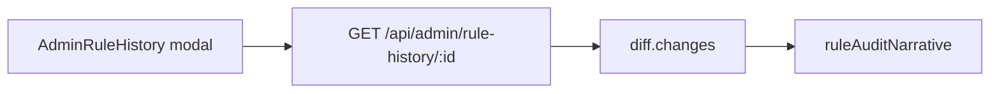

# 规则审计日志详细执行方案

> **单一真源**：主方案与台账均引用本文件（`…_7ffb510d.plan.md`）。  
> 过渡稿 `规则审计日志详细执行方案_4e47bf39.plan.md` 仅保留跳转说明，勿以其为执行依据。  
> 主方案：[终版云本地协同方案_6100b6d5.plan.md](./终版云本地协同方案_6100b6d5.plan.md) 里程碑 **4.4**。

## 0. 与主方案的关系

- **基线（已完成）**：管理端 `GET /api/admin/rule-history`、`GET /api/admin/rule-history/:id`；前端 [`src/views/AdminRuleHistory.vue`](src/views/AdminRuleHistory.vue)；`rule_history` + 迁移 `042_rule_history_snapshot_before.sql`；详情字段级 `diff` 以 JSON 展示。
- **本文档（已落地，见 §13）**：在**不改动上述 API 响应形状（P0）**的前提下，已提升**筛选体验**与**详情可读性**（读时叙述模块、集合差分、双栏对照、集合增减摘要等）。

## 0.1 三条必须死守的原则（开发与合码）

以下为本方案**灵魂**，实现与 Code Review 时须显式对照，避免「能跑但不可审计」或白屏。

### 原则一：读时 Diff（Read-time Diffing）

- **数据库永不存「差异结果」**：`rule_history` 只存配置快照（`rule_snapshot` / `snapshot_before`）及审计元数据，**不增加**预计算 diff 文本或差异 BLOB 列。以后若要换展示（配色、折叠、叙述模板），**优先只改前端**。
- **服务端单次读时计算**：详情接口在请求处理内用 `snapshot_before` 与 `rule_snapshot` 调用 `diffRuleSnapshots` 得到 `diff.changes`，属**读时、不落库**的字段级对比，与「不存差异」一致。
- **展示层一律读时生成**：中文分条叙述、高亮策略等，由前端基于返回的 `snapshot_*` 与 `diff.changes`（及 `notice`）在浏览器内生成；**禁止**为展示去改库表或要求后端存渲染结果。
- **可选演进（非 P0）**：若未来将字段级 diff 也完全前移到浏览器，需单独立项评估 API 与包体积；本里程碑仍以现有响应为准。

### 原则二：集合类差分必须可审计

- 对 **`target_account_ids`**、**`exclude_ids`**（及本方案涉及的其它 ID 集合：`target_ids`、`target_by_account` 等），**禁止**用「已修改」「配置已变更」等模糊句替代。
- 必须按计划输出 **新增哪些 ID、移除哪些 ID**（**全量列出**，与产品口径一致）；`exclude_ids` 按 **ad / adset / campaign** 分层叙述；`target_by_account` 遵守 §10.4 键级 + 键内差分。对运营而言，这就是可读报表。

### 原则三：防御性编程与 `safeArray`（命门）

- 在 [`ruleAuditNarrative.js`](src/utils/ruleAuditNarrative.js) 将 **`safeArray`**（及 `exclude_ids` 用的 **`safeExcludeIds` / `safeObject`**）实现为**标准工具**，**所有**涉及数组遍历、集合差分的入口**必须先经过**上述归一，禁止在业务分支里零散 `|| []` 遗漏路径。
- **合码检查清单**：任何处理 `diff.changes[].before/after` 的 PR，须能指出对应防御点；遗漏视为阻塞合并项。详见 §10.2。

### 补充（与原则一并读）：旧数据与「读时」解析的一致性风险

- **风险**：读时 Diff 与叙述依赖**当前** `formatConditions` / 词典；若未来规则编辑器或指标命名变更，**旧快照**仍可能触发解析路径异常（非 `safeArray` 能覆盖的逻辑错误）。
- **要求**：叙述链路须有 **try-catch 降级**（详见 §10.5），保证**单条失败不拖垮整窗**；与 `safeArray` 互补（类型防御 vs 语义/版本异常）。

## 1. 数据里有什么：话术与快照字段对齐

快照键以服务端为真源：[`server/services/ruleHistoryService.js`](server/services/ruleHistoryService.js) 中 `SNAPSHOT_KEYS` 与 `SNAPSHOT_FIELD_LABELS`。每条「运营想听懂的话」对应 0～n 个字段；**一次保存**若多字段变化，详情里已是多条 `diff.changes`（每项 `field`、`label`、`before`、`after`）。

| 语义（人话） | 主要字段 | 数据形态（要点） |
|--------------|----------|------------------|
| 选择/添加了哪些广告账户 | `target_account_ids` | `act_xxx` 字符串数组；对 `before`/`after` 做**稳定排序 + 去重**后求 added/removed |
| 手动圈选目标（广告/组/系列） | `target_ids`、`target_by_account` | 扁平 ID 列表，或按账户分桶 `{ "act_xxx": ["id", ...] }`（多账户方案 B）；按桶分别差分 |
| 开/关动态筛选 | `use_dynamic_scope` | 布尔；一句话「由关改为开」等 |
| 动态筛选条件从 A 变 B | `scope_filters` | `{ level, conditions[] }`（与规则页 [`RuleManager.vue`](src/views/RuleManager.vue) 中 `parseScopeFilters` / `buildScopeFiltersFromRows` 一致）；需专用 `formatScopeFilters` |
| 排除了哪些对象 | `exclude_ids` | 多为 `{ ad_ids, adset_ids, campaign_ids }`（与 `buildExcludeIdsForPreview` 落库形态一致）；**按层级**分别集合差分 |
| IF 条件组增删改 | `conditions`（及可能 `logic_operator`） | **v1**：数组；**v2**：`{ version: 2, groups: [{ operator, conditions }] }`（组内 AND、组间 OR，与 [`server/utils/conditionsValidator.js`](server/utils/conditionsValidator.js) 一致）；要「多了一组」需**结构化**对比，不能仅靠整段 JSON 相等 |
| THEN 动作 | `actions` | 数组；类型见 [`server/utils/templateValidator.js`](server/utils/templateValidator.js) `VALID_ACTION_TYPES`；需处理 `value`、`value_unit`、预算上下限等 |
| 名称、启用、时区、执行间隔、时间窗等 | `rule_name`、`enabled`、`timezone_name`、`execution_interval_minutes`、`execution_time_windows`、`target_level`、`is_simulation`、`max_dynamic_matches` 等 | 标量或短结构；`before`→`after` 模板句 |

**字段中文名**：叙述展示优先使用接口自带的 `c.label`（与 `SNAPSHOT_FIELD_LABELS` 一致），前端词典主要负责 **metric / operator / action / time_window / scope 条件** 等**值语义**。

## 2. 怎么变成一句话：三层叙述器（前端模块）

建议统一放在 [`src/utils/ruleAuditNarrative.js`](src/utils/ruleAuditNarrative.js)（文件名可微调），避免在 Vue 里堆 `if (type === 'pause_ad')`。

### A. 标量 / 枚举

- 适用：`rule_name`、`enabled`、`target_level`、`use_dynamic_scope`、`max_dynamic_matches`、`timezone_name`、`is_simulation`、`execution_interval_minutes` 等。
- 输出：`{label}：由「…」改为「…」`；创建类仅「变更后」、删除类仅「变更前」等单边句式（与 `change_type` / `notice` 配合）。

### B. 集合类（账户 ID、对象 ID）

- **须符合 §0.1 原则二**：可审计、禁止模糊句。
- 适用：`target_account_ids`、`target_ids`、`exclude_ids` 各层级、`target_by_account` 各 `act_xxx` 下 id 列表。
- 流程：规范化（trim、去重、**稳定排序**）→ `added` / `removed` → **各生成至少一句中文**。
- **产品裁定（已拍板）**：新增/移除 **全部写出，不截断**（不用「前 N 条 + 等共 M 条」）；账户仅展示 **`act_xxx`**，广告/组/系列仅展示 **ID**，不接名称（无额外接口依赖）。
- 示例句式：`目标广告账户：新增 act_111、act_222；移除 act_333。` `排除名单（广告）：新增 …；移除 …。` `手动目标：在账户 act_xxx 下新增 …`

### C. 结构化大块（「由摘要 A 变为摘要 B」）

- 适用：`scope_filters`、`conditions`、`actions`、`execution_time_windows`。
- 每类实现 `formatXxxForHumans(value) -> string` 或多行 `string[]`，diff 时：`{label}：由「…」改为「…」` 或分两栏列表对照。
- 降级：若某字段暂时无法细述，用「配置已变更」+ **折叠区**内前后各一段人话列表或 JSON（仍优于满屏无结构 JSON）。

## 3. 谁来做：与现有 API 的配合



- **与 §0.1 原则一一致**：`diff.changes` 由 `snapshot_before` / `rule_snapshot` 在**单次请求内**计算，**不**作为独立结果写入 `rule_history` 表；中文叙述与样式仍在前端读时生成。
- **P0**：**不改** [`server/routes/admin.js`](server/routes/admin.js) 详情 JSON 形状。前端对 `diff.changes` **按 `field` 分发**：若在集合/结构化白名单则调用对应叙述器；否则走标量模板或 JSON 兜底。
- **无 `changes` 的旧记录 / 仅全量快照**：对 `snapshot_after`（及需要时的 `snapshot_before`）调用「整快照多行叙述」函数。
- **可选 P1**：后端增加 `summary_lines` 或在 Node 复用同一套叙述逻辑，便于列表页一行摘要；代价是双端或 `shared` 包——**话术在 P0 用前端验证稳定后再评估**。

## 4. 同一次保存、多条变更：展示顺序（已拍板）

**固定顺序**输出多条 bullet（或有序列表），不合并成一段话。建议顺序（`field -> rank` 映射表实现）：

1. `rule_name`
2. `enabled`
3. `target_account_ids`
4. `use_dynamic_scope`
5. `scope_filters`
6. `target_level`、`target_ids`、`target_by_account`
7. `exclude_ids`
8. `max_dynamic_matches`
9. `conditions`、`logic_operator`
10. `actions`
11. `timezone_name`、`is_simulation`、`execution_interval_minutes`、`execution_time_windows`
12. 其余出现在 `diff.changes` 中但未列入上表的字段（按 `field` 名字母序或接在末尾）

## 5. 特殊文案（已拍板）

- **排除名单**从「有内容」变为「各层级均为空」：**使用固定句「已清空排除名单」**（可辅以层级说明）；与「移除全部排除项」相比，统一用前者以减少口径分叉。
- **语义级 diff**（如「多了一组条件」）：依赖 v2 `groups` 的结构化对比；v1 以整段 IF 前后摘要为主，避免错误推断。

## 6. 列表筛选：日期范围 UI（已拍板）

- 替换 [`AdminRuleHistory.vue`](src/views/AdminRuleHistory.vue) 中两个原生 `type="date"`。
- 单一日期范围控件（双月历 + 快捷：今天、昨天、最近 7/30 天、最近 3 个月等，与运营参考的看板体验对齐）；值同步为现有查询参数 **`from` / `to`**（`YYYY-MM-DD`），与 [`admin.js`](server/routes/admin.js) 现有 `changed_at` 过滤一致。
- **选完日期范围后仍须点击「查询」**才调用 `load(1)`，不自动请求。
- 依赖：如 `@vuepic/vue-datepicker` + 已有 `dayjs`；按需引入样式，[`package.json`](package.json) 增加依赖。

## 7. 详情弹窗 UI（目标形态）

- **变更说明**主区：`buildDetailNarrativeLines(detail)` → `<ul><li>…</li></ul>`。
- 原「字段级变更」双列 JSON：**默认折叠**或并入「查看原始 JSON」。
- **完整配置**区块：优先多行人话列表；底部保留 **折叠的原始 JSON**（词典未覆盖时的救命通道）。
- **全量展示与布局（已拍板）**：
  - **数据层**：集合类 ID **不截断**、不合并为「等共 N 条」，与 §0.1 原则二一致。
  - **呈现层**：避免因极长列表（如单次排除 **数百个 ID**）将弹窗撑出视口、影响阅读。对**变更说明列表**、**单字段内多行 ID 文本**等易超长区块，使用**独立滚动容器**：例如 `max-height: min(40vh, 360px)` 或固定 `300px`（实现时可与现有 `var(--radius)` / 设计稿对齐），并设 `overflow-y: auto`。整块弹窗外层（如 `.modal-body`）仍可保留总高度上限与纵向滚动，形成**外层 + 内层**可组合滚动，避免单块内容独占无限高度。
  - 上述 CSS **不削弱「全量」**：仅约束**可视区域高度**，用户通过滚动阅读全部 ID；与「文字上不省略」不矛盾。

- **叙述异常**：`buildDetailNarrativeLines` 及子函数须遵守 §10.5，避免单条解析失败导致整窗空白。

## 8. 分阶段落地（里程碑）

| 阶段 | 内容 | 验收要点 |
|------|------|----------|
| **M1** | 依赖安装 + 日期范围筛选 + 词典骨架；`target_account_ids`、`exclude_ids`（分 `ad_ids`/`adset_ids`/`campaign_ids`）、`target_ids`、`target_by_account` 集合差分叙述 | 筛选与查询行为正确；账户/排除/手动目标变更句可读且 ID 全量 |
| **M2** | `use_dynamic_scope` 标量句；`formatScopeFilters`（对齐 `effective_status` / `created_time`+`within_hours` / `name`+contains 等） | 与规则页保存的 `scope_filters` 语义一致 |
| **M3** | `formatConditions`（v1 + v2）；v2 **组级** diff 或前后整段摘要；`formatActions`（含 `set_budget`、`value_unit`、cap） | 多组规则可见「组」级变化或清晰前后对照 |
| **M4** | 无 diff 时的整快照 `formatFullSnapshot`；字段排序表；折叠 JSON；§10.5 try-catch 与 §7 滚动区样式；全路径手测 | 创建/删除/无 snapshot_before 的旧记录均可读；人为构造异常快照时弹窗不白屏、可见降级句与 JSON |

## 9. 风险与依赖

- **全量 ID**：单条日志极长；**数据上不截断**，**UI 上**用 §7 所述限高滚动区承接，避免撑破视口。
- **读时解析与版本漂移**：旧快照或未来格式升级可能导致某字段叙述抛错；依赖 §10.5 **按条降级**，并保留原始 JSON 对照。
- **新枚举**：词典未命中时显示英文 key + JSON 兜底；发版说明要求「新 metric/action 同步前端词典」。
- **`target_ids` 与 `target_by_account`**：叙述时以**多账户下的主形态**（多为 `target_by_account`）为主，避免同一次保存重复两段矛盾描述（实现时对比 `before/after` 实际哪路有增量）。

## 10. 落地注意事项（防弹清单）

实现 `ruleAuditNarrative` 与集合差分时必须遵守，避免白屏或错误展示。

### 10.1 `time_window` 与条件展示（`formatConditions`）

- 真实数据里除 `today` 外，还可能有其它枚举（如 `last_3_days`、`lifetime` 等），也可能为 **`null` / `undefined`**（部分条件无时间窗语义）。
- **禁止**把 `undefined`/`null` 渲染成可见字符串；无有效时间窗时**省略**「(时间窗 …)」类后缀即可。
- 词典未覆盖的取值：可回退为**原始 key 字符串**或仅展示指标+运算符+值，与产品口径一致即可。

### 10.2 集合差分前的输入防御（`diffStringSets` 等）与 `safeArray`（已采纳）

**架构约定**：在 [`ruleAuditNarrative.js`](src/utils/ruleAuditNarrative.js) 内提供通用工具，**凡参与数组差分、遍历的 `before` / `after` 必须先经此归一**，禁止在业务分支里散落判空。

- 推荐形态（语义示例，实现时可微调命名）：

```javascript
/** 将任意输入转为合法数组，避免 null/undefined/非数组导致白屏 */
function safeArray(value) {
  return Array.isArray(value) ? value : []
}
```

- `diff.changes` 中 `before` / `after` 可能为 **`undefined`**（字段缺失）、**`null`** 或非数组；旧数据路径尤甚。**进入 `diffStringSets(before, after)` 前**应写作：`diffStringSets(safeArray(before), safeArray(after))`（或在内部分别调用 `safeArray`）。
- 在任意 `.map` / `.filter` / 展开运算前，对已确认为「应为数组」的字段**统一**走 `safeArray`，避免运行时异常导致**整页白屏**。
- 对 `exclude_ids` 等**对象**形态字段：不能只用 `safeArray`；需 **`safeObject`（或 `safeExcludeIds`）** 保证根对象为对象，再对 `ad_ids` / `adset_ids` / `campaign_ids` 各层使用 `safeArray`，禁止对 `undefined` 直接下钻。

### 10.3 主线程与性能（明确不采纳的选项）

- **不作为默认要求**：用 `requestIdleCallback` 或 `setTimeout(..., 0)` 包裹 `buildDetailNarrativeLines`，以避免阻塞渲染。单条详情对单次 `diff` 的叙述计算通常足够轻量；**先同步实现**即可。
- **若**上线后 profiling 证明极端大快照下主线程卡顿，再**局部**考虑分片或让出主线程；不作为本方案里程碑验收项。

### 10.4 `target_by_account`：账户键级变更 + 键内 ID 差分

- 结构为 `{ act_xxx: [id, ...], ... }`，除「同一账户下 ID 增删」外，必须显式处理：
  - **`after` 中新增的 `act_xxx` 键**（整账户桶新增）：叙述为在该账户下新增的一批目标 ID（全量列出，与产品口径一致）。
  - **`before` 中有、`after` 中消失的键**（整账户桶删除）：叙述为移除该账户下的手动目标（可列举删除前 ID 全量或概括为「该账户下全部手动目标」——实现时选一种并与全文风格统一）。
- 建议实现顺序：**先做键集合的 added/removed**，再对**交集键**做 ID 列表差分；并用单测或固定夹具覆盖「仅键变」「仅 ID 变」「两者同时变」三种情况。

### 10.5 叙述与 Diff 的异常隔离（try-catch，已采纳）

**动机**：`safeArray` 等解决「类型不合法」；**旧数据怪异结构、指标改名、条件格式升级**仍可能在 `formatConditions`、`formatScopeFilters`、深拷贝路径中**抛错**。若不在叙述层设防，**一次未捕获异常会导致整页/整弹窗白屏**，用户无法看到原始 JSON。

**落地要求**（[`ruleAuditNarrative.js`](src/utils/ruleAuditNarrative.js) 与调用方 [`AdminRuleHistory.vue`](src/views/AdminRuleHistory.vue) 协同）：

1. **粒度**：优先对 **`diff.changes` 的每一条**（或映射出的**每一行叙述**）单独 `try { ... } catch (e) { ... }`，失败时该条输出固定降级句，**其余条目照常渲染**。
2. **降级文案（建议）**：`该条目解析失败，请查看下方原始 JSON。`（可与 `c.label` / `c.field` 并列展示，便于排障。）
3. **最外层保险**：`buildDetailNarrativeLines(detail)` 整体再包一层 `try/catch`，若连枚举行都失败，至少展示 `notice`、元信息与「查看原始 JSON」，避免空白弹窗。
4. **可观测性**：开发环境将 `e` 记入 `console.error`（含 `record.id`、`field`）；**详细调试姿势见 §11 第二步**。生产可按项目规范决定是否上报，**不向最终用户暴露堆栈**。
5. **与 §7 关系**：降级句所在列表项同样受**限高滚动容器**约束，避免失败提示本身把布局撑乱。

## 11. 落地操作顺序与保命符（实施纪律）

以下三条为**执行期纪律**，与 §8 里程碑配套，避免「一次写全格式化器」导致排错面爆炸。

### 第一步：严格按 M1→M4 递增，不要一次性写完所有格式化器

- **顺序与 §8 一致**：先完成 **M1**（日期范围 + 词典骨架 + **集合类**叙述）；集合类中建议以 **`target_account_ids`** 为**最先打通**的用例（结构简单、便于肉眼对照 JSON），再扩展到 `exclude_ids`（分层级）、`target_ids`、`target_by_account`（键级 + 键内，见 §10.4）。
- **再 M2**：`use_dynamic_scope`、**`formatScopeFilters`**（结构化但形态稳定）。
- **再 M3**：**`conditions`（v1/v2）与 `actions`**——字段最复杂、分支最多，**放在集合与 scope 已稳定之后**，减少「同时怀疑格式器与数据」。
- **最后 M4**：无 diff 的整快照 `formatFullSnapshot`、排序、折叠 JSON、§10.5 与 §7 联调。
- **禁止**：在集合类叙述未在真实数据上跑通前，就一次性实现全部 `formatConditions` / 全表字段——违背分阶段验收，排错成本陡增。

### 第二步：开发/联调期的 catch 与日志（定位「哪条旧数据坏了」）

- 当 `buildDetailNarrativeLines`、或**单条** `diff.changes` 的叙述分支在开发阶段抛错时，在 **catch** 内除 §10.5 的降级文案外，建议输出足够上下文以便**秒级定位**，例如：
  - `console.error('[ruleAuditNarrative]', err, { field: c.field, label: c.label, recordId: detail?.record?.id, changeType: detail?.record?.change_type })`
  - 必要时附加 **`before`/`after` 的精简引用**或 `JSON.stringify` 截断片段（注意大对象勿整表打印拖慢控制台）。
- 目的：识别「哪个字段、哪条历史、哪种**旧快照格式**」与当前 `formatXxx` 假设不一致；与 §10.5「不向用户暴露堆栈」不冲突（仅开发者工具）。

### 第三步：[`AdminRuleHistory.vue`](src/views/AdminRuleHistory.vue) 弹窗与盒子模型

- **记住 §7 数值**：长内容区优先使用 **`max-height: min(40vh, 360px)`**（或产品确认后的等价值）+ **`overflow-y: auto`**，与「全量数据、不在文案里截断」并存。
- **若出现「弹窗空白、内容高度为 0、只能看到遮罩」**：优先排查**父级链条**的 **height / min-height / flex / overflow**：
  - 父元素 `height: 0`、`overflow: hidden` 且未给子元素分配高度；
  - `flex` 子项未设 `min-height: 0` 导致子滚动区无法收缩；
  - 多层嵌套时**内层**设了 `max-height` 但**外层** `max-height: none` 且视口被撑出——应按 §7 从 `.modal` → `.modal-body` → **叙述列表滚动容器**逐层用开发者工具查看**计算后高度**。
- 此类问题为前端常见「盒子模型」踩坑，与叙述逻辑无关；先修布局再怀疑 `buildDetailNarrativeLines`。

## 12. 主方案台账

- 主方案 §4.4 子计划 **已完成**（2026-04-11）：本文件 `status: completed`；主方案 [终版云本地协同方案_6100b6d5.plan.md](./终版云本地协同方案_6100b6d5.plan.md) 中 `rule-audit-ux-enhancement` todo 已置为 **completed**。

## 13. 落地结果与相对原方案的增量（2026-04-11）

以下与正文 §7「变更说明主区 = `<ul>` 长列表」的**表述**略有演进，但**仍遵守 P0（不改 API）与 §0.1 三条原则**；验收以真实页面与 `npm run build` / `npm run test` 为准。

### 13.1 已交付能力（代码真源）

| 能力 | 落点 |
|------|------|
| 日期范围 | `@vuepic/vue-datepicker` + 快捷区间；`from`/`to` 仍须点「查询」才请求 |
| 读时叙述 | [`src/utils/ruleAuditNarrative.js`](src/utils/ruleAuditNarrative.js)：`safeArray` / `safeExcludeIds`、`DIFF_FIELD_RANK` + `sortRuleHistoryChanges`、集合/scope/IF/THEN 格式化、`buildDetailNarrativeLines`（叙述链路仍可用于校验与兜底） |
| 详情主 UI | [`src/views/AdminRuleHistory.vue`](src/views/AdminRuleHistory.vue)：按 **field 排序** 的 **双栏**（修改前灰 / 修改后绿）+ 每字段 **人话单列**（`formatDiffColumnBefore` / `After`）；**非字母序**，与 `DIFF_FIELD_RANK` 一致 |
| 详情加载态 | 请求后「正在加载详情…」→「正在解析变更详情…」（双 `requestAnimationFrame` 减轻闪烁） |
| §10.5 | `detailViewOk` + 解析失败时底部 **原始详情 JSON 兜底**；折叠区保留 **字段级原始 JSON** |
| §7 滚动 | `narrative-scroll` / `max-height` 约束长内容 |
| 列表页布局 | `.admin-page` `margin: 0 auto` 居中 |

### 13.2 方案外增量（双栏之上的「增减摘要」）

- 对 **`target_account_ids`、`target_ids`**：在双栏**上方**增加 **「本次增减摘要」**：**新增** 与 **减少** 分块展示（`getCollectionDeltaSummary` → `kind: 'flat'`），与下方**全量双栏**并存，便于一眼看谁多谁少。
- 对 **`exclude_ids`**：摘要按 **广告 / 广告组 / 广告系列** 分层，每层内 **新增排除 / 减少排除** 分开。
- 对 **`target_by_account`**：摘要分为 **新增账户（新桶）**、**移除账户（整桶）**、**同账户下 ID 增减**（与 §10.4 一致）。

### 13.3 与 §8 里程碑的对照

- **M1–M3**：叙述与格式化已在 `ruleAuditNarrative.js` 贯通；详情展示以 **双栏 + 摘要** 为主，而非原文 §7 的纯 `<ul>` 长列表。
- **M4**：`formatFullSnapshot` 专用于「整段人话列表」的独立区块**未单独实现**；无字段级 diff 时仍以 **`diff.notice` + 完整配置 JSON**（及折叠 JSON）满足可读与兜底。若后续要 §8 字面意义的「整快照人话列表」，可单独立项。

### 13.4 过程问题与处理（窗口纪要）

| 问题 | 处理 |
|------|------|
| 长句「由…改为…」导致 IF 等字段难读 | 改为双栏各列人话 + 折叠 JSON；复杂字段不再依赖单句合并 |
| 仅差分栏时丢失「全量」对照 | 恢复双栏全量快照，再**叠加**增减摘要（§13.2） |
| 解析失败白屏风险 | `formatDiffColumn*` / `getCollectionDeltaSummary` 内 try-catch + `detailViewOk` + 底部 JSON |
| 字段顺序混乱 | 导出并统一使用 `DIFF_FIELD_RANK`，禁止纯字母序 |

---

## 14. 归档引用

- 过程文档：`项目开发过程/云端项目总结-2026-04-11-规则审计页体验增强与双栏摘要.md`
