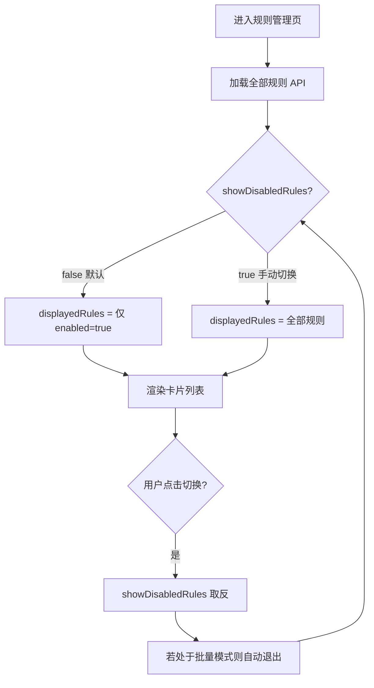

# 规则管理页「显示/隐藏已关闭规则」切换 — 实现方案

## 一、需求

在规则管理页（`src/views/RuleManager.vue`）顶部操作栏加入一个**显示/隐藏已关闭规则**的切换控件。默认进入页面时**隐藏已关闭（`enabled=false`）的规则**，用户可手动切换为显示全部。

---

## 二、影响范围

| 层级 | 文件 | 改动性质 |
|------|------|----------|
| 前端 | `src/views/RuleManager.vue` | 新增状态变量、computed、模板控件、样式 |

> 不涉及后端改动。API `GET /api/rules` 始终返回全部规则（含已关闭），过滤在前端完成。

---

## 三、实现步骤

### 步骤1：新增响应式状态变量

在 `setup()` 中已有状态区（约第 1060 行 `rulesLoaded` 附近）新增一个变量：

```js
/** 是否在列表中显示已关闭（enabled=false）的规则；默认关闭（隐藏已关闭规则） */
const showDisabledRules = ref(false)
```

位置参考：在 `const rulesLoaded = ref(false)` 之后添加。

---

### 步骤2：新增 computed（过滤列表 + 隐藏计数）

在 `setup()` 中（约第 1200 行 `showBootstrapButton` 附近）新增两个 computed：

```js
/** 根据 showDisabledRules 开关过滤后的规则列表，用于模板渲染 */
const displayedRules = computed(() => {
  if (showDisabledRules.value) return rules.value
  return rules.value.filter(r => r.enabled !== false)
})

/** 当前被隐藏的已关闭规则数量 */
const hiddenDisabledCount = computed(() => {
  if (showDisabledRules.value) return 0
  return rules.value.filter(r => r.enabled === false).length
})
```

> 说明：由于 `normalizeRule` 已保证 `r.enabled` 为 boolean（第 1486 行 `enabled: r.enabled !== false`），过滤条件用 `r.enabled !== false` / `r.enabled === false` 即可。

> `hiddenDisabledCount` 仅在 `showDisabledRules=false` 时有值；切换为显示全部后归零，避免显示无意义的"已隐藏 0 条"。

---

### 步骤3：模板中替换 `rules` 为 `displayedRules`

需要替换的位置有 **4 处**，涉及模板中的列表渲染和条件判断：

#### 3.1 空状态判断（约第 108 行）

```html
<!-- 原代码 -->
<div v-if="rules.length === 0" class="empty-rules">

<!-- 改为 -->
<div v-if="displayedRules.length === 0" class="empty-rules">
```

> 注意：`showBootstrapButton` computed 中使用了 `rules.value.length === 0`（第 1200 行），需要同时改为 `displayedRules.value.length === 0`，否则当所有规则都是已关闭时，隐藏后仍可能显示空状态的一键铺底按钮。

#### 3.2 规则网格迭代（约第 131 行）

```html
<!-- 原代码 -->
<div v-for="r in rules" ...>

<!-- 改为 -->
<div v-for="r in displayedRules" ...>
```

#### 3.3 顶部操作栏条件判断（约第 87-93 行）

顶部操作栏中 `全部折叠/全部展开` 和 `批量添加账户` 按钮的外层 `<template>` 判断用到了 `rules.length > 0`：

```html
<!-- 原代码 -->
<template v-if="rules.length > 0">
  <button ...>全部折叠</button>
  <button ...>全部展开</button>
</template>
<template v-if="!bulkMode && rules.length > 0">
  <button ...>批量添加账户</button>
</template>

<!-- 改为 -->
<template v-if="displayedRules.length > 0">
  ...
</template>
<template v-if="!bulkMode && displayedRules.length > 0">
  ...
</template>
```

#### 3.4 批量模式下的全选判断（约第 91-95 行）

```html
<!-- 原代码 -->
{{ selectedCount === rules.length ? '取消全选' : '全选' }}

<!-- 改为 -->
{{ selectedCount === displayedRules.length ? '取消全选' : '全选' }}
```

以及 `toggleSelectAllRules` 函数中（约第 965-969 行的 JS）：

```js
// 原代码
const toggleSelectAllRules = () => {
  if (selectedCount.value === rules.value.length) {
    selectedRuleIds.value = []
  } else {
    selectedRuleIds.value = rules.value.map(r => r.id)
  }
}

// 改为
const toggleSelectAllRules = () => {
  const visible = displayedRules.value
  if (selectedCount.value === visible.length) {
    selectedRuleIds.value = []
  } else {
    selectedRuleIds.value = visible.map(r => r.id)
  }
}
```

---

### 步骤4：在顶部操作栏添加切换控件（含隐藏计数）

在顶部操作栏的 `<div class="actions">` 中，建议放在折叠/展开按钮之前，与现有控件平级。位置参考：约第 16 行 `<div class="actions">` 内。

```html
<!-- 在「批量添加账户」按钮之前插入 -->
<label class="toggle-disabled-rules">
  <input
    type="checkbox"
    v-model="showDisabledRules"
    @change="onToggleDisabledRules"
  />
  <span class="toggle-label">显示已关闭规则</span>
  <span v-if="hiddenDisabledCount > 0" class="hidden-count">已隐藏 {{ hiddenDisabledCount }} 条</span>
</label>
```

配套的 JS 函数（在 setup 内）：

```js
/** 切换显示/隐藏已关闭规则时，退出批量模式避免选中状态混乱 */
const onToggleDisabledRules = () => {
  if (bulkMode.value) exitBulkMode()
}
```

> **计数显示逻辑**：当 `showDisabledRules=false` 且有已关闭规则时，显示 `已隐藏 N 条`；勾选显示全部后计数归零，标签自动隐藏。

---

### 步骤5：修改 `showBootstrapButton` 的计算口径

`showBootstrapButton`（第 1200 行）目前判断 `rules.value.length === 0`，需要改为基于 `displayedRules`：

```js
// 原代码
const showBootstrapButton = computed(() =>
  rulesLoaded.value && !isAdminFromRules.value && rules.value.length === 0
)

// 改为
const showBootstrapButton = computed(() =>
  rulesLoaded.value && !isAdminFromRules.value && displayedRules.value.length === 0
)
```

---

### 步骤6：修改 `collapseAllRuleCards` / `expandAllRuleCards`

这两个函数（约第 1254 行）用到了 `rules.value`：

```js
// 原代码（全部展开）
expandedRuleIds.value = rules.value.map(r => r.id)  // 或类似逻辑

// 改为：对当前可见的规则操作
expandedRuleIds.value = displayedRules.value.map(r => r.id)
```

---

### 步骤7：setup() return 补充导出

在 `setup()` 的 return 对象中（约第 3130+ 行）补上新增的变量：

```js
return {
  // ...existing...
  showDisabledRules,
  displayedRules,
  hiddenDisabledCount,
  onToggleDisabledRules,
  // ...existing...
}
```

---

### 步骤8：添加样式

在 `<style scoped>` 末尾添加切换控件和计数标签的样式：

```css
/* 显示/隐藏已关闭规则切换 */
.toggle-disabled-rules {
  display: inline-flex;
  align-items: center;
  gap: 6px;
  cursor: pointer;
  font-size: 13px;
  color: var(--text-secondary);
  user-select: none;
  white-space: nowrap;
}

.toggle-disabled-rules input[type="checkbox"] {
  width: 15px;
  height: 15px;
  cursor: pointer;
  accent-color: var(--primary-color, #4A90D9);
}

.toggle-disabled-rules .toggle-label {
  cursor: pointer;
}

/* 已隐藏计数标签 */
.toggle-disabled-rules .hidden-count {
  font-size: 12px;
  color: var(--text-muted, #999);
  background: var(--bg-muted, #f0f0f0);
  padding: 1px 8px;
  border-radius: 10px;
  margin-left: 2px;
}
```

---

## 四、用户交互流程



---

## 五、边界情况处理

| 场景 | 处理方式 |
|------|----------|
| 全部规则都是已关闭 → 默认隐藏 | `displayedRules` 为空数组，显示空状态（"暂无自动化规则"），但"一键生成常用模板规则"按钮隐藏（因 `showBootstrapButton` 基于 `displayedRules` 判断） |
| 批量模式下切换 | `onToggleDisabledRules` 自动调用 `exitBulkMode()` 退出批量模式，避免选中规则 ID 与可见列表不一致 |
| 选中负责人筛选后再切换隐藏 | 无影响——`rules` 数组不变，`displayedRules` 在 `rules` 基础上叠加 `showDisabledRules` 过滤 |
| 从其他页面切回规则页 | 由于 `showDisabledRules` 是 ref 而非持久化存储，刷新页面或重新进入均会重置为默认 `false`（隐藏已关闭） |

---

## 六、不在本次范围内的可选增强（后续可做）

1. **持久化用户偏好**：将 `showDisabledRules` 存入 `localStorage`，用户下次进入保持上次选择。
2. **URL query 参数同步**：`?showDisabled=1` 控制初始状态，方便分享链接。

---

## 七、改动汇总

| 改动类型 | 位置 | 数量 |
|----------|------|------|
| 新增 ref | setup() 变量区 | 1 |
| 新增 computed | setup() computed 区 | 2（displayedRules + hiddenDisabledCount） |
| 新增函数 | setup() 函数区 | 1 |
| 模板替换 `rules` → `displayedRules` | template 中约 5 处 | ~5 |
| 新增模板元素 | header-actions 区 | 1 个 `<label>`（含计数 `<span>`） |
| 修改 JS 函数 | `toggleSelectAllRules`、`showBootstrapButton` 等 | ~3 |
| 新增样式 | `<style scoped>` | ~25 行 |
| setup return 补充 | return 对象 | 4 行 |
