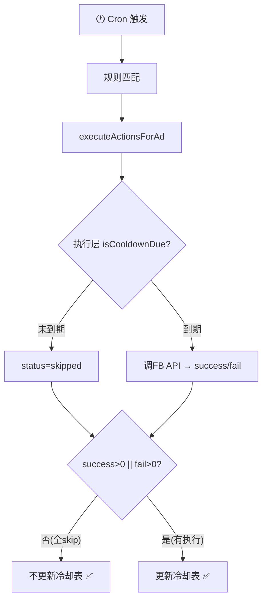

# 预算冷却无限重置 Bug 诊断报告

> 日期：2026-06-04
> 严重级别：🔴 高
> 影响范围：所有设置了 `execution_interval_minutes > 0` 的预算类规则
> 发现方式：用户反馈 + 数据库追溯 + 代码审查

---

## 一、用户反馈

> "natie-159147-Mssbabe-TD-ZK-01 账户的广告 120245703325380388，在约 6.5 日 3 点半触发了规则减预算后，没有按规则在两小时后再减。"

预期行为：规则「每次减 50%」配置了 120 分钟执行间隔，应在首次减预算 2 小时后再次评估并执行。

---

## 二、数据库追溯

### 2.1 涉及实体

| 实体 | 值 |
|---|---|
| 账户 | `act_927139705822379`（natie-159147-Mssbabe-TD-ZK-01） |
| 广告 | `120245703325380388`（常规-amao-26051415-Men's 250th Anniversary） |
| 广告组 | `120245703325370388` |
| 规则 ID | `977` |
| 规则名 | 【所有投放中的广告】【减预算】每次减 50% |
| 执行间隔 | `120` 分钟 |
| 动作 | `decrease_budget`，每次减 50%，最低 $5.00 |

### 2.2 规则条件（OR 两组）

```json
{
  "groups": [
    {"operator": "AND", "conditions": [
      {"metric": "spend", "operator": "gt", "value": 27, "time_window": "today"},
      {"metric": "purchases", "operator": "eq", "value": 0, "time_window": "today"}
    ]},
    {"operator": "AND", "conditions": [
      {"metric": "spend", "operator": "gt", "value": 0, "time_window": "today"},
      {"metric": "purchases", "operator": "gte", "value": 1, "time_window": "today"},
      {"metric": "roas", "operator": "lt", "value": 2.2, "time_window": "today"},
      {"metric": "cpa", "operator": "gt", "value": 25, "time_window": "today"}
    ]}
  ],
  "version": 2
}
```

### 2.3 执行时间线（`automation_logs`）

| 北京时间 | UTC | 状态 | 说明 |
|---|---|---|---|
| 6/5 **03:33:20** | 06-04 19:33:20 | ✅ **success** | **唯一一次成功执行**，减预算 50% |
| 03:34 ~ 09:46 | 19:34 ~ 01:46 | ❌ skipped | 连续 373 次 "预算冷却未到期"，每分钟 1 次 |
| 09:47+ | 01:47+ | — | 规则条件不再匹配，停止评估 |

```sql
-- 验证：只有 1 条 success
SELECT COUNT(*) FROM automation_logs 
WHERE account_id='act_927139705822379' AND ad_id='120245703325380388'
  AND rule_id=977 AND action_type='DECREASE_BUDGET' AND status='success';
-- 结果: 1（仅在 19:33:20 UTC）
```

### 2.4 冷却状态表（`rule_ad_execution_state`）

```
rule_id: 977
scope_key: budget_adset:120245703325370388
last_executed_at: 2026-06-05 01:46:44 UTC  ← 注意：在 skipped 期间持续被覆盖
last_status: success
```

冷却键 `budget_adset:120245703325370388` 的 `last_executed_at` 在每次 Cron 扫描时都被更新为当前时间，从未有机会等到 120 分钟过期。

---

## 三、根因分析

### 3.1 Bug 位置

**文件**：`server/services/cronService.js`  
**行号**：约 L1098（冷却未到期分支）、约 L1125（预算已达目标分支）

```js
// L1089-1110：预算冷却检查（调度层 batch 路径）
const cooldownKey = scope === 'adset' ? `budget_adset:${nodeId}` : `budget_campaign:${nodeId}`
if (intervalMin > 0) {
    const due = await isCooldownDue(meta.winnerRule.id, cooldownKey, intervalMin)
    if (!due) {
        // 冷却未到期 → 应该跳过，不应该更新冷却时钟
        executionResultsByScope[scopeKey] = { success: 0, fail: 0, skipped: 1 }
        accountMatched++
        accountExecuted++
        stateUpdates.push({                                    // 🔴 BUG HERE
            ruleId: meta.winnerRule.id,
            scopeKey: cooldownKey,
            lastStatus: 'success'                              // 写入了 success！
        })
        await writeBatchStatusAuditLog({
            // ... status: 'skipped', errorMessage: '预算冷却未到期'
        })
        continue
    }
}
```

```js
// L1118-1133：预算已达目标分支（同样的问题）
if (currentCents === newBudgetCents) {
    // 预算已在目标值 → 应该跳过，不应该更新冷却时钟
    executionResultsByScope[scopeKey] = { success: 0, fail: 0, skipped: 1 }
    accountMatched++
    accountExecuted++
    stateUpdates.push({                                        // 🔴 BUG HERE
        ruleId: meta.winnerRule.id,
        scopeKey: cooldownKey,
        lastStatus: 'success'                                  // 写入了 success！
    })
    await writeBatchStatusAuditLog({
        // ... status: 'skipped', errorMessage: '目标已达成（budget_already_at_target）'
    })
    continue
}
```

### 3.2 `stateUpdates` 的下游处理

```js
// ruleExecutionStateService.js L96-126
export async function upsertRuleAdExecutionStateBatch(entries) {
    const validStatus = ['success', 'fail', 'suppressed', 'outside_window']
    for (const { ruleId, scopeKey, lastStatus } of entries) {
        // 仅过滤 outside_window / suppressed
        if (lastStatus === 'outside_window' || lastStatus === 'suppressed') continue
        
        // success / fail → 写入冷却表，更新 last_executed_at
        await pool.execute(
            `INSERT INTO rule_ad_execution_state (...) VALUES (..., UTC_TIMESTAMP(), ...)
             ON DUPLICATE KEY UPDATE last_executed_at = VALUES(last_executed_at), ...`
        )
    }
}
```

`success` 和 `fail` 状态**不在过滤名单中**，会被写入 `rule_ad_execution_state`，导致 `last_executed_at` 被更新为 `UTC_TIMESTAMP()`。

### 3.3 究竟是怎么"错误更新"的——逐步骤白话拆解

先理解一个背景：系统里有一张"冷却记录表"叫 `rule_ad_execution_state`，它记着"某个规则的某个广告组，上一次真正调 FB API 改预算是什么时间"。后面的冷却判断全靠查这张表——"距离上次操作满 120 分钟了吗？"

**正常流程（应该的样子）：**

```
第1次 Cron 触发：
  规则条件命中 → 冷却表里没记录（第一次）→ 执行减预算 ✅
  → 在冷却表里记一笔：last_executed_at = 03:33

第2~120次 Cron 触发（接下来 2 小时）：
  规则条件仍然命中 → 查冷却表：上次是 03:33，才过了 X 分钟，没到 120
  → 跳过，不调 FB API，冷却表不动 ← 关键：冷却表不动！

第121次 Cron 触发（2 小时后）：
  规则条件仍然命中 → 查冷却表：上次是 03:33，过了 120 分钟
  → 冷却到期！→ 再执行一次减预算 ✅
  → 更新冷却表：last_executed_at = 05:33
```

**实际的 Bug 流程（现在代码的行为）：**

下面我把代码拆开，一段一段加注释说明每一步实际干了什么。

---

#### 第 1 步：Cron 每分钟触发，进入规则评估

```js
// cronService.js — 每分钟执行一次
cron.schedule('* * * * *', async () => {
    //   ↑ 每分钟 1 次
    await executeRulesForAccount('act_927139705822379')
})
```

#### 第 2 步：规则条件命中，进入预算冷却检查

```js
// 规则 977 的条件是：spend > $27 AND purchases = 0（today）
// 现在 spend = $50, purchases = 0 → 条件命中！

// ↓ 进入这段代码 ↓
const cooldownKey = 'budget_adset:120245703325370388'  // 按广告组冷却
const intervalMin = 120  // 规则设置的 120 分钟冷却间隔

// 查冷却表：这个广告组上次改预算是什么时候？
const due = await isCooldownDue(ruleId=977, cooldownKey, intervalMin=120)
//          ↑ 这个函数去 SELECT rule_ad_execution_state
//            查 last_executed_at，算距离现在过了多少分钟
```

#### 第 3 步：冷却没到期 → 本应只记 skipped 日志，但代码多做了一件事

```js
if (!due) {  // 冷却没到期！现在才过了 1 分钟

    // ✅ 下面这三行是对的：统计上记一次 skipped
    executionResultsByScope[scopeKey] = { success: 0, fail: 0, skipped: 1 }
    accountMatched++    // 统计：匹配了
    accountExecuted++   // 统计：执行了（其实是跳过了，命名有歧义但不影响逻辑）

    // 🔴 问题就在这里！下面这 4 行不该存在：
    stateUpdates.push({
        ruleId: 977,
        scopeKey: 'budget_adset:120245703325370388',
        lastStatus: 'success'   // ← 把"跳过"标记成了"执行成功"！
    })
    // 这行代码的意思是："帮我记一下，规则 977 对这个广告组执行成功了"
    // 但实际上根本没有执行！只是跳过了！

    // ✅ 这行是对的：审计日志如实记录
    await writeBatchStatusAuditLog({
        status: 'skipped',                        // 如实写 skipped
        errorMessage: '预算冷却未到期'              // 如实写原因
    })

    continue  // 跳过本次，等下次 Cron
}
```

#### 第 4 步：`stateUpdates` 数组在函数末尾被统一写入冷却表

```js
// cronService.js 函数末尾（约 L1348）
if (fromScheduler && stateUpdates.length > 0) {
    await upsertRuleAdExecutionStateBatch(stateUpdates)
    //    ↑ 把 stateUpdates 里攒的所有记录，一条条写进 rule_ad_execution_state 表
}
```

#### 第 5 步：写入函数收到 `lastStatus: 'success'` → 放行了

```js
// ruleExecutionStateService.js
export async function upsertRuleAdExecutionStateBatch(entries) {
    for (const { ruleId, scopeKey, lastStatus } of entries) {

        // 5.16 修复在这里加了过滤：跳过 outside_window 和 suppressed
        if (lastStatus === 'outside_window' || lastStatus === 'suppressed') {
            continue  // ← 这两种不写入，冷却表不动
        }

        // 但是 lastStatus 是 'success'，不在过滤名单里！
        // → 没有被拦截 → 继续往下走 →

        await pool.execute(
            `INSERT INTO rule_ad_execution_state
                 (rule_id, scope_key, last_executed_at, last_status)
             VALUES (?, ?, UTC_TIMESTAMP(), ?)   -- ← UTC_TIMESTAMP() = 当前时间！
             ON DUPLICATE KEY UPDATE
                 last_executed_at = VALUES(last_executed_at)`,
                 // ↑ 如果已有记录，就把 last_executed_at 更新成当前时间
            [977, 'budget_adset:120245703325370388', 'success']
        )
    }
}
```

#### 第 6 步：冷却表的时钟被覆盖了

执行完上面这条 SQL 后，`rule_ad_execution_state` 表里这条记录变成了：

```
rule_id:  977
scope_key: budget_adset:120245703325370388
last_executed_at: 2026-06-05 03:34:00  ← 被更新成了"刚才"！
last_status: success
```

原来 `last_executed_at` 是 `03:33:20`（第一次真正执行的时间），现在被覆盖成了 `03:34:00`（刚才跳过的时刻）。

#### 第 7 步：下一分钟 Cron 再来 → 死循环

```
Cron 触发（03:35）→ 规则条件仍命中
  → isCooldownDue 查表：last_executed_at = 03:34
  → 距离现在才 1 分钟 → 没到 120 → !due
  → stateUpdates.push({ lastStatus: 'success' })  ← 又写了一次
  → 冷却表被更新成 03:35
  → isCooldownDue 查表：last_executed_at = 03:35
  → 距离现在才 1 分钟 → 没到 120 → !due
  → stateUpdates.push({ lastStatus: 'success' })  ← 又又写了
  → 冷却表被更新成 03:36
  → ...无限循环...
```

#### 用一句话总结

> 每次 Cron 发现"冷却还没到"，不仅跳过了执行（这是对的），**还顺手把冷却表里的 `last_executed_at` 改成了当前时间**（这是错的）。冷却表记录的是"最后一次操作的时间"——但现在"跳过"也被当成"操作"记进去了。于是冷却时钟被每分钟重置一次，2 小时的倒计时永远走不完。

#### 类比

就像你用微波炉热饭，设了 2 分钟。但每过 1 秒你就按一下"重置"按钮——计时器又回到 2:00 重新倒数。你按了 373 次重置，饭永远热不好。这个 Bug 就是代码在替你把"跳过"当成"重置"按钮在按。

---

## 四、影响范围

---

## 四、影响范围

### 4.1 受影响的规则类型

| 动作类型 | 冷却键前缀 | 是否受影响 |
|---|---|---|
| `increase_budget` | `budget_adset:` / `budget_campaign:` | 🔴 是 |
| `decrease_budget` | `budget_adset:` / `budget_campaign:` | 🔴 是 |
| `set_budget` | `budget_adset:` / `budget_campaign:` | 🔴 是 |
| `pause_ad` / `activate_ad` | `status_ad:` / `status_adset:` / `status_campaign:` | 🟢 否（走不同路径） |

### 4.2 触发条件

同时满足以下条件时触发：

1. 规则 `execution_interval_minutes > 0`
2. 规则条件在首次执行后**持续匹配**（如 spend/ROAS 等累积指标）
3. 规则走调度层 batch 路径（非 force 手动执行路径）

### 4.3 实际后果

- 规则变成**事实上的"仅执行一次"**
- 产生大量无意义的 `skipped` 审计日志（本例：373 条）
- 冷却表 `rule_ad_execution_state` 被高频写入（每秒 1 次）
- 用户看到的日志充满 "预算冷却未到期"，但冷却永远不会到期

---

## 五、修复方案

### 5.1 第一轮修复（06-04 23:17 部署）— L1098 ❌ 未生效

**修改**：`cronService.js` L1098，删除 `stateUpdates.push`。

**问题**：修改位置正确，但这整段代码被 `canUseBatchForBudget = false`（L1026）跳过了，从未执行。

```js
// L1026 — 这行导致我们修的那段代码被完全跳过
const canUseBatchForBudget = false
if (canUseBatchForBudget) {   // ← false！整段不执行
    // ... 调度层冷却检查（含 L1098 的修复）
}
// 所有预算规则直接落到这里 ↓
results = await executeActionsForAd({ ... })
```

### 5.2 第二轮诊断（06-05）— 找到真正的执行路径

```
预算规则实际执行路径（canUseBatchForBudget=false 后）：

Cron → 规则匹配 → 预计算预算
  → 跳过调度层冷却检查（L1026=false）
  → executeActionsForAd()                    ← 实际走这里
       ├─ actionExecutorService.js 内部 isCooldownDue
       │    → 未到期 → status='skipped', errorMessage='预算冷却未到期'
       └─ 返回 [{ status: 'skipped' }]
  → cronService.js L1226:
       success=0, fail=0, skipped=1
       statusForCooldown = fail>0 ? 'fail' : 'success'
       → fail=0 → 'success'
       → stateUpdates.push({ lastStatus: 'success' })   ← 🔴 这里重置了冷却！
```

### 5.3 根因总结

| 层 | 位置 | 问题 | 状态 |
|---|---|---|---|
| 调度层 | L1098 | skip 时更新冷却 | ✅ 已修复但代码路径被禁用 |
| 执行层 | L1226 | skip 结果全标记 success → 更新冷却 | 🔴 **真正需要修的** |

L1226 的注释甚至写了"所有 skipped 均按 success 占冷却"——这是有意设计，但在冷却未到期的场景下是错误的。

### 5.4 最终修复（第二轮）

**文件**：`server/services/cronService.js`  
**位置**：L1225-1227

```diff
      if (fromScheduler) {
-        // 使用执行层返回的 cooldownKey；所有 skipped 均按 success 占冷却
-        const statusForCooldown = fail > 0 ? 'fail' : 'success'
-        const cooldownKey = (Array.isArray(results) && results[0]?.cooldownKey)
-            ? results[0].cooldownKey
-            : buildStatusCooldownKey(meta.winnerRule, meta.matchedAd, actionToPass)
-        stateUpdates.push({
-            ruleId: meta.winnerRule.id,
-            scopeKey: cooldownKey,
-            lastStatus: statusForCooldown
-        })
+        // 仅当有实际执行（success 或 fail）时才更新冷却表
+        // 全 skipped（如冷却未到期）不更新冷却时钟
+        if (success > 0 || fail > 0) {
+          const statusForCooldown = fail > 0 ? 'fail' : 'success'
+          const cooldownKey = (Array.isArray(results) && results[0]?.cooldownKey)
+              ? results[0].cooldownKey
+              : buildStatusCooldownKey(meta.winnerRule, meta.matchedAd, actionToPass)
+          stateUpdates.push({
+              ruleId: meta.winnerRule.id,
+              scopeKey: cooldownKey,
+              lastStatus: statusForCooldown
+          })
+        }
      }
```

**逻辑**：`success > 0 || fail > 0` 确保只有真正调用了 FB API 的操作才更新冷却时钟。全部 skipped 时不写冷却表 → 冷却时钟保持原值 → 正常倒计时。

### 5.5 修复后的完整链路

```
T0:    执行成功 → success=1 → L1226 写入 cooldown = T0 ✅
T+1:   冷却未到期 → 执行层 skip → success=0,fail=0 → L1226 不写入 ✅
T+2:   同上 → cooldown 仍 = T0 ✅
...
T+120: 冷却到期 → 执行层 isCooldownDue=true → 执行成功
       → success=1 → L1226 写入 cooldown = T+120 ✅
T+121: 冷却未到期 → skip → 不写入 ✅
```



---

## 六、验证方法

### 6.1 修复后验证

1. 找一个设置了 `execution_interval_minutes` 的预算规则
2. 等待首次执行成功
3. 检查 `rule_ad_execution_state` 中 `last_executed_at` 是否保持不变（直到冷却到期）
4. 确认冷却到期后规则能再次执行

### 6.2 回归检查

- 暂停/激活类规则仍正常按冷却执行（不受影响，路径不同）
- 手动 force 执行仍绕过冷却（不受影响）
- 审计日志中 skipped 条目仍正常记录，但不影响冷却时钟

---

## 七、附录：关键查询 SQL

```sql
-- 1. 查看某广告的预算规则执行历史
SELECT triggered_at, status, error_message, rule_name
FROM automation_logs 
WHERE account_id = 'act_927139705822379' 
  AND ad_id = '120245703325380388'
  AND action_type = 'DECREASE_BUDGET'
  AND triggered_at >= '2026-06-04 19:00:00'
ORDER BY triggered_at;

-- 2. 查看冷却状态
SELECT rule_id, scope_key, last_executed_at, last_status,
  TIMESTAMPDIFF(MINUTE, last_executed_at, UTC_TIMESTAMP()) AS minutes_ago
FROM rule_ad_execution_state 
WHERE scope_key = 'budget_adset:120245703325370388';

-- 3. 统计 skipped 数量（衡量 Bug 影响程度）
SELECT COUNT(*) AS skipped_count,
  MIN(triggered_at) AS first_skip,
  MAX(triggered_at) AS last_skip
FROM automation_logs 
WHERE account_id = 'act_927139705822379' 
  AND ad_id = '120245703325380388'
  AND rule_id = 977
  AND status = 'skipped'
  AND error_message = '预算冷却未到期';
```

---

## 八、修复记录

### 第一轮（06-04 23:17 EDT）— L1098

| 文件 | 位置 | 操作 | 效果 |
|---|---|---|---|
| `cronService.js` | L1098 | 删除 `stateUpdates.push` | ❌ 未生效：代码路径被 `canUseBatchForBudget=false` 禁用 |

### 第二轮（06-05 部署）— L1226 ✅ 已修复

| 文件 | 位置 | 操作 | 效果 |
|---|---|---|---|
| `cronService.js` | L1225-1231 | `success>0\|\|fail>0` 时才更新冷却 | 覆盖所有预算规则的实际执行路径 |

**具体改动**：在 `if (fromScheduler)` 内部新增守卫条件：
```js
if (success > 0 || fail > 0) {
  // 仅真正执行过才写冷却表
}
```

### 当前代码状态（修复后）

```
cronService.js:
  L1098:  调度层冷却检查 → 已修复 ✅ (但 canUseBatchForBudget=false → 未生效)
  L1226:  执行层冷却收口 → 已修复 ✅ (2026-06-05 部署，核心修复)
  L1125:  预算已达目标    → 保留 (合理，防重复查询，但被 canUseBatchForBudget=false 跳过)
  L989:   状态已达成      → 保留 (合理，防重复查询)
```
